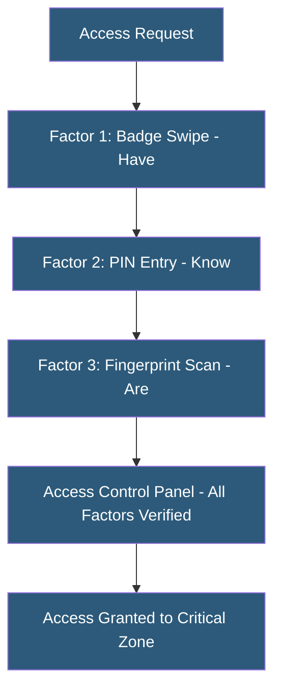

**Category:** Gigawatt Security & Access Control
**Difficulty:** Intermediate
**Reading time:** 6 min read

---

Multi-factor authentication (MFA) infrastructure combines two or more distinct authentication factors—possession, knowledge, and inherence—to verify identity before granting physical or logical access. In gigawatt-scale facilities, MFA is applied at high-security zone transitions to prevent unauthorized access even when one factor is compromised.

- **Factor categories** — something you have (card/token), something you know (PIN/password), something you are (biometric)
- **Two-factor authentication (2FA)** — requires exactly two factors from different categories
- **MFA** — requires two or more factors; term often used interchangeably with 2FA
- **OTP (One-Time Password)** — time-based or event-based password valid for a single use
- **TOTP** — time-based OTP algorithm (RFC 6238); basis of Google Authenticator and OATH tokens
- **Hardware token** — dedicated device generating OTP codes (RSA SecurID, YubiKey)
- **Out-of-band authentication** — second factor delivered through a different communication channel
- **Step-up authentication** — requiring additional factors when accessing more sensitive resources

Physical MFA in gigawatt facilities typically combines a smart card (possession) with a PIN (knowledge) at standard access points, and adds biometric verification (inherence) for the highest-security zones. The access control panel must receive all required factors before sending the unlock signal. If any factor fails verification, access is denied and the event is logged for security review.

The card-plus-PIN combination is the most common physical MFA deployment. The card reader with integrated PIN keypad sends both the card identifier and PIN hash to the access control panel. Access control software validates both against the stored records. This defeats credential sharing (the PIN is known only to the cardholder) and lost card attacks (the card alone is insufficient).

For logical system access in facility operations technology (OT) environments, software MFA applies to remote access, privileged workstation login, and SCADA system access. TOTP-based authentication using hardware tokens (RSA SecurID) or authenticator apps (TOTP codes displayed on a registered phone) is common. NERC CIP-007 requires multi-factor authentication for interactive remote access to high-impact and medium-impact BES Cyber Systems.

FIDO2/WebAuthn represents the modern evolution of MFA for logical systems. Hardware security keys (YubiKey) provide phishing-resistant authentication by performing a cryptographic challenge-response using a private key stored in the hardware token. This eliminates the OTP interception risk present in SMS and TOTP-based systems.

MFA infrastructure must account for failure modes: lost tokens, enrolled finger injuries, forgotten PINs. Backup authentication procedures are needed but must not create a bypass that undermines MFA security.

- Physical zone access using card plus PIN combination
- Privileged workstation access using smart card plus biometric
- Remote access VPN requiring TOTP hardware token plus password
- SCADA system login requiring hardware security key per NERC CIP-007
- Administrative console access using FIDO2 security key

| Advantage | Disadvantage |
|-----------|--------------|
| Defeating MFA requires compromising multiple independent factors | User friction, especially for frequent access to high-security zones |
| Biometric third factor creates non-repudiable access records | Backup/recovery procedures can undermine MFA if poorly designed |
| FIDO2 eliminates phishing risk for logical system access | Hardware token distribution and management at scale is operationally demanding |
| Meets NERC CIP, SOC 2, and ISO 27001 MFA requirements | Lost token recovery workflow requires secure out-of-band verification |

- [Badge Access Control Systems](badge-access-control-systems.md)
- [Biometric Authentication Deployment](biometric-authentication-deployment.md)
- [Security Audit and Compliance](security-audit-and-compliance.md)

---
*Part of the [Gigawatt Security & Access Control](index.md) category · [Back to Master Index](../../index.md)*
