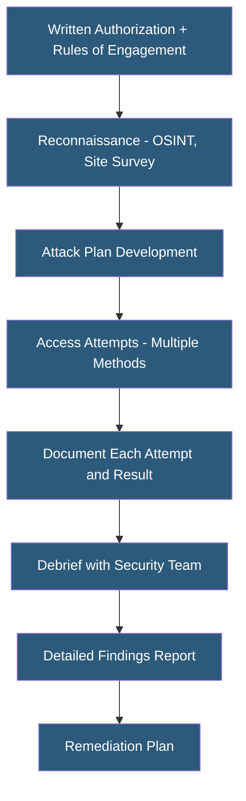

**Category:** Gigawatt Security & Access Control
**Difficulty:** Advanced
**Reading time:** 7 min read

---

Physical penetration testing employs trained security professionals to attempt unauthorized access to secured facilities using the same techniques as real-world adversaries. These controlled assessments identify vulnerabilities in physical security controls that are invisible to desk-based reviews and that compliance audits may miss.

- **Physical pen test** — authorized attempt to breach physical security controls to identify vulnerabilities
- **Red team** — offensive security team simulating adversary tactics, techniques, and procedures
- **Social engineering** — manipulating people into providing unauthorized access or information
- **Tailgating attempt** — tester follows authorized person through access-controlled door
- **Credential cloning** — copying a proximity card credential using a long-range reader
- **Lockpicking** — physical skill for bypassing mechanical pin-tumbler locks
- **Rules of engagement** — written authorization document defining test boundaries, methods, and abort conditions
- **Findings report** — detailed document describing vulnerabilities identified and recommended remediations

Physical penetration tests begin with a signed rules of engagement document defining authorized methods, target areas, out-of-scope systems (safety-critical controls), abort criteria, and contact procedures if a tester is detained. This document protects both the organization and the testers. A limited number of internal security personnel (typically the security director only) are aware of the test to avoid unintentionally tipping off staff.

The test team conducts open-source intelligence (OSINT) gathering—publicly available facility photos, social media posts from employees revealing access procedures, company directory information—to plan their approach. Site surveillance identifies camera locations, guard patrol patterns, and entry point procedures.

Access attempt methods typically include: tailgating (following authorized personnel through controlled doors), social engineering (impersonating delivery drivers, IT contractors, or building management staff), credential cloning (using a concealed long-range RFID reader to copy proximity card data from unsuspecting employees in public areas), and physical bypass techniques (picking locks, bypassing magnetic contacts).

The most valuable findings are often not technical vulnerabilities but human ones: employees who hold doors for strangers, guards who don't verify IDs, social engineering scenarios that succeed because staff are trained to be helpful but not security-aware. Technical findings might include cloneable proximity cards, cameras with blind spots, doors that can be shimmed open, or tailgate detection sensors that are disabled.

The debrief with the security team provides immediate situational awareness. The full report documents each vulnerability with severity rating, evidence (photographs, video), and specific remediation recommendations.

- Annual red team assessment of datacenter physical security controls
- Compliance-driven physical security assessment for SOC 2 or ISO 27001 preparation
- New facility security validation before full operational occupation
- Post-incident testing to verify that specific vulnerabilities have been closed
- Employee security awareness training using real findings from pen test

| Advantage | Disadvantage |
|-----------|--------------|
| Reveals real-world exploitable vulnerabilities that paper reviews miss | Requires careful scoping and authorization to avoid legal and safety issues |
| Tests human factors (social engineering, tailgating) invisible to technical audits | Testers may be detained or cause alarm, disrupting operations |
| Provides specific, actionable remediation guidance | Cost of qualified physical pen test teams is significant |
| Validates security control effectiveness under realistic adversary conditions | Findings may be embarrassing and create internal political challenges |

- [Security Audit and Compliance](security-audit-and-compliance.md)
- [Security Incident Response](security-incident-response.md)
- [Insider Threat Mitigation](insider-threat-mitigation.md)

---
*Part of the [Gigawatt Security & Access Control](index.md) category · [Back to Master Index](../../index.md)*
