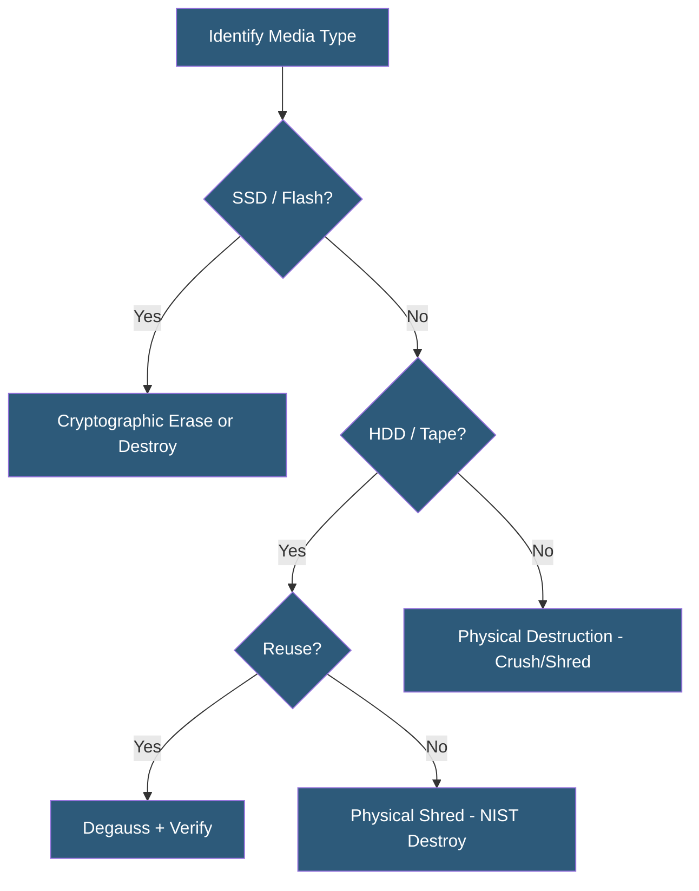

**Category:** Gigawatt Security & Access Control
**Difficulty:** Intermediate
**Reading time:** 6 min read

---

Secure destruction processes ensure that data and physical assets are rendered unrecoverable before disposal, preventing information exposure through discarded equipment. NIST SP 800-88 provides the authoritative framework for media sanitization, while physical destruction methods address equipment that cannot be sanitized electronically.

- **Media sanitization** — process of removing data from storage media to a defined assurance level
- **Clear** — lowest sanitization level; overwriting data so standard tools cannot recover it
- **Purge** — higher level; applying techniques resisting laboratory-level recovery attempts
- **Destroy** — physical destruction ensuring recovery is infeasible by any means
- **NIST SP 800-88** — NIST guidelines for media sanitization providing authoritative standards
- **Certificate of destruction** — document from destruction vendor certifying specific media has been destroyed
- **Degaussing** — applying strong magnetic field to erase magnetic storage media (HDDs, tapes)
- **Shredding** — physical size reduction to fragments meeting defined particle size standards

NIST SP 800-88 Rev. 1 defines three sanitization categories. Clear applies logical overwriting—writing a defined pattern over all addressable storage locations. This is appropriate for media that will be reused within a trusted environment and where laboratory recovery is not a threat. DoD 5220.22-M-based wiping tools perform Clear-level sanitization on HDDs.

Purge renders data recovery infeasible even with state-of-the-art laboratory techniques. For magnetic drives, degaussing uses a degausser rated for the media coercivity—exposing the drive to a magnetic field stronger than the drive's coercive force, randomizing all magnetic domains. For SSDs and flash media, overwriting is insufficient because wear leveling may preserve data in reserved cells; Purge for flash requires Cryptographic Erase (deleting the encryption key for self-encrypting drives) or Secure Erase commands issued directly to the drive firmware.

Destroy renders the storage media unusable by any means. Physical shredding to particle sizes meeting NSA standards (3/16 inch or smaller for hard drives under EPL 04-01) is the most common Destroy method for facilities without a degausser. Incineration and disintegration are alternatives. Physical destruction is required for SSDs and flash memory that cannot be reliably purged electronically.

At gigawatt facilities, the destruction program must address the volume of equipment being cycled out during hardware refreshes. On-site shredding services bring mobile industrial shredders to the facility and shred drives in view of facility staff, providing immediate destruction and eliminating transport chain-of-custody risk. A certificate listing each serial number destroyed is provided.

- End-of-life server drive sanitization before equipment leaves datacenter
- Laptop and workstation sanitization before employee departure or device reassignment
- Mobile device wipe and destruction before disposal
- Tape backup media destruction at retention period expiration
- Emergency destruction procedures for critical media in security incident scenarios

| Advantage | Disadvantage |
|-----------|--------------|
| Certificates of destruction provide audit evidence for compliance | Physical destruction is irreversible; equipment cannot be reused |
| On-site shredding eliminates chain-of-custody risk during transport | Degaussers effective for HDDs are ineffective for SSDs |
| Cryptographic erase enables instant large-scale destruction for encrypted drives | Crypto erase effectiveness depends on implementation quality of self-encrypting drive |
| NIST SP 800-88 provides defensible standard for compliance audits | Shredding generates significant material waste requiring responsible recycling |

- [Chain of Custody Procedures](chain-of-custody-procedures.md)
- [Equipment Serialization](equipment-serialization.md)
- [Security Audit and Compliance](security-audit-and-compliance.md)

---
*Part of the [Gigawatt Security & Access Control](index.md) category · [Back to Master Index](../../index.md)*
