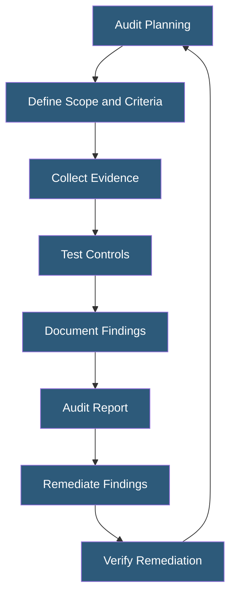

**Category:** Gigawatt Security & Access Control
**Difficulty:** Intermediate
**Reading time:** 6 min read

---

Security audit and compliance programs provide systematic verification that physical and logical security controls are implemented, functioning, and meeting applicable regulatory and standards requirements. For gigawatt facilities, key frameworks include NERC CIP, SOC 2, ISO 27001, and facility-specific security plans.

- **Security audit** — systematic, independent examination of security controls against defined criteria
- **Compliance** — state of meeting applicable regulatory requirements and contractual obligations
- **NERC CIP** — North American Electric Reliability Corporation Critical Infrastructure Protection standards
- **SOC 2** — Service Organization Control 2; audits security, availability, processing integrity, confidentiality, and privacy
- **ISO 27001** — international information security management system (ISMS) standard
- **Control effectiveness** — degree to which a security control achieves its intended purpose
- **Evidence** — documentation demonstrating that a control is implemented and functioning
- **Finding** — identified gap or deficiency in security control implementation or operation

Physical security audits at gigawatt facilities assess controls across multiple domains: perimeter security (fence integrity, lighting, camera coverage), access control (badge system configuration, access level reviews, anti-passback functionality), personnel security (background check records, training completion), and operational security (visitor logs, escort compliance, security guard tour records).

NERC CIP compliance audits are conducted by regional entities every 3 years for registered entities. NERC CIP requires extensive documentation: Physical Security Plans defining the Physical Security Perimeter, access authorization records, visitor logs, security event logs, and incident reports. Evidence is typically provided via document production followed by in-person interviews and facility walkthrough.

SOC 2 Type II audits are performed by accredited CPA firms over an observation period (typically 6–12 months). The auditor tests that physical access controls operated continuously throughout the period—not just at a point in time. Evidence includes access control system reports, badge audit logs, camera retention records, and visitor management system exports. Gaps in evidence for any period within scope can result in a qualified opinion.

Internal audit programs supplement external compliance audits with more frequent, operationally integrated reviews. Quarterly internal audits of access control logs (identifying accounts that should be deprovisioned), monthly physical security walk-throughs, and weekly SOC performance metric reviews maintain continuous control effectiveness between external audits.

Audit findings are tracked in a remediation register with assigned owners, target dates, and completion evidence. Open findings from external audits are communicated to senior management and the board through security governance reporting.

- NERC CIP triennial compliance audit preparation and evidence production
- SOC 2 Type II audit supporting cloud service customer due diligence
- ISO 27001 certification audit for international customer security requirements
- Internal access control review identifying overprivileged accounts
- Quarterly physical security inspection verifying fence, lighting, and camera operation

| Advantage | Disadvantage |
|-----------|--------------|
| External audits provide independent validation of control effectiveness | Audit preparation is resource-intensive and disruptive to operations |
| Compliance frameworks provide clear requirements for security investment | Compliance is not equivalent to security—meeting minimum standards is insufficient |
| Audit findings drive systematic improvement in security posture | Non-compliance findings can result in regulatory penalties or loss of customer trust |
| Internal audits maintain continuous readiness between external audits | Audit fatigue can result in compliance theater rather than genuine security |

- [Security Incident Response](security-incident-response.md)
- [Badge Access Control Systems](badge-access-control-systems.md)
- [Physical Penetration Testing](physical-penetration-testing.md)

---
*Part of the [Gigawatt Security & Access Control](index.md) category · [Back to Master Index](../../index.md)*
