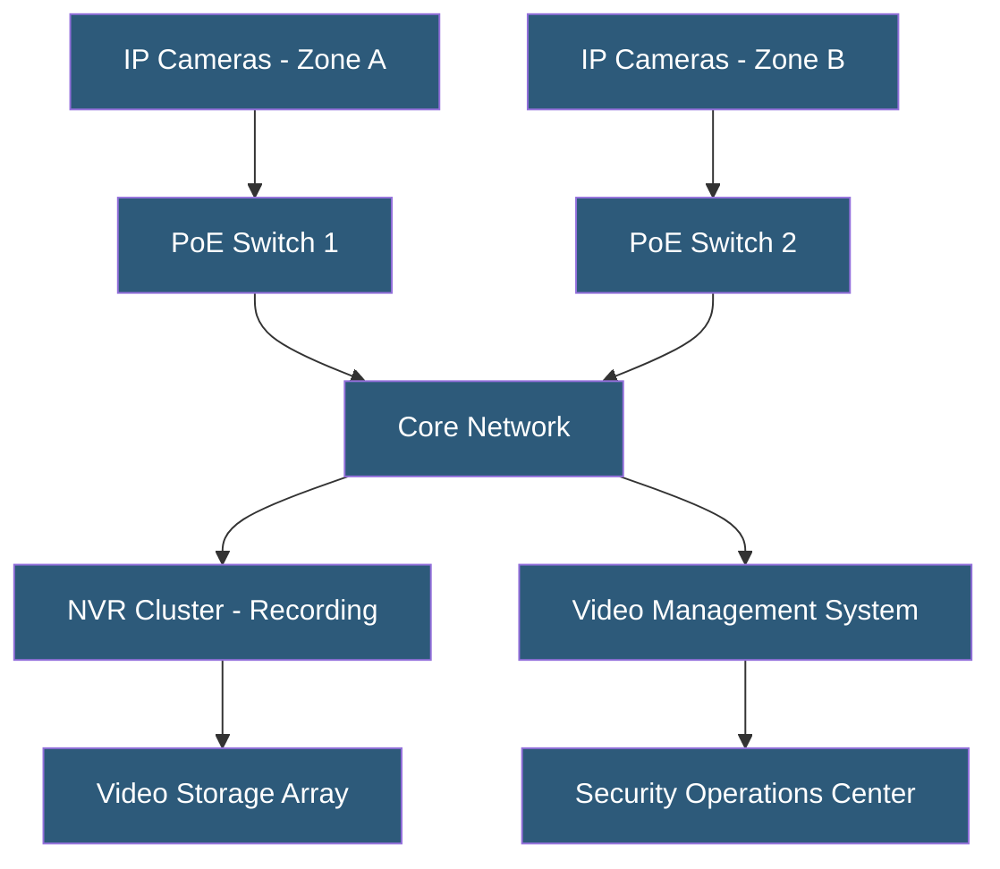

**Category:** Gigawatt Security & Access Control
**Difficulty:** Intermediate
**Reading time:** 6 min read

---

Security camera networks provide continuous visual surveillance across gigawatt-scale facilities, capturing footage for real-time monitoring, incident response, and forensic review. Modern IP camera networks integrate with video management software, analytics engines, and access control systems to create a unified security picture.

- **VMS (Video Management System)** — software platform managing IP cameras, recording, playback, and integration
- **IP camera** — network-connected camera streaming video over Ethernet; replaces analog CCTV
- **PTZ camera** — pan-tilt-zoom camera remotely controllable to track subjects or zoom to detail
- **Fixed camera** — stationary camera providing constant coverage of a defined area
- **NVR (Network Video Recorder)** — dedicated hardware recording and storing IP camera streams
- **Retention period** — duration video footage is kept before overwriting; often 30–90 days for compliance
- **PoE switch** — network switch providing power over Ethernet to IP cameras, simplifying installation
- **Megapixel density** — camera resolution measured in megapixels; higher resolution enables identification at greater distance

Large-scale camera networks for gigawatt facilities may include hundreds to thousands of cameras covering perimeter fence lines, access points, equipment yards, control buildings, and all corridor intersections. Camera selection matches the application: wide-angle fixed cameras for general area coverage, high-resolution cameras (4–8 MP) for identification at entry points, and PTZ cameras for perimeter patrol and incident tracking.

Camera placement follows coverage analysis—a security consultant maps the facility and identifies all areas requiring surveillance, calculates the camera field of view required, and specifies camera models accordingly. Overlapping coverage ensures that camera failure does not create blind spots. Cameras are positioned at heights that prevent tampering and with mounting angles optimized for the target viewing area.

IP cameras connect to the network via PoE switches (IEEE 802.3at/bt) that simultaneously provide power and data connectivity, eliminating separate power runs. Cameras stream H.264 or H.265 compressed video to network video recorders. H.265 reduces storage and bandwidth requirements by approximately 50% compared to H.264 at equivalent quality, which is significant for large deployments.

Video storage sizing accounts for camera count, resolution, frame rate, compression ratio, and retention period. A 4MP camera at 15 fps with H.265 compression generates approximately 1–2 TB per month. A 500-camera facility with 90-day retention requires 150–300 TB of storage—typically provisioned on dedicated NAS or SAN arrays with RAID protection.

Cybersecurity is critical for IP camera networks. Cameras must be deployed on a dedicated VLAN isolated from operational networks, firmware must be kept updated, default credentials must be changed, and TLS encryption should be enabled for video streams. Several high-profile breaches have occurred through compromised IP cameras.

- Perimeter camera network covering facility fence line with PTZ response cameras
- Data hall surveillance for server rack access monitoring and equipment tracking
- Entry point cameras providing facial capture for access audit
- Parking and vehicle area coverage for incident investigation
- Remote facility monitoring via secure cloud-connected VMS

| Advantage | Disadvantage |
|-----------|--------------|
| Continuous recording enables forensic review of any incident | Large deployments require significant storage infrastructure |
| Integration with access control enables correlated event review | IP cameras are a cybersecurity attack surface if misconfigured |
| Remote monitoring reduces on-site guard requirements | Camera blind spots can be exploited by knowledgeable insiders |
| AI analytics automate detection of anomalous activity | High-resolution, high-frame-rate cameras generate large bandwidth demand |

- [Video Analytics and AI Surveillance](video-analytics-and-ai-surveillance.md)
- [Security Operations Center (SOC) Design](security-operations-center-soc-design.md)
- [Intrusion Detection Systems](intrusion-detection-systems.md)

---
*Part of the [Gigawatt Security & Access Control](index.md) category · [Back to Master Index](../../index.md)*
