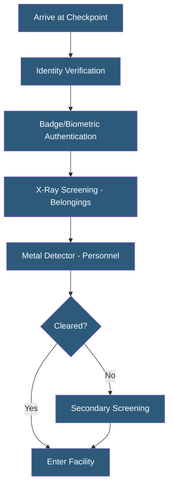

**Category:** Gigawatt Security & Access Control
**Difficulty:** Intermediate
**Reading time:** 6 min read

---

Security checkpoints control the transition between security zones by verifying identity, credentials, and permitted items before granting access. Effective checkpoint design balances throughput (speed of processing legitimate personnel) against security (detecting unauthorized individuals and prohibited items) at scale.

- **Primary checkpoint** — first screening point verifying identity and base authorization
- **Secondary screening** — additional inspection for individuals or items flagged at primary
- **Badge reader** — electronic credential verification at checkpoint entry
- **X-ray screening** — conveyor-based baggage and equipment inspection system
- **Walk-through metal detector (WTMD)** — personnel screening for metallic items
- **Hand-held metal detector (HHMD)** — portable detector for secondary or targeted screening
- **Throughput rate** — number of people processed per hour; critical for shift-change design
- **Tailgating prevention** — physical and procedural controls preventing unauthorized entry behind a cleared person

Checkpoint design begins with a throughput analysis. Gigawatt facilities may have hundreds of workers arriving within a 30-minute window at shift change. The checkpoint must process this volume without creating queues that extend outside secured space. A single staffed checkpoint lane processes approximately 200–300 people per hour with standard identity verification; X-ray screening reduces this to 100–150 per hour per lane. Multiple parallel lanes scale throughput accordingly.

The checkpoint sequence for a high-security facility begins with a staffed guard verifying government-issued photo identification against an authorization list. For facilities with pre-enrolled personnel, this transitions to self-service badge swipe or biometric verification, with guards available for exceptions. Turnstiles or electronic gates control passage, opening only after successful authentication.

Equipment and personal items screening using X-ray is common at data center facilities where equipment theft or introduction of unauthorized devices (USB drives, recording equipment) is a concern. Walk-through metal detectors or handheld screening address weapons and metallic contraband. The level of screening must be proportionate to the threat model and operational context—excessive screening delays legitimate workers and creates friction.

Tailgating is a primary checkpoint vulnerability. Turnstiles physically allow only one person per valid authentication. Video analytics can detect when two people pass through on a single authentication event. Officers stationed at checkpoints provide visual deterrence and can challenge individuals attempting to follow closely behind cleared personnel.

- Hyperscale datacenter employee checkpoint with biometric and badge integration
- Power plant security checkpoint with X-ray and metal detection
- Government facility checkpoint processing cleared staff and visitors
- Industrial campus shift-change checkpoint handling hundreds of workers per hour
- Airport-style equipment screening at sensitive facility loading docks

| Advantage | Disadvantage |
|-----------|--------------|
| Single controlled access point enables comprehensive logging | Checkpoint bottlenecks at shift changes without adequate lane capacity |
| X-ray screening detects prohibited equipment and weapons | Equipment screening adds significant personnel cost and time |
| Biometric verification eliminates credential sharing risk | Biometric enrollment requires upfront registration effort |
| Tailgating controls prevent unauthorized entry behind cleared staff | Overly restrictive checkpoints create morale and productivity issues |

- [Badge Access Control Systems](badge-access-control-systems.md)
- [Biometric Authentication Deployment](biometric-authentication-deployment.md)
- [Mantrap Entry Systems](mantrap-entry-systems.md)

---
*Part of the [Gigawatt Security & Access Control](index.md) category · [Back to Master Index](../../index.md)*
