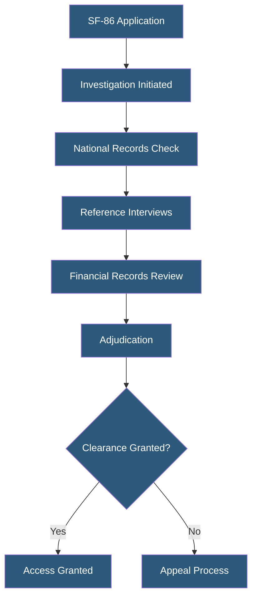

**Category:** Gigawatt Security & Access Control
**Difficulty:** Intermediate
**Reading time:** 5 min read

---

Security clearance requirements define the investigation, adjudication, and ongoing standards that personnel must meet to access classified information or the most sensitive areas of critical infrastructure. For private sector gigawatt facilities, clearance requirements range from facility-defined background check tiers to formal government security clearances for defense-contractor or government-adjacent work.

- **Security clearance** — official determination that a person is eligible to access classified information at a specified level
- **Confidential** — lowest US government clearance level; requires basic NACLC investigation
- **Secret** — mid-level clearance; requires NACLC plus additional records review
- **Top Secret (TS)** — highest standard clearance; requires Single Scope Background Investigation (SSBI)
- **TS/SCI** — Top Secret with access to Sensitive Compartmented Information; requires lifestyle polygraph for some programs
- **NERC CIP personnel risk assessment** — industry-specific background check equivalent for bulk electric system personnel
- **Adjudication** — formal process evaluating background investigation results against criteria for access eligibility
- **Continuous evaluation (CE)** — automated, ongoing monitoring of cleared personnel between periodic reinvestigations

For private critical infrastructure operators (not government contractors), formal government clearances are not typically required unless the facility supports classified government contracts. Instead, organizations define internal clearance tiers that determine which facility zones and systems a person may access. These tiers correspond to background check depth, investigation scope, and adjudication criteria defined in the organization's security policy.

NERC CIP-004 defines Personnel Risk Assessment (PRA) requirements for the bulk electric system. Organizations must conduct PRAs on all personnel with unescorted physical or unescorted electronic access to high- and medium-impact BES Cyber Systems. PRAs must include a seven-year criminal history check from a reputable source. Personnel with convictions for certain crimes (crimes involving critical infrastructure, certain fraud, felonies within the past 7 years) are disqualified from unescorted access.

Government security clearances are required for personnel working at facilities supporting classified defense contracts, accessing classified networks, or occupying positions designated as sensitive. The SF-86 (Questionnaire for National Security Positions) collects 10 years of personal history. Defense Counterintelligence and Security Agency (DCSA) conducts the investigation. Adjudication applies the 13 guidelines (allegiance, foreign preference, foreign contacts, personal conduct, financial, alcohol, drug involvement, psychological, technology systems, criminal conduct, handling of protected information, outside activities, sexual behavior) to determine eligibility.

- NERC CIP PRA program for utility control center operators and substation technicians
- Defense contractor facility access requiring TS clearance for certain zones
- Classified program support staff requiring TS/SCI with polygraph
- Internal clearance tiering for datacenter physical access control
- Government cloud facility staff requiring government security clearances

| Advantage | Disadvantage |
|-----------|--------------|
| Government clearances represent deep, comprehensive investigation | Clearance processing timelines (6 months to 2+ years for TS/SCI) delay hiring |
| NERC CIP PRA provides standardized baseline for power sector | Clearance maintenance requires ongoing reinvestigation and CE monitoring |
| Internal clearance tiers create defensible access control framework | Cost of comprehensive background investigation programs is significant |
| Reciprocity allows cleared staff to transition between cleared contractors | Adjudication can deny access based on foreign contacts common in a global workforce |

- [Background Check Processes](background-check-processes.md)
- [Insider Threat Mitigation](insider-threat-mitigation.md)
- [Security Audit and Compliance](security-audit-and-compliance.md)

---
*Part of the [Gigawatt Security & Access Control](index.md) category · [Back to Master Index](../../index.md)*
