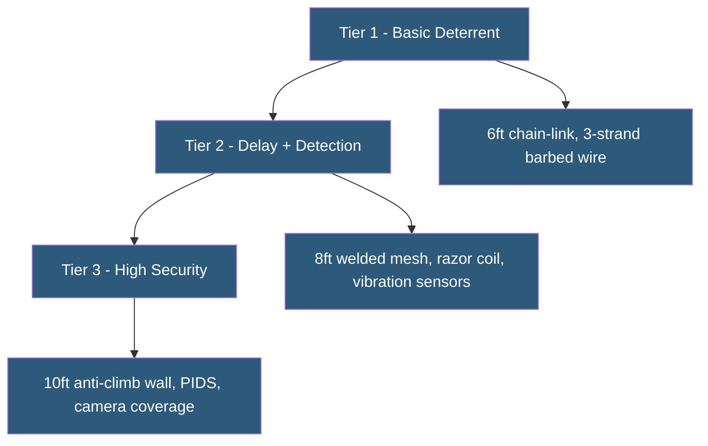

**Category:** Gigawatt Security & Access Control
**Difficulty:** Beginner
**Reading time:** 5 min read

---

Security fence specifications define the physical characteristics that determine a fence's effectiveness as a delay and detection barrier. Standards bodies including NERC CIP, UL, and government agencies define minimum specifications for fences protecting critical infrastructure based on threat level and asset criticality.

- **Chain-link fence** — woven wire mesh standard; typically 6–8 feet with 3-strand barbed wire topping
- **Welded wire mesh** — rigid panel fence; more climbing-resistant than chain-link
- **Anti-climb topping** — barbed wire, razor wire, or anti-climb spikes on fence top
- **Anti-dig apron** — horizontal mesh extending outward from fence base preventing tunneling
- **Fence height** — minimum 6 feet per most standards; 8+ feet for higher-security applications
- **Post spacing** — typically 10 feet for chain-link; closer spacing increases rigidity
- **Fence gauge** — wire diameter; heavier gauge (lower number) provides more cut resistance
- **Crash rating** — for vehicle barriers attached to fence lines; ASTM F2656 standard

Fence specifications serve three security functions: deterrence (visible barrier discouraging casual intruders), delay (slowing determined intruders to allow response time), and detection (sensor integration alerting security personnel to intrusion attempts). Higher security ratings require fences that better serve all three functions.

Standard commercial security fencing for critical infrastructure typically specifies a minimum 8-foot-tall, 9-gauge chain-link or welded wire mesh fence with a 3-foot barbed wire or razor coil extension, bringing total height to 11 feet. The fence is set in a concrete footing with the chain-link mesh extended 6 inches below grade or with a horizontal anti-dig apron to prevent tunneling beneath.

Vibration detection sensors are attached to fence posts or woven through the mesh. These sensors detect the vibration signature of climbing (slow rhythmic vibrations) or cutting (rapid high-frequency vibrations). Sensitivity calibration is critical—overly sensitive settings generate excessive false alarms from wind, while insufficient sensitivity misses actual intrusion attempts.

NERC CIP-006-6 defines Physical Security Perimeter (PSP) requirements for bulk electric system assets. The standard requires a six-wall boundary (floor, ceiling, and four walls) for certain assets. For outdoor perimeters, it mandates monitored electronic access control at entry points, a defined security perimeter that only authorized personnel may cross, and visitor escort requirements.

For vehicle threats, fence systems can be supplemented with foundation-embedded bollards or anti-ram cable systems. These components must be specified and tested to ASTM F2656 or DOS SD-STD-02.01 ratings defining resistance to vehicle impact at specified speeds.

- Utility substation perimeter fence meeting NERC CIP physical security requirements
- Solar farm boundary fencing preventing equipment theft and vandalism
- Datacenter campus perimeter combining chain-link, razor wire, and PIDS
- Pipeline compression station security fencing
- Transformer yard protection with anti-ram vehicle barriers

| Advantage | Disadvantage |
|-----------|--------------|
| Standardized specifications enable compliance documentation | Higher-spec fencing has significantly higher material and installation cost |
| Anti-dig and anti-climb features increase intrusion difficulty | Razor wire creates safety and liability issues for maintenance staff |
| Integrated sensors convert fence into detection layer | Metal fences conduct electricity; safe installation near high-voltage requires precautions |
| Long lifespan with minimal maintenance for steel fencing | Perimeter management in harsh climates requires corrosion-resistant coatings |

- [Perimeter Security at Scale](perimeter-security-at-scale.md)
- [Vehicle Barriers and Bollards](vehicle-barriers-and-bollards.md)
- [Security Zone Design for GW Facilities](security-zone-design-for-gw-facilities.md)

---
*Part of the [Gigawatt Security & Access Control](index.md) category · [Back to Master Index](../../index.md)*
