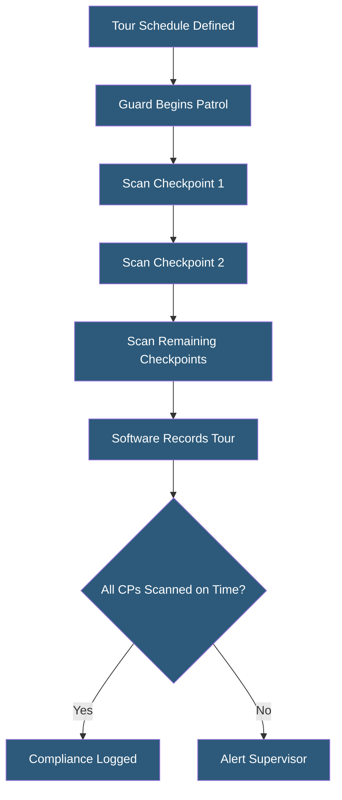

**Category:** Gigawatt Security & Access Control
**Difficulty:** Beginner
**Reading time:** 5 min read

---

Security guard tour systems electronically verify that guards patrol defined checkpoints on their assigned routes and schedules. They create an automated audit trail of patrol activity, alert supervisors to missed checkpoints, and provide evidence of security presence throughout the facility.

- **Checkpoint** — physical location equipped with an NFC tag, QR code, or electronic wand reader that guards scan during patrol
- **Tour** — defined sequence of checkpoints that a guard must complete within a time window
- **Guard tour wand** — handheld scanner that records checkpoint touches with timestamp
- **NFC checkpoint** — passive NFC tag mounted on walls or equipment; scanned via smartphone or wand
- **Missed checkpoint alert** — notification to supervisor when a checkpoint is not scanned within its window
- **Guard tour software** — platform collecting tour data, generating compliance reports, and managing alerts
- **Real-time tracking** — GPS or BLE-based continuous location tracking versus checkpoint-only recording
- **Tour compliance rate** — percentage of scheduled checkpoints successfully scanned within the required window

Modern guard tour systems use NFC or QR code checkpoints combined with smartphone-based scanning apps or dedicated guard wand devices. NFC tags are small, inexpensive, and tamper-evident; guards tap their phone or wand reader against the tag to record a scan. The scan includes the checkpoint identifier, guard identifier, and timestamp. Data syncs to the tour management software via cellular or Wi-Fi.

Tour schedules specify which checkpoints must be scanned, in what order (optional—some tours allow any sequence), and within what time windows. A typical facility patrol might require 20 checkpoints to be completed within a 90-minute window. If checkpoints 5 and 6 are not scanned by their deadline, the software sends an SMS and email alert to the supervisor, who investigates whether the guard is delayed, needs assistance, or is not performing the required patrol.

Tour reports provide management visibility into patrol compliance rates over time. Patterns of missed checkpoints at specific locations may indicate a guard who is avoiding certain areas, or a checkpoint that requires rescheduling. Incident notes—entered by the guard at a checkpoint—associate observations with specific locations and times, providing a security log linked to patrol activity.

Some facilities implement real-time GPS tracking of guards, providing continuous location data rather than checkpoint-only records. This enables immediate location of a guard who triggers an emergency duress alert. However, continuous tracking raises worker privacy considerations that must be addressed in employment agreements.

- Large facility perimeter patrol verification with checkpoint scanning
- Data center hallway patrol compliance for SOC 2 audit documentation
- Multi-building campus patrol management with supervisor dashboards
- Unmanned remote facility periodic inspection verification
- Contract guard performance monitoring and compliance reporting

| Advantage | Disadvantage |
|-----------|--------------|
| Creates verifiable audit trail of security patrol activity | Determined guards can bypass by scanning checkpoints without actually patrolling |
| Real-time alerts for missed checkpoints enable immediate management | GPS tracking raises worker privacy issues requiring policy and consent |
| Reports support contract performance reviews and compliance audits | NFC tags require installation at defined checkpoint locations |
| Incident notes link observations to specific locations and times | System failure or connectivity gaps create gaps in patrol records |

- [24/7 Security Staffing](247-security-staffing.md)
- [Security Operations Center (SOC) Design](security-operations-center-soc-design.md)
- [Security Audit and Compliance](security-audit-and-compliance.md)

---
*Part of the [Gigawatt Security & Access Control](index.md) category · [Back to Master Index](../../index.md)*
