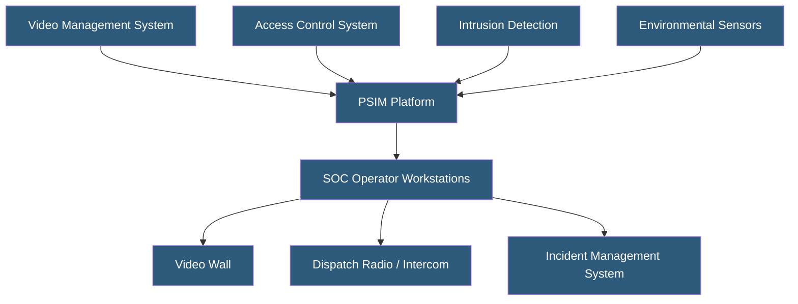

**Category:** Gigawatt Security & Access Control
**Difficulty:** Advanced
**Reading time:** 7 min read

---

A physical Security Operations Center (SOC) is the nerve center of a gigawatt facility's security program, providing continuous monitoring of cameras, access control, intrusion detection, and environmental systems. SOC design encompasses physical space, technology integration, staffing, and workflow to enable rapid detection and coordinated response to security events.

- **Video wall** — array of monitors displaying camera feeds, alarm dashboards, and system status
- **PSIM (Physical Security Information Management)** — platform integrating all security subsystems into unified SOC interface
- **Alarm management** — prioritization and routing of security alerts to appropriate operators
- **Situational awareness** — operator's real-time understanding of facility security status
- **Dispatch** — tasking of security officers to respond to incidents
- **SOC hardening** — physical security measures protecting the SOC itself from attack or disruption
- **Redundant SOC** — backup operations center that can assume monitoring if primary SOC is compromised
- **Mean time to acknowledge (MTTA)** — average time from alarm generation to operator acknowledgment

The SOC physical design prioritizes operator effectiveness and system resilience. Ergonomic workstations positioned for optimal viewing of the video wall support extended monitoring shifts. Lighting is controlled to balance monitor visibility with operator alertness. The room is hardened—reinforced door, independent power supply (UPS), and restricted access—to ensure it remains operational even if the facility experiences a security incident.

The PSIM platform provides the unified operational picture. Rather than requiring operators to monitor separate screens for camera management, access control alarms, IDS events, and environmental alerts, the PSIM correlates events across systems and presents unified situational awareness. When a perimeter sensor triggers, the PSIM automatically slews the nearest PTZ camera to the location and displays the view on the operator's primary screen, simultaneously showing the access control status of nearby entry points and the access history for the last 30 minutes.

Alarm management workflows prioritize events by severity and route them to the appropriate responder. Priority 1 events (confirmed intrusion, fire, active security threat) generate immediate audio/visual alarms and require operator acknowledgment within 30 seconds. Priority 3 events (propped door, environmental out-of-range) are logged and displayed without immediate interruption.

SOC staffing models for large facilities provide minimum one-on-one monitoring during high-security periods and supervisor coverage on all shifts. Response time standards—typically 5 minutes for perimeter alarms, 2 minutes for confirmed intrusion—drive security officer deployment and patrol assignment decisions.

- Hyperscale datacenter physical SOC monitoring 1,000+ cameras and 500+ access points
- Utility facility SOC integrating SCADA alarms with physical security monitoring
- Multi-site enterprise SOC centrally monitoring geographically dispersed facilities
- Campus SOC for university or corporate complex unified security
- Government facility SOC meeting FISMA physical security requirements

| Advantage | Disadvantage |
|-----------|--------------|
| Unified PSIM view dramatically increases operator effectiveness | PSIM integration projects are complex and expensive |
| 24/7 monitoring enables rapid incident detection and response | Staffing costs for around-the-clock coverage are substantial |
| Centralized logging provides comprehensive audit trail | SOC becomes a high-value target; its own security requires investment |
| Alarm management reduces response time to priority events | Information overload from poorly tuned alarm policies degrades effectiveness |

- [Security Camera Networks](security-camera-networks.md)
- [Video Analytics and AI Surveillance](video-analytics-and-ai-surveillance.md)
- [Security Incident Response](security-incident-response.md)

---
*Part of the [Gigawatt Security & Access Control](index.md) category · [Back to Master Index](../../index.md)*
