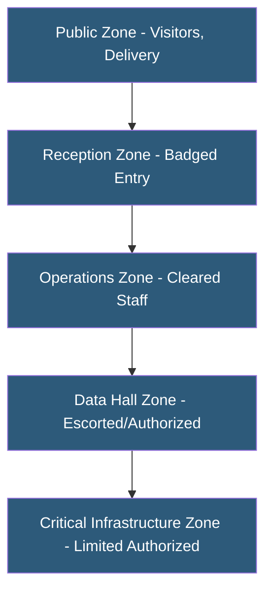

**Category:** Gigawatt Security & Access Control
**Difficulty:** Advanced
**Reading time:** 7 min read

---

Security zone design for gigawatt-scale facilities creates concentric rings of protection, each requiring progressively higher authorization levels to enter. This layered approach—from public perimeter through critical infrastructure zones—limits exposure from both external threats and insider access, ensuring that no single breach grants access to all facility assets.

- **Security zone** — defined area with uniform access control requirements and trust level
- **Concentric ring model** — nested security zones where each inner ring has stricter controls
- **DMZ (demilitarized zone)** — buffer zone between public and secured areas
- **Critical infrastructure zone** — innermost zone housing high-voltage switchgear and control systems
- **Access control boundary** — physical and logical demarcation between zones
- **Cleared personnel** — staff authorized to access specific security zones
- **Zone transition point** — physical checkpoint between zones, often with mantrap or guard station
- **Defense in depth** — security philosophy requiring multiple independent controls to be defeated for compromise

Gigawatt-scale facilities—campus-sized power generation, transmission, or hyperscale datacenter complexes—require security zone design that accommodates hundreds of personnel, equipment deliveries, maintenance contractors, and 24/7 operational activity while maintaining strict segregation of critical infrastructure.

The outermost zone is public-facing: parking areas, visitor reception, and delivery docks. This zone requires no special authorization but is under continuous camera surveillance. Perimeter fencing and vehicle barriers prevent unauthorized vehicle access. The reception zone begins after a staffed or automated entry checkpoint where identity is verified and credentials are issued.

The operations zone requires valid facility credentials (badge or biometric). Background checks are required for all personnel cleared to this level. This zone houses administrative offices, monitoring centers, break rooms, and equipment staging areas. Contractor personnel operate within this zone under escort protocols.

The data hall or power generation zone requires elevated authorization with specific access lists. Access events are logged in real time. This zone contains the primary operational assets—servers, switchgear, generators, or power conversion equipment. Visitor access requires an escort who is cleared for unescorted access. Anti-tailgating measures prevent unauthorized entry behind a cleared person.

The critical infrastructure zone—high-voltage electrical systems, control rooms, and network core—is the most restricted. Access is limited to a small number of named individuals. Dual-factor authentication, mantrap entry, and additional biometric verification are standard. All activity within this zone is recorded and reviewed.

- Hyperscale datacenter campus security architecture
- Utility-scale solar/wind generation facility access control
- High-voltage substation security design
- Industrial control system (ICS/SCADA) facility protection
- Co-location datacenter customer cage separation

| Advantage | Disadvantage |
|-----------|--------------|
| Limits blast radius of any single security breach | Complex design and implementation cost |
| Provides clear authorization boundaries for compliance | Operational friction for personnel frequently crossing zones |
| Audit trails per zone enable forensic analysis | Requires sustained access list management |
| Aligns with NERC CIP and physical security standards | Emergency egress requirements must not conflict with security |

- [Perimeter Security at Scale](perimeter-security-at-scale.md)
- [Mantrap Entry Systems](mantrap-entry-systems.md)
- [Security Operations Center (SOC) Design](security-operations-center-soc-design.md)

---
*Part of the [Gigawatt Security & Access Control](index.md) category · [Back to Master Index](../../index.md)*
