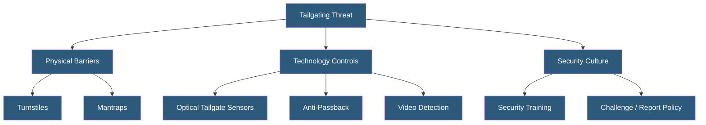

**Category:** Gigawatt Security & Access Control
**Difficulty:** Intermediate
**Reading time:** 5 min read

---

Tailgating (also called piggybacking) occurs when an unauthorized person follows an authorized person through an access-controlled door before it closes. It is one of the most common and simplest physical security vulnerabilities, and preventing it requires a combination of technology controls, physical design, and employee security culture.

- **Tailgating** — unauthorized person following authorized person through a controlled door
- **Anti-tailgate sensor** — sensor system detecting multiple people passing through one access event
- **Optical turnstile** — barrier with infrared beams detecting and blocking simultaneous passage
- **Full-height turnstile** — physical barrier allowing only one rotation per authentication
- **Door holder alarm** — alarm triggered when a door is held open longer than a defined time
- **Propped door alarm** — alarm when a door remains open without continuous authentication events
- **Social engineering** — manipulation of authorized personnel into allowing unauthorized access
- **Security culture** — employee behavior pattern of challenging or reporting tailgating attempts

Physical barriers provide the strongest technical tailgating prevention. Full-height turnstiles (floor-to-ceiling rotating mechanisms) allow exactly one person per authentication—physically impossible to tailgate. Optical turnstiles use infrared beams to detect passage and close barrier panels on unauthorized passage attempts; they are faster than full-height turnstiles but less physically resistant. Mantraps with single-occupancy verification provide the highest security for critical zone entry.

Optical tailgate detection sensors installed at standard doors use overlapping infrared beam grids to count the number of persons passing through the door opening. If the sensor detects two people following a single credential presentation, an alarm alerts the security team. These sensors must be calibrated for the door width, average human dimensions, and lighting conditions.

Anti-passback rules in the access control system create a logical barrier. Once a credential is used to enter a zone, it cannot be used to enter again until it has registered an exit. If person A badges into a zone and tailgates person B, person B's access is logged but their credential is now in an "inside" state. If person B attempts to enter a second time, anti-passback blocks the credential.

Video analytics at access points detect tailgating events automatically. AI-based person counting at doors triggers alerts when more people pass than authentication events occurred. Footage is recorded for review. However, high-traffic areas make reliable detection challenging without controlled flow.

Security culture is the last line of defense. Employees trained to challenge unfamiliar faces and empowered to decline holding doors—without fear of social consequences—prevent tailgating attempts that technology might miss. Challenge training should emphasize professional, non-confrontational approaches.

- Optical turnstiles at corporate headquarters lobby controlling employee access
- Full-height turnstiles at datacenter building entry points
- Anti-passback configuration at server room access points
- Video tailgate detection at manufacturing facility secure area doors
- Security awareness training programs teaching challenge procedures

| Advantage | Disadvantage |
|-----------|--------------|
| Physical barriers provide absolute prevention at controlled points | Turnstiles reduce traffic throughput; problematic at high-volume entry points |
| Anti-passback logical controls require no additional hardware | Anti-passback can cause false access denials if exit events are missed |
| Video detection scales to many doors without barrier hardware cost | Video analytics accuracy degrades with crowd density |
| Security culture training applies everywhere, including un-sensored doors | Social engineering (holding door for someone with full hands) defeats cultural controls |

- [Mantrap Entry Systems](mantrap-entry-systems.md)
- [Badge Access Control Systems](badge-access-control-systems.md)
- [Security Checkpoint Design](security-checkpoint-design.md)

---
*Part of the [Gigawatt Security & Access Control](index.md) category · [Back to Master Index](../../index.md)*
