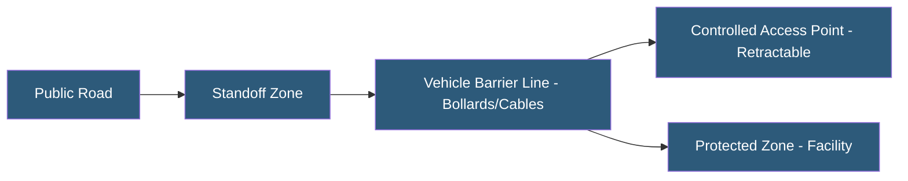

**Category:** Gigawatt Security & Access Control
**Difficulty:** Intermediate
**Reading time:** 5 min read

---

Vehicle barriers and bollards protect critical infrastructure from vehicle-borne attacks by physically stopping or redirecting vehicles before they reach protected assets. They are tested and rated under standardized impact tests that define the vehicle weight and speed a barrier can stop while limiting penetration distance.

- **ASTM F2656** — standard for vehicle crash test ratings; defines M and K ratings by vehicle size and speed
- **K-rating** — older DOS vehicle barrier classification (K4, K8, K12 based on stopping speed)
- **M-rating** — ASTM F2656 classification; M30 stops 15,000 lb vehicle at 30 mph
- **Fixed bollard** — permanent steel cylinder embedded in concrete; maximum protection, no movement
- **Retractable bollard** — bollard that lowers into the ground to permit authorized vehicle access
- **Anti-ram cable** — steel cable strung between anchor posts providing barrier against vehicle penetration
- **Jersey barrier** — reinforced concrete barrier providing passive vehicle diversion
- **Standoff distance** — minimum distance between barrier and protected building

Vehicle barrier systems are specified based on the threat model: the attacker vehicle type, weight, and speed that the facility must withstand. ASTM F2656 testing uses standardized vehicles (6,800 lb sedan, 15,000 lb truck) at defined speeds (30, 40, 50 mph). A barrier rated M50/P1 stops a 15,000 lb truck at 50 mph with maximum 1 meter penetration of the barrier line.

Fixed bollards are the most common solution for continuous protection of building frontages. Steel pipe filled with concrete and set in a reinforced concrete footing, spaced at 4-foot intervals, provides effective protection. Aesthetically designed bollards using architectural finishes are used in public-facing settings. Spacing must be close enough to prevent a vehicle from passing between bollards—typically 4–5 feet—while allowing pedestrian passage.

Retractable (deployable) bollards at access points allow authorized vehicle entry while maintaining protection when vehicles are not expected. Hydraulic, electro-mechanical, or pneumatic actuators lower the bollard below grade in 3–8 seconds. Access control integration ensures bollards only lower after vehicle authentication (badge, license plate recognition). Fail-secure configuration keeps bollards raised during power failure.

Anti-ram cable systems—stainless steel cables anchored at rated tension between certified posts—provide a cost-effective perimeter barrier over long distances. The cable deflects and absorbs vehicle impact energy. These are commonly used for solar farm and substation perimeter protection where aesthetics are less important and long perimeters must be protected.

- Datacenter entry points with retractable bollards for delivery vehicle access
- Substation perimeter anti-ram cable system protecting transformer yards
- Building frontage fixed bollards preventing vehicle ramming attacks
- Event venues using deployable concrete barriers during gatherings
- Government facility vehicle access control lanes with crash-rated gates

| Advantage | Disadvantage |
|-----------|--------------|
| Crash-rated barriers physically stop vehicle-borne attacks | Fixed bollards are permanent—layout changes are expensive |
| Retractable bollards maintain operational vehicle access | Retractable mechanisms require power and ongoing maintenance |
| Anti-ram cables protect long perimeters cost-effectively | Cable barriers allow significant deflection on high-speed impact |
| ASTM ratings provide clear, verifiable protection specifications | Improper installation can dramatically reduce rated performance |

- [Security Fence Specifications](security-fence-specifications.md)
- [Security Checkpoint Design](security-checkpoint-design.md)
- [Perimeter Security at Scale](perimeter-security-at-scale.md)

---
*Part of the [Gigawatt Security & Access Control](index.md) category · [Back to Master Index](../../index.md)*
