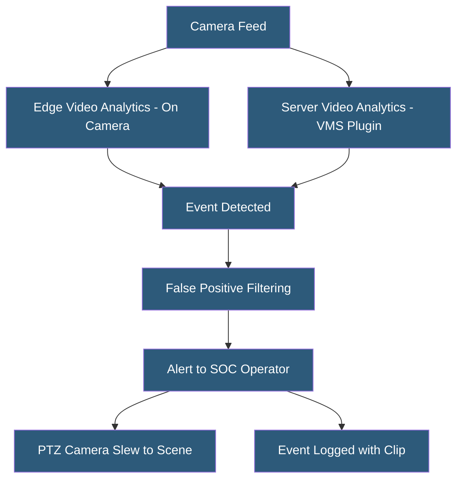

**Category:** Gigawatt Security & Access Control
**Difficulty:** Advanced
**Reading time:** 7 min read

---

Video analytics applies computer vision and machine learning algorithms to security camera feeds in real time, automatically detecting events of interest—perimeter intrusion, loitering, crowd formation, vehicle movements—and alerting security operators without requiring constant human monitoring of every camera feed.

- **Video analytics** — automated processing of video streams to detect defined events
- **Rule-based analytics** — detects events based on explicitly programmed conditions (virtual tripwire, zone entry)
- **AI-based analytics** — uses trained neural networks to classify objects (person, vehicle) and behaviors
- **Virtual tripwire** — configurable line in the camera view; triggers alert when crossed in defined direction
- **Loitering detection** — alert when a person remains in a defined zone beyond a threshold duration
- **Crowd density analysis** — counts people in a zone and alerts when density exceeds a threshold
- **Object removal detection** — alerts when an object present in the scene is no longer detected
- **False positive rate** — frequency of incorrect alerts; high rates lead to alert fatigue

Video analytics can be deployed at two processing points: on-camera (edge analytics using onboard AI chips like Ambarella or NVIDIA Jetson) or server-side (VMS-integrated analytics software processing streams centrally). Edge analytics reduce network bandwidth by sending only event metadata rather than full video streams; server-side analytics are more flexible and easier to update.

For perimeter security, virtual tripwires are drawn across the camera view aligned with the fence line. Direction-sensitive triggers ensure that alerts fire only for crossing in the ingress direction, not for guards patrolling inside. Object classification (person versus animal) dramatically reduces false positives from wildlife in rural facilities—a major issue for solar farms and substations in areas with deer or other large animals.

Deep learning models for person detection achieve over 95% detection accuracy and under 2% false positive rates in controlled conditions. Performance degrades in challenging conditions: darkness without adequate IR illumination, heavy rain or snow obscuring the scene, camera lens contamination, or very small persons at the edge of camera range. System design must account for these conditions through appropriate camera specifications and environmental monitoring.

License plate recognition (LPR) analytics applied to entry point cameras automatically capture and log all vehicles entering and exiting. When integrated with an authorized vehicle database, the system alerts on unregistered vehicles and automatically opens barriers for registered ones. LPR is standard at critical infrastructure facilities for vehicle access management.

Facial recognition analytics remain controversial due to accuracy concerns in diverse populations, privacy regulations, and civil liberties considerations. Deployment at critical infrastructure facilities is subject to jurisdiction-specific regulations and organizational policy.

- Perimeter virtual tripwire detecting unauthorized fence crossing
- Data center loading dock monitoring for unauthorized vehicle entry
- Solar farm perimeter analytics reducing guard patrol requirements
- Entry point LPR automating vehicle access and maintaining logs
- Large facility crowd density monitoring during emergency evacuation

| Advantage | Disadvantage |
|-----------|--------------|
| Automated detection reduces monitoring labor requirements | False positives from environmental factors cause alert fatigue |
| AI object classification greatly reduces animal-triggered false alarms | Accuracy degrades in poor lighting, weather, or at long range |
| Continuous detection coverage without operator attention lapse | Privacy regulations restrict certain analytics applications |
| Events logged with video clip for forensic review | AI-based analytics require ongoing model updates and tuning |

- [Security Camera Networks](security-camera-networks.md)
- [Security Operations Center (SOC) Design](security-operations-center-soc-design.md)
- [Drone Detection and Mitigation](drone-detection-and-mitigation.md)

---
*Part of the [Gigawatt Security & Access Control](index.md) category · [Back to Master Index](../../index.md)*
