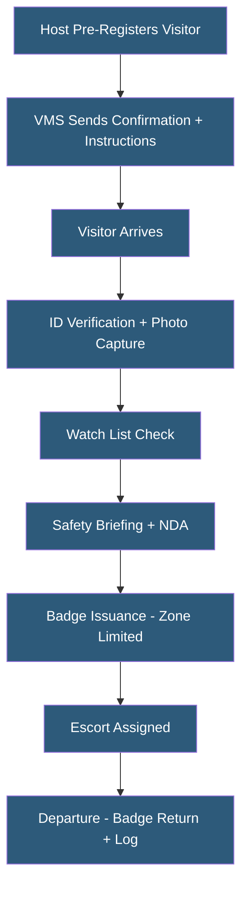

**Category:** Gigawatt Security & Access Control
**Difficulty:** Intermediate
**Reading time:** 5 min read

---

Visitor management at gigawatt-scale facilities handles hundreds of contractors, vendors, auditors, and guests while maintaining complete audit trails and ensuring that every non-permanent visitor is appropriately vetted, escorted, and tracked throughout their time on site.

- **Visitor management system (VMS)** — software platform managing visitor registration, pre-authorization, badge issuance, and check-out
- **Pre-registration** — advance notification and authorization before a visitor arrives
- **Escort requirement** — mandate that visitors are accompanied by cleared personnel at all times in restricted zones
- **Temporary badge** — time-limited and zone-restricted visitor credential
- **Watch list screening** — automated check of visitor identity against security watch lists
- **NDAs and safety briefings** — required acknowledgments before granting access
- **Visitor log** — audit record of all visitor entries, escorts, locations, and departures
- **Visitor badging station** — self-service kiosk for pre-registered visitor check-in

Modern visitor management systems (Envoy, Proxyclick, Lenel, Genetec) replace paper visitor logs with digital workflows that integrate access control systems, pre-registration email workflows, and real-time dashboards. The process begins before arrival: the facility host registers the expected visitor in the VMS, which sends the visitor a confirmation email with instructions, QR code, parking details, and required documents (NDA, safety training certificate for contractors).

At arrival, visitors check in at a staffed reception desk or self-service kiosk. Government-issued ID is scanned and captured; some enterprise systems perform automated watch list screening against OFAC, terrorism, and sex offender registries. A digital NDA and safety briefing acknowledgment can be completed on a tablet. A time-limited visitor badge is printed, programmed only for zones the visitor is authorized to access.

For contractor-heavy facilities, contractor management extends visitor management with trade-specific safety certifications, drug test compliance, and specialized training records. Platforms like ISNetworld or Avetta verify contractor qualifications. Temporary contractor badges may be valid for the duration of a project (weeks or months) rather than a single day, with periodic re-verification.

Escort assignment and tracking is critical for compliance with standards like NERC CIP. The VMS records which cleared employee is escorting which visitor at all times. If a visitor is seen in a restricted area without an escort, the VMS can flag this against access control logs. At departure, the visitor returns their badge and the VMS closes the record.

- Utility facility contractor management for planned maintenance events
- Datacenter visitor management with cloud badge issuance integration
- Regulatory auditor visits requiring complete access logs
- Construction contractor management during facility build-out
- Large-scale maintenance events with hundreds of simultaneous contractors

| Advantage | Disadvantage |
|-----------|--------------|
| Complete digital audit trail for compliance | VMS software requires integration with access control systems |
| Pre-registration reduces reception desk congestion | Watch list screening may create false positives and visitor friction |
| Automated escort tracking enforces access policies | Escort requirements are operationally demanding during busy periods |
| Digital NDAs create legally defensible acknowledgment records | System failure can cause significant check-in delays |

- [Security Checkpoint Design](security-checkpoint-design.md)
- [Escort Requirements](escort-requirements.md)
- [Badge Access Control Systems](badge-access-control-systems.md)

---
*Part of the [Gigawatt Security & Access Control](index.md) category · [Back to Master Index](../../index.md)*
