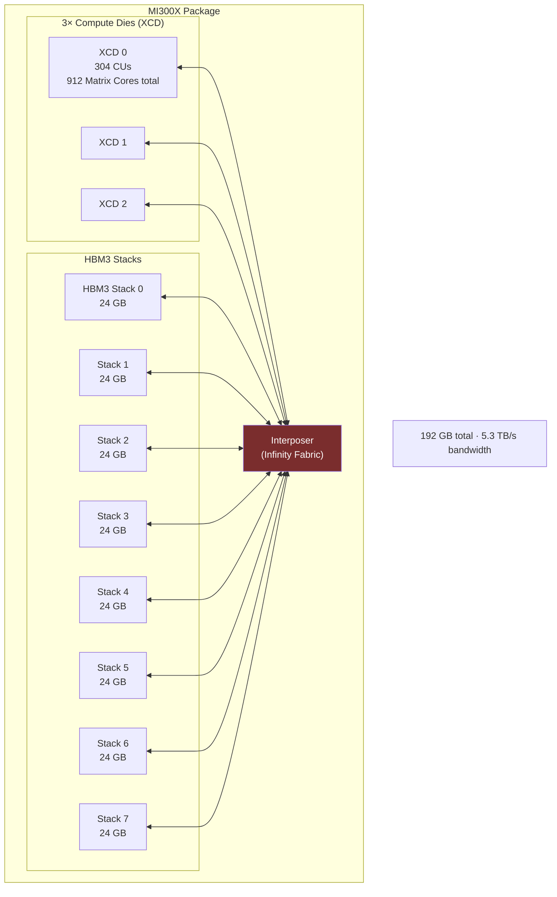

**Category:** GPU Infrastructure
**Difficulty:** Intermediate
**Reading time:** 6 min read

---

AMD's Instinct MI series (formerly FirePro) is AMD's line of datacenter compute GPUs, directly competing with NVIDIA's A100/H100 for HPC and AI training workloads. The MI300X (CDNA3 architecture) introduced a chiplet-based design with 192 GB of HBM3 — the largest GPU memory capacity in production as of 2024 — making it compelling for running very large models without model parallelism.

- **CDNA architecture** — AMD's Compute DNA architecture, forked from the graphics RDNA lineage and optimized purely for matrix compute (no rasterization hardware)
- **Matrix Core** — AMD's equivalent of NVIDIA Tensor Cores; specialized MMA units supporting FP64, FP32, BF16, FP16, INT8, and FP8
- **Infinity Fabric** — AMD's die-to-die and chip-to-chip interconnect, used within a GPU package and between GPUs in multi-GPU servers
- **192 GB HBM3 (MI300X)** — unified CPU+GPU memory pool in the MI300A APU variant; standalone GPU in MI300X holds 192 GB, the highest capacity available
- **ROCm** — AMD's open-source GPU compute platform (equivalent to NVIDIA CUDA), required for all AI framework integration
- **XGMI/Infinity Fabric links** — AMD's inter-GPU links providing up to 896 GB/s bidirectional bandwidth in 8-GPU configurations

The MI300X is built from a 3D chiplet stack: three compute dies (XCDs) and four HBM3 memory stacks are connected via Infinity Fabric on an interposer. Each XCD contains 228 Matrix Cores, giving the full MI300X 912 Matrix Cores and 304 compute units total.

The 192 GB HBM3 capacity is the defining feature for AI inference — a 70B-parameter model in FP16 occupies approximately 140 GB, which fits entirely on a single MI300X. On NVIDIA hardware, the same model requires two A100 80GB cards, introducing PCIe-bottlenecked tensor parallel communication.

For training, 8-GPU MI300X nodes interconnect via four XGMI links per GPU, delivering 896 GB/s aggregate bandwidth — comparable to NVLink 4.0 in 8-GPU configurations. All-reduce collectives run via the RCCL library (AMD's NCCL fork).

Software support runs through ROCm, which provides HIP (a CUDA-compatible API), MIOpen (cuDNN equivalent), and RCCL. Major frameworks — PyTorch, JAX, TensorFlow — support MI300X via ROCm 6.x, though kernel-level optimization libraries (FlashAttention, vLLM) require AMD-specific builds that lag NVIDIA equivalents by 3–6 months.

- Serving 70B+ parameter LLMs on a single GPU (no tensor parallelism required)
- HPC simulations requiring FP64 throughput at scale (MI300A with unified CPU+GPU memory)
- AI training on open-source models where software portability via ROCm is sufficient
- Cost-arbitrage inference deployments where AMD cloud instances are cheaper than equivalent NVIDIA capacity
- Memory-bandwidth-intensive workloads (sparse transformers, mixture-of-experts routing)

| Advantage | Disadvantage |
|-----------|--------------|
| 192 GB HBM3 eliminates tensor parallelism overhead for large models | ROCm ecosystem lags CUDA — fewer optimized kernels, slower library releases |
| Chiplet design enables higher memory capacity per die | Infinity Fabric multi-GPU bandwidth slightly lower than NVLink 4.0 at scale |
| Competitive FP8 and BF16 throughput vs H100 in ideal conditions | Smaller ecosystem of profiling and debugging tools vs NVIDIA Nsight suite |
| AMD cloud availability diversifies vendor lock-in risk | Software maturity gap increases operational complexity for engineering teams |

- [ROCm for AMD GPUs](rocm-for-amd-gpus.md)
- [HBM High Bandwidth Memory Technology](hbm-high-bandwidth-memory-technology.md)
- [GPU Cluster Networking Topology](gpu-cluster-networking-topology.md)

---
*Part of the [GPU Infrastructure](index.md) category · [Back to Master Index](../../index.md)*
