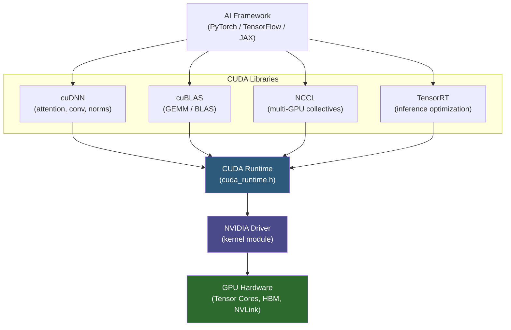

**Category:** GPU Infrastructure
**Difficulty:** Intermediate
**Reading time:** 6 min read

---

The CUDA Toolkit is NVIDIA's complete software platform for GPU programming — comprising the compiler (nvcc), runtime, debugger, profiler, and a suite of math libraries (cuBLAS, cuDNN, NCCL, TensorRT) that underpin virtually every production AI and HPC workload on NVIDIA hardware. Understanding the toolkit's components and versioning constraints is essential for building and maintaining GPU software stacks.

- **CUDA runtime** — the C/C++ API (`cuda_runtime.h`) that manages devices, streams, memory allocation, and kernel launches; what most GPU code calls directly
- **nvcc** — NVIDIA's CUDA compiler; compiles `.cu` files containing mixed host (C++) and device (GPU kernel) code into GPU PTX bytecode and host binaries
- **PTX (Parallel Thread Execution)** — NVIDIA's virtual ISA for GPUs; compiled JIT at runtime to the native ISA of the installed GPU, enabling forward compatibility
- **cuBLAS** — CUDA Basic Linear Algebra Subroutines; highly optimized GEMM (matrix multiply) implementation used by PyTorch and TensorFlow for dense layer compute
- **cuDNN** — CUDA Deep Neural Network library; provides optimized primitives for convolutions, attention, normalizations, and activation functions
- **NCCL (NVIDIA Collective Communications Library)** — implements all-reduce, broadcast, and scatter/gather across multiple GPUs using NVLink and InfiniBand
- **TensorRT** — inference optimization engine; takes trained models, applies layer fusion, precision calibration (INT8/FP8), and generates optimized execution plans

The CUDA toolkit is versioned independently of the NVIDIA GPU driver. A critical rule: the driver version must support the CUDA toolkit version, but is backward compatible — a driver supporting CUDA 12.4 can run code compiled for CUDA 11.8. The reverse is not true: code compiled for CUDA 12.4 will not run on a driver that only supports CUDA 11.x.

When a CUDA program launches, the runtime queries the installed GPU's compute capability (e.g., 9.0 for H100) and compiles the PTX bytecode to native SM instructions via the JIT compiler. This JIT step adds startup latency on first run; production deployments typically pre-compile to native code (`-gencode arch=compute_90,code=sm_90`) to eliminate it.

cuBLAS and cuDNN are the performance-critical libraries in AI workloads. When PyTorch performs a linear layer forward pass, it calls cuBLAS GEMM under the hood. cuDNN handles attention and convolution primitives. Both libraries are tuned per GPU generation — cuDNN 8.9 has H100-specific Tensor Core schedules that outperform generic GEMM by 30–50%.

NCCL uses CUDA streams and the GPU's Copy Engine to overlap all-reduce communication with compute. It automatically selects the fastest transport: NVLink for intra-node, InfiniBand RDMA for inter-node, or PCIe P2P as a fallback.

TensorRT's optimization pipeline takes an ONNX model, performs operator fusion (combining LayerNorm + GELU into one kernel), applies FP8 calibration, and generates an engine file — a GPU-specific binary with no Python or framework overhead at inference time.

- Building PyTorch from source targeting a specific CUDA version for a custom driver deployment
- Using TensorRT to convert a HuggingFace model to an optimized FP8 inference engine
- Profiling GPU kernels with Nsight Systems to identify which cuDNN operations dominate inference time
- Configuring NCCL environment variables (`NCCL_SOCKET_IFNAME`, `NCCL_IB_HCA`) for a new InfiniBand cluster
- Managing CUDA version compatibility in Docker images for multi-GPU training pipelines

| Advantage | Disadvantage |
|-----------|--------------|
| Mature ecosystem — 15+ years of optimization, tooling, and community knowledge | CUDA ties workloads to NVIDIA hardware — no cross-vendor portability |
| cuBLAS/cuDNN deliver near-theoretical-peak hardware utilization | CUDA, cuDNN, cuBLAS, and driver versions must all be compatible — complex dependency management |
| PTX enables forward compatibility across GPU generations | TensorRT engines are GPU-architecture-specific — must be regenerated per hardware generation |
| NCCL automatically selects optimal transport, reducing tuning burden | CUDA toolkit installation size is large (~5 GB) and adds complexity to container images |

- [GPU Optimized Operating Systems](gpu-optimized-operating-systems.md)
- [ROCm for AMD GPUs](rocm-for-amd-gpus.md)
- [GPU Driver Management and Updates](gpu-driver-management-and-updates.md)

---
*Part of the [GPU Infrastructure](index.md) category · [Back to Master Index](../../index.md)*
