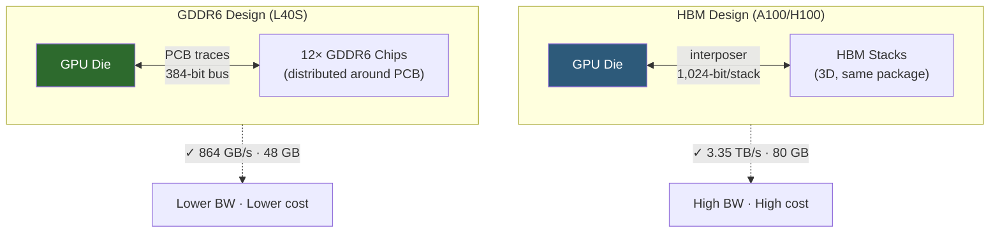

**Category:** GPU Infrastructure
**Difficulty:** Beginner
**Reading time:** 5 min read

---

GDDR (Graphics Double Data Rate) memory is the traditional discrete DRAM technology used in consumer and some professional GPUs, offering lower cost per GB than HBM at the expense of bandwidth and power efficiency. In datacenter contexts, GDDR6 and GDDR6X are found on inference-optimized GPUs like the NVIDIA L40S and A10G where HBM's bandwidth premium is not needed.

- **GDDR6** — the current mainstream GPU memory standard; operates at up to 16 Gbps per pin on a 384-bit bus, delivering ~768 GB/s peak bandwidth
- **GDDR6X** — NVIDIA's variant of GDDR6 using PAM4 signaling (4 voltage levels vs 2), doubling effective data rate to ~1 TB/s on high-end consumer GPUs
- **Memory bus width** — number of parallel data lines between GPU and DRAM chips; datacenter GPUs use 256–384-bit buses for GDDR6
- **VRAM capacity** — total GPU-accessible memory; GDDR6 datacenter cards range from 16 GB to 48 GB
- **ECC support** — GDDR6 supports ECC on datacenter SKUs via a dedicated ECC chip or inline error correction; adds ~12% memory overhead
- **Memory controller** — the GPU-side logic that manages GDDR6 channels, timing, and error correction; separate controllers per memory channel

GDDR6 chips are soldered directly onto the GPU PCB in banks, each chip attached to the GPU's memory controller via a dedicated 32-bit channel. An NVIDIA L40S uses twelve GDDR6 chips on a 384-bit bus, providing 864 GB/s bandwidth from a 48 GB pool.

Unlike HBM, GDDR6 chips don't require a silicon interposer — they connect via standard PCB traces. This keeps manufacturing costs low and allows GPU cards to be produced on standard PCB assembly lines rather than advanced packaging lines (CoWoS).

The bandwidth gap between GDDR6 and HBM3 is roughly 4×: GDDR6 at 864 GB/s vs HBM3 at 3.35 TB/s on H100. For workloads that are compute-bound rather than memory-bound (large batch inference, training with large matrices), this gap has limited real-world impact. For memory-bound workloads (small batch inference, attention over long contexts), GDDR6 GPUs are notably slower.

ECC on GDDR6 works differently than on HBM: corrections are made at the memory controller level, introducing a small latency penalty and reducing effective capacity by about 12% (48 GB becomes ~42 GB usable with ECC enabled). On HBM GPUs, ECC is integrated into the memory stack itself with lower overhead.

- Cost-effective inference serving where H100 bandwidth is overkill (small models, large batches)
- GPU-accelerated rendering and visualization with simultaneous AI inference (L40S)
- Edge AI servers and on-premises appliances where PCIe form factor and power are constrained
- Development and testing environments where per-GPU cost must be minimized
- Video transcoding clusters where NVENC/NVDEC usage dominates over memory bandwidth

| Advantage | Disadvantage |
|-----------|--------------|
| 3–5× lower cost per GB vs HBM | 4× lower bandwidth vs HBM3 on same-generation hardware |
| Standard PCB assembly — no exotic packaging required | Memory capacity ceiling ~48 GB, vs 192 GB on HBM-based cards |
| Widely available from multiple suppliers (Micron, Samsung, SK Hynix) | Higher power per bit of bandwidth transferred |
| Enables PCIe-slot-compatible GPU cards | Performance cliff on memory-bound inference workloads |

- [HBM High Bandwidth Memory Technology](hbm-high-bandwidth-memory-technology.md)
- [GPU Memory Bandwidth Importance](gpu-memory-bandwidth-importance.md)
- [NVIDIA L40S for AI Inference](nvidia-l40s-for-ai-inference.md)

---
*Part of the [GPU Infrastructure](index.md) category · [Back to Master Index](../../index.md)*
