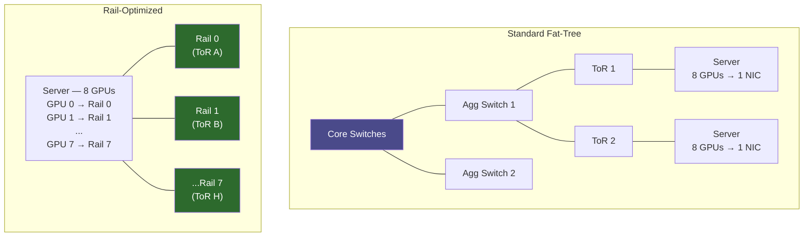

**Category:** GPU Infrastructure
**Difficulty:** Advanced
**Reading time:** 7 min read

---

GPU cluster networking topology defines how compute nodes communicate during distributed training and inference — specifically how gradient synchronization, activations, and attention KV-cache are exchanged. The topology choice (fat-tree, dragonfly, rail-optimized) determines all-reduce latency, bisection bandwidth, and therefore the maximum Model FLOP Utilization (MFU) achievable at scale.

- **All-reduce** — a collective operation where each GPU's gradient tensor is summed across all GPUs, with the result returned to all; the dominant inter-node communication pattern in distributed training
- **Bisection bandwidth** — the bandwidth available between any two halves of a network; determines worst-case inter-pod communication
- **Fat-tree topology** — a multi-tier Clos network where every switch level doubles bandwidth; guarantees non-blocking bandwidth between any two endpoints when fully subscribed
- **Dragonfly topology** — a two-level network (local groups connected by all-to-all inter-group links); fewer switches than fat-tree at the cost of being traffic-pattern-dependent
- **Rail-optimized topology** — each GPU in a server connects to a different top-of-rack switch "rail"; all-reduce traffic is spread across all rails simultaneously, maximizing bandwidth utilization
- **InfiniBand HDR/NDR** — NVIDIA's high-performance fabric standard; HDR at 200 Gb/s, NDR at 400 Gb/s per port; the dominant interconnect for large AI training clusters
- **ECMP (Equal-Cost Multi-Path)** — network load balancing distributing flows across multiple equal-cost paths; required for non-blocking fabric utilization

In a standard fat-tree AI cluster, servers connect to ToR (top-of-rack) switches at the access layer. ToR switches connect upward to aggregation switches, which connect to core switches. A non-blocking fat-tree provides full bisection bandwidth — any server can communicate with any other at line rate.

Rail-optimized topology improves on standard fat-tree for GPU workloads. In an 8-GPU server, each GPU connects to a different ToR switch rail (8 separate ToR switches per rack). When an all-reduce runs, each GPU sends to a different switch simultaneously — spreading the bandwidth load across all 8 rails at once, rather than all traffic funneling through one ToR switch.

For ring-allreduce across N nodes, each node sends N-1 chunks. With rail optimization, chunks from GPU 0 go on rail 0, GPU 1 on rail 1, etc. — achieving near-linear scaling of effective bandwidth with GPU count per server.

NVLink Network (H100) extends this further: within a 32-server pod, all 256 H100s share a flat NVLink domain, running all-reduce at NVLink speeds (900 GB/s) without using InfiniBand at all. InfiniBand is then used only for inter-pod communication at larger scales.

Network congestion control (PFC + DCQCN for RoCE, or IB's built-in credit flow control) prevents drops that would cause NCCL all-reduce retries — retry storms can reduce effective MFU from 50% to under 20%.

- Sizing InfiniBand fabric for a 512-GPU training cluster to achieve target MFU
- Designing rail-optimized cabling for 8-GPU servers to maximize NCCL all-reduce bandwidth
- Evaluating dragonfly vs fat-tree for a new 1,000-node GPU cluster based on traffic patterns
- Diagnosing low MFU caused by network congestion or hot-spot switch ports
- Planning NVLink Network pod boundaries for H100 clusters to minimize InfiniBand dependency

| Advantage (fat-tree)                                                   | Disadvantage                                                                           |
| ---------------------------------------------------------------------- | -------------------------------------------------------------------------------------- |
| Non-blocking bandwidth between any two nodes                           | High switch port count = significant CapEx for large clusters                          |
| Well-understood topology with mature routing and monitoring tools      | Oversubscription at aggregation layers if budget-constrained                           |
| Rail optimization gives near-linear bandwidth scaling per server       | Rail cabling is complex — each GPU's NIC must connect to a specific switch             |
| InfiniBand NDR (400 Gb/s) provides headroom for next-gen GPU bandwidth | Congestion from one misconfigured flow can degrade cluster-wide all-reduce performance |

- [InfiniBand for GPU Interconnect](infiniband-for-gpu-interconnect.md)
- [NVLink Interconnect Technology](nvlink-interconnect-technology.md)
- [GPU Direct RDMA for Networking](gpu-direct-rdma-for-networking.md)

---
*Part of the [GPU Infrastructure](index.md) category · [Back to Master Index](../../index.md)*
