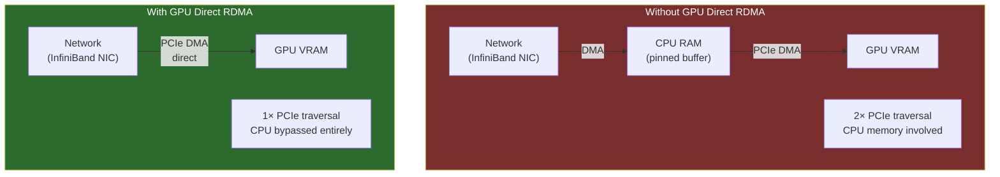

**Category:** GPU Infrastructure
**Difficulty:** Advanced
**Reading time:** 6 min read

---

GPU Direct RDMA (Remote Direct Memory Access) enables network cards and storage controllers to transfer data directly into GPU memory, bypassing CPU RAM and its associated copy overhead. In large GPU clusters, this technology is the difference between network bandwidth being useful for ML workloads and being wasted on CPU-mediated copies.

- **RDMA (Remote Direct Memory Access)** — a networking technique allowing one computer to read/write another's memory without involving either CPU's operating system
- **GPU Direct RDMA** — NVIDIA's extension of RDMA to allow NIC/HCA-to-GPU-VRAM transfers on the same PCIe bus, bypassing CPU memory
- **GPUDirect Storage** — similar technology for NVMe drives: data flows directly from SSD to GPU VRAM without staging in CPU RAM
- **HCA (Host Channel Adapter)** — an InfiniBand or RoCE network card with RDMA capability (e.g., NVIDIA ConnectX-7)
- **Pinned memory** — host CPU memory that is page-locked and registered for DMA, required as a staging buffer when GPU Direct RDMA is not available
- **Zero-copy** — transferring data without any intermediate copies, reducing latency and CPU utilization
- **RoCE (RDMA over Converged Ethernet)** — RDMA running over Ethernet rather than InfiniBand, using PFC flow control to prevent packet drops

Without GPU Direct RDMA, network-to-GPU data flow requires two copies: NIC → CPU pinned memory (via DMA), then CPU pinned memory → GPU VRAM (via PCIe DMA). This doubles PCIe bandwidth consumption and adds latency from the intermediate buffer management.

With GPU Direct RDMA enabled, the NIC and GPU negotiate a shared PCIe address mapping. When a packet arrives at the NIC destined for GPU memory, the NIC's DMA engine writes directly into the GPU's BAR (Base Address Register) memory space over the PCIe bus. The CPU and its memory are not involved in the data path.

The prerequisite is that both the NIC and GPU are on the same PCIe root complex (ideally connected to the same CPU socket's PCIe lanes). Cross-NUMA transfers still work but traverse additional fabric, increasing latency.

In practice, GPU Direct RDMA is enabled through the `nvidia-peermem` kernel module (for InfiniBand) or the `nv_peer_mem` equivalent for RoCE. NCCL (NVIDIA's collective communications library) automatically detects GPU Direct RDMA availability and uses it for inter-node all-reduce operations.

For distributed training on 8+ nodes, the difference is substantial: without GPU Direct RDMA, gradient exchange at 200 Gb/s InfiniBand would saturate CPU memory bandwidth; with it, gradient tensors flow directly from GPU memory to the network and back.

- Multi-node distributed training where inter-node gradient synchronization is the bottleneck
- High-frequency inference serving where model inputs arrive faster than CPU-staged copies can handle
- GPUDirect Storage for streaming training datasets from NVMe directly into GPU memory
- NCCL all-reduce across multiple nodes on InfiniBand or RoCE fabric
- Real-time data acquisition (sensors, cameras) streaming directly into GPU for processing

| Advantage | Disadvantage |
|-----------|--------------|
| Eliminates CPU memory copy bottleneck for network-to-GPU transfers | Requires GPU and NIC on the same PCIe root complex for optimal performance |
| Reduces CPU utilization for data movement, freeing cores for preprocessing | `nvidia-peermem` kernel module adds complexity to driver management |
| Enables full utilization of 200–400 Gb/s InfiniBand bandwidth in GPU workloads | Not all Ethernet NICs support RoCE — requires specific hardware |
| GPU Direct Storage removes staging buffer overhead for dataset loading | Debugging RDMA path failures is significantly more complex than standard networking |

- [InfiniBand for GPU Interconnect](infiniband-for-gpu-interconnect.md)
- [GPU PCIe Lanes and Bandwidth](gpu-pcie-lanes-and-bandwidth.md)
- [GPU Cluster Networking Topology](gpu-cluster-networking-topology.md)

---
*Part of the [GPU Infrastructure](index.md) category · [Back to Master Index](../../index.md)*
