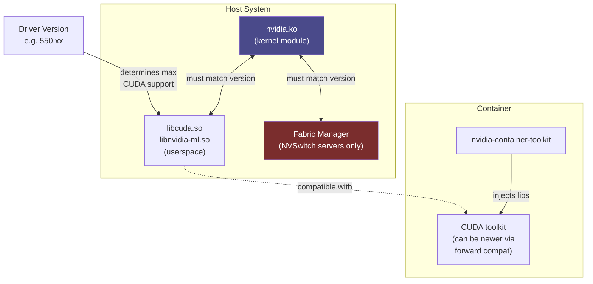

**Category:** GPU Infrastructure
**Difficulty:** Intermediate
**Reading time:** 6 min read

---

GPU driver management in production datacenters is a critical operational discipline — a mismatched driver version can silently degrade performance, break CUDA compatibility, or cause entire training jobs to fail. Managing driver updates across hundreds of nodes requires automated tooling, staged rollouts, and clear version pinning strategies.

- **Driver branch** — NVIDIA releases drivers on multiple branches: Production (stable, infrequent updates), New Feature (frequent, less tested), and Data Center Driver (NVIDIA Data Center Driver / NVSDC for enterprise support)
- **Driver vs CUDA toolkit version** — the installed driver determines the maximum CUDA version supported; CUDA applications compiled for older versions run on newer drivers (backward compatible), but not the reverse
- **DKMS (Dynamic Kernel Module Support)** — Linux mechanism that automatically rebuilds the NVIDIA kernel module when the Linux kernel is updated, preventing driver breakage after OS kernel upgrades
- **Fabric Manager** — NVIDIA service required on multi-GPU NVLink servers (DGX/HGX); manages NVSwitch fabric initialization; must be version-matched to the driver
- **nvidia-smi** — NVIDIA's system management CLI; reports driver version, GPU status, power, temperature, and active processes; the first tool reached for driver diagnostics
- **Driver persistence daemon** — `nvidia-persistenced` keeps the driver initialized between workloads, reducing GPU initialization latency from ~500ms to <10ms
- **Secure Boot** — UEFI feature that validates kernel modules with signatures; NVIDIA's driver must be enrolled or signed for Secure Boot-enabled systems

NVIDIA GPU drivers consist of two components: a kernel module (`nvidia.ko`) that interfaces with the GPU hardware, and userspace libraries (`libcuda.so`, `libnvidia-ml.so`) that applications link against. The kernel module version must match the userspace library version exactly — mixing versions from different driver releases causes immediate failures.

In production clusters, driver updates follow a three-stage pattern: lab validation (test the new driver against the production workload suite on 2–4 nodes), canary deployment (roll to 5–10% of nodes and monitor for GPU errors, performance regressions, or job failures), then full rollout via configuration management (Ansible, Chef, or Puppet).

DKMS is essential: without it, a routine OS kernel security update will break the NVIDIA kernel module (because the module was compiled against the old kernel headers). With DKMS, the module is automatically rebuilt against the new kernel version as part of the kernel update process.

On NVSwitch-based HGX systems, the NVIDIA Fabric Manager must be updated simultaneously with the driver — they are version-locked. Failing to update Fabric Manager after a driver update causes NVLink initialization failures, silently preventing multi-GPU NVLink communication.

Container-based GPU clusters (Kubernetes with nvidia-container-toolkit) add another version dependency: the container toolkit version must be compatible with the host driver. The CUDA toolkit inside containers can be newer than the host driver's CUDA support ceiling — this is the "CUDA forward compatibility" feature.

- Planning a driver rollout across a 500-node GPU cluster with zero-downtime update strategy
- Diagnosing training failures caused by mismatched driver and Fabric Manager versions on HGX servers
- Configuring DKMS to prevent driver breakage from automated kernel security updates
- Pinning driver versions in immutable OS images (Golden AMI pattern) for cloud GPU fleets
- Enabling CUDA forward compatibility to run CUDA 12.x applications on nodes with older drivers

| Advantage (driver version pinning) | Disadvantage |
|-----------|--------------|
| Reproducible, tested environment — no surprise behavioral changes | Pinned versions accumulate security vulnerabilities over time |
| Driver version consistency eliminates cross-node variation in training runs | New GPU hardware often requires newer drivers — pinning blocks hardware expansion |
| Staged rollouts catch driver regressions before cluster-wide impact | Manual driver management across large fleets requires robust automation |
| Immutable OS images guarantee driver consistency across node replacements | DKMS adds kernel-module rebuild time to OS update operations |

- [GPU Firmware Updates](gpu-firmware-updates.md)
- [GPU Monitoring and Telemetry](gpu-monitoring-and-telemetry.md)
- [GPU Optimized Operating Systems](gpu-optimized-operating-systems.md)

---
*Part of the [GPU Infrastructure](index.md) category · [Back to Master Index](../../index.md)*
