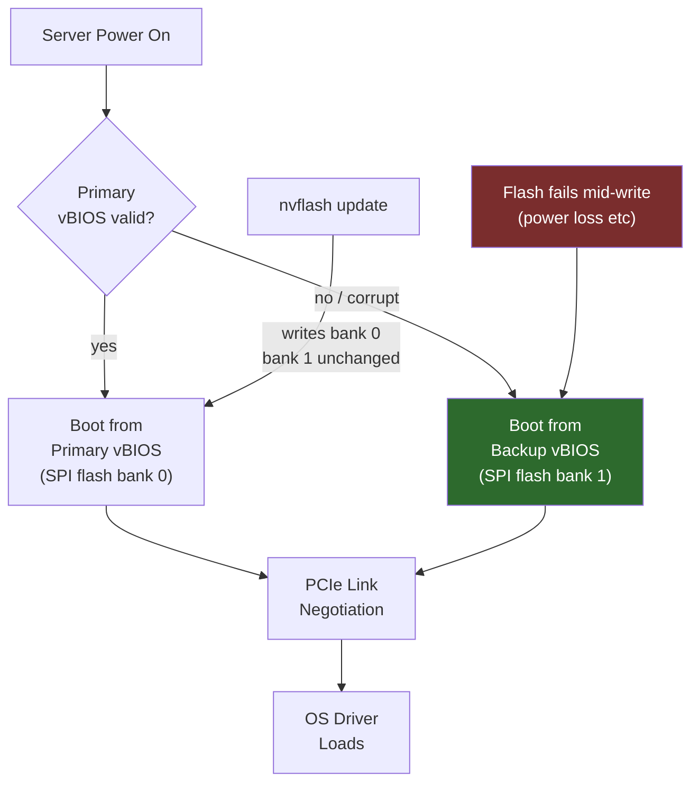

**Category:** GPU Infrastructure
**Difficulty:** Intermediate
**Reading time:** 5 min read

---

GPU firmware (also called InfoROM, vBIOS, or GPC firmware) controls low-level hardware behavior including power management, thermal thresholds, clock tables, and PCIe link negotiation. Firmware updates in production GPU clusters are less frequent than driver updates but carry higher risk — a failed firmware flash can brick a GPU card.

- **vBIOS (Video BIOS)** — the firmware stored in flash memory on the GPU card; controls hardware initialization, clock tables, power limits, and PCIe configuration before the OS driver loads
- **InfoROM** — a small on-board EEPROM on NVIDIA datacenter GPUs storing operational data: error counts, power history, thermal events, and ECC statistics across the GPU's lifetime
- **GPC firmware** — sub-component firmware for individual Graphics Processing Clusters; updated as part of the GPU driver package on modern NVIDIA cards (not flashed separately)
- **SBIOS compatibility** — server BIOS versions must be compatible with GPU vBIOS versions; mismatches can prevent PCIe link negotiation from completing
- **Secure firmware** — modern datacenter GPU firmware (H100+) is cryptographically signed; unsigned firmware is rejected by the hardware, preventing unauthorized modification
- **FGS (Firmware Generation Signature)** — NVIDIA's versioning scheme for vBIOS; major version changes indicate non-backward-compatible hardware behavior changes

GPU vBIOS is stored in a dedicated SPI flash chip on the GPU PCB. At server power-on, the server BIOS enumerates PCIe devices and executes the GPU's option ROM (stored in vBIOS), which initializes the GPU to a state where the OS driver can take over.

NVIDIA provides vBIOS updates via the `nvflash` utility (for Linux) and through OEM-specific firmware update tools (Dell UEFI firmware updater, HPE Smart Update Manager). The update process reads the current vBIOS, validates the new image's compatibility, erases the SPI flash, and writes the new image — a process that takes 30–120 seconds per GPU.

Modern NVIDIA datacenter GPUs (A100, H100) include a backup vBIOS partition: if the primary partition is corrupted during a failed flash, the GPU boots from the backup, allowing recovery without physical hardware replacement. Consumer GPUs lack this safety net.

Firmware updates are typically needed when:
1. A new vBIOS version fixes a thermal or power management bug causing throttling
2. A server BIOS update requires a new GPU vBIOS version for PCIe compatibility
3. A security vulnerability in the GPU firmware requires patching
4. MIG configuration behavior changes require a vBIOS update (rare)

InfoROM updates are separate: `nvidia-smi --fieldmon` reports InfoROM version; updates are bundled with driver packages and applied automatically when the driver detects a mismatch.

- Applying a vBIOS update that fixes an H100 thermal throttling bug in specific server chassis
- Recovering a GPU from a corrupted primary vBIOS partition using the backup partition via nvflash
- Updating InfoROM after a GPU is moved to a new server to reset operational logs
- Validating vBIOS versions as part of a new server acceptance testing procedure
- Coordinating GPU firmware and server BIOS updates during a planned maintenance window

| Advantage | Disadvantage |
|-----------|--------------|
| Dual-partition vBIOS prevents bricking on most datacenter GPUs | Failed flash on single-partition GPUs requires physical RMA |
| Firmware fixes can resolve performance issues without hardware replacement | Firmware updates require GPU to be offline (no active workloads) |
| Signed firmware prevents unauthorized modification of GPU behavior | nvflash requires root access and direct GPU access — complex in containerized environments |
| InfoROM preserves lifetime operational history for warranty and diagnostics | Firmware versions must be coordinated with server BIOS versions — adds change management complexity |

- [GPU Driver Management and Updates](gpu-driver-management-and-updates.md)
- [GPU Monitoring and Telemetry](gpu-monitoring-and-telemetry.md)
- [GPU Thermal Management Solutions](gpu-thermal-management-solutions.md)

---
*Part of the [GPU Infrastructure](index.md) category · [Back to Master Index](../../index.md)*
