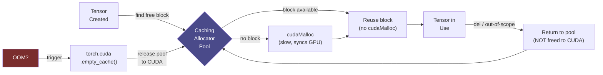

**Category:** GPU Infrastructure
**Difficulty:** Intermediate
**Reading time:** 6 min read

---

Efficient GPU memory allocation determines whether a model fits on available hardware, how many concurrent requests an inference server can handle, and whether training runs OOM (out of memory) mid-epoch. Understanding PyTorch's caching allocator, activation checkpointing, and KV-cache management is essential for running large models efficiently.

- **PyTorch caching allocator** — PyTorch's GPU memory manager that pools and reuses CUDA allocations to avoid expensive `cudaMalloc` calls on the critical path
- **Memory fragmentation** — gaps in the GPU memory pool caused by variable-size tensor allocations and deallocations; can prevent large contiguous allocations even when total free memory is sufficient
- **Activation checkpointing (gradient checkpointing)** — trading compute for memory by discarding activations after the forward pass and recomputing them during backward, reducing peak memory by 30–60%
- **KV cache** — in LLM inference, the key-value attention cache stores past token representations to avoid recomputation; dominates GPU memory usage at large batch sizes or long contexts
- **Paged attention** — manages KV cache in non-contiguous memory pages (like OS virtual memory), eliminating KV cache fragmentation in variable-length sequence batching
- **Tensor parallelism memory split** — distributing model weights across multiple GPUs, with each holding a shard; halves per-GPU memory at the cost of inter-GPU communication per layer
- **CUDA memory pool** — pre-allocated blocks of CUDA memory that avoid per-allocation overhead; configurable via `PYTORCH_CUDA_ALLOC_CONF`

PyTorch allocates GPU tensors through its CachingAllocator, which maintains a pool of free CUDA memory blocks. When a tensor is created, the allocator finds the best-fit free block rather than calling `cudaMalloc` (which synchronizes the GPU). When a tensor is freed, the block returns to the pool rather than being released to CUDA.

This design means `torch.cuda.memory_reserved()` grows throughout training and rarely shrinks — PyTorch holds memory speculatively to avoid future `cudaMalloc` overhead. The actual memory consumed by live tensors is `torch.cuda.memory_allocated()`.

For training, peak memory occurs during the backward pass when both the forward activations and gradients must coexist. A 7B parameter model in BF16 requires ~14 GB for weights, ~56 GB for Adam optimizer states, and 5–20 GB for activations depending on batch size and sequence length. Activation checkpointing reduces activation memory to ~2 GB by recomputing rather than storing intermediates.

For inference, KV cache memory scales with batch size × sequence length × layers × 2 (K+V) × precision. At batch size 32, sequence length 4096, and 32 layers in BF16, KV cache consumes ~8 GB per request — quickly overwhelming available memory at scale. vLLM's paged attention solves this by managing KV cache as OS-style memory pages, reducing fragmentation waste from ~30% to ~3%.

- Fitting a 70B model onto an 80 GB GPU using quantization (FP8 or INT4) + optimizer memory offloading
- Configuring PyTorch `PYTORCH_CUDA_ALLOC_CONF=max_split_size_mb` to reduce fragmentation in training runs
- Choosing tensor vs pipeline parallelism based on GPU memory capacity vs inter-GPU bandwidth
- Sizing vLLM KV cache reservations for a given maximum batch size and context length
- Debugging CUDA OOM errors by profiling memory timeline with `torch.cuda.memory_snapshot()`

| Advantage | Disadvantage |
|-----------|--------------|
| Caching allocator eliminates per-step `cudaMalloc` overhead | Reserved memory grows until process exit — looks like a leak in monitoring |
| Activation checkpointing halves training memory at ~20% compute cost | Activation checkpointing increases training time — profiling needed to confirm it's worthwhile |
| KV cache paging (vLLM) reduces inference memory waste by 10× | Paged attention implementation is inference-server-specific — not built into vanilla HuggingFace |
| Tensor parallelism enables models larger than any single GPU's VRAM | Tensor parallelism requires all-reduce per transformer layer — latency penalty on slow interconnects |

- [GPU Memory Bandwidth Importance](gpu-memory-bandwidth-importance.md)
- [GPU Partitioning and MIG](gpu-partitioning-and-mig.md)
- [CUDA Toolkit and Libraries](cuda-toolkit-and-libraries.md)

---
*Part of the [GPU Infrastructure](index.md) category · [Back to Master Index](../../index.md)*
