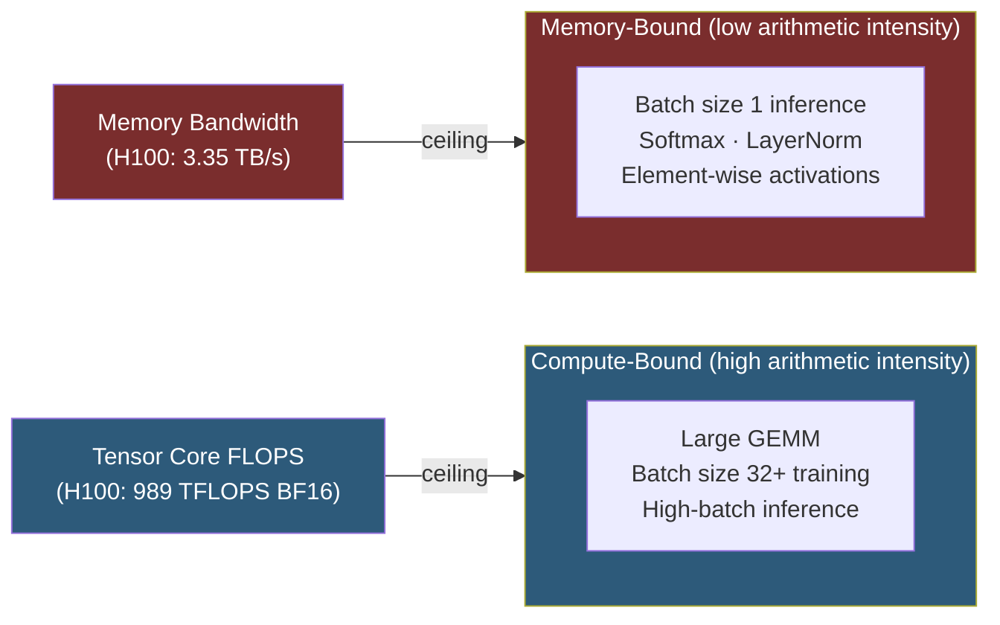

**Category:** GPU Infrastructure
**Difficulty:** Intermediate
**Reading time:** 6 min read

---

Memory bandwidth — the rate at which data can be read from or written to GPU memory — is often the primary performance bottleneck in AI inference and many HPC workloads, even when a GPU has abundant compute throughput. Understanding the arithmetic intensity of a workload determines whether it is compute-bound or memory-bound, and therefore which GPU specification matters most.

- **Memory bandwidth** — the peak data transfer rate between GPU DRAM and the shader cores, measured in TB/s (e.g., H100 SXM = 3.35 TB/s)
- **Arithmetic intensity** — the ratio of floating-point operations to bytes accessed; measured in FLOP/byte. High arithmetic intensity = compute-bound; low = memory-bound
- **Roofline model** — a visual performance model plotting achievable FLOPS against arithmetic intensity; the "roof" shows where compute or memory bandwidth becomes the ceiling
- **Memory-bound operation** — an operation where GPU cores finish computing faster than data can be loaded from DRAM (e.g., element-wise activation functions, attention softmax)
- **Compute-bound operation** — an operation where DRAM delivers data faster than cores can process it (e.g., large matrix multiplications at high batch size)
- **Bandwidth utilization** — percentage of peak theoretical bandwidth actually achieved; well-optimized kernels reach 70–90% of peak
- **Flash Attention** — an algorithm that restructures attention computation to minimize DRAM reads/writes by keeping intermediates in SRAM, converting a memory-bound operation to a compute-bound one

Modern transformer inference at batch size 1 (single-user latency mode) is almost entirely memory-bandwidth-limited. Each token generation requires loading model weights from DRAM into compute units — for a 70B-parameter FP16 model, that is ~140 GB transferred per forward pass. At 3.35 TB/s (H100), that theoretical minimum is ~42ms per token; at 2.0 TB/s (A100), ~70ms. The GPU's TFLOPS rating is largely irrelevant here because cores are idle waiting for data.

As batch size increases, the same weights are reused across multiple samples in a single pass, amortizing the memory transfer cost. At batch size 32+, attention and FFN layers become compute-bound, and TFLOPS becomes the limiting factor. This is why inference optimization involves finding the batch size sweet spot or techniques like continuous batching that maximize GPU utilization.

Memory bandwidth also governs optimizer throughput during training. Gradient updates require reading and writing all model parameters every step — at 140 GB for a 70B model, this alone consumes significant bandwidth budget.

The Flash Attention algorithm demonstrates how algorithmic redesign can overcome memory limits: by fusing the Q×K and softmax×V operations and tiling them to fit in SRAM, it avoids materializing the full attention matrix in DRAM — reducing memory reads by 5–20× for long sequence lengths.

- Choosing between GPU SKUs for inference serving (bandwidth often matters more than TFLOPS)
- Diagnosing why a model runs slower than expected despite high GPU utilization
- Deciding whether FP8 quantization helps (reduces memory footprint → higher effective bandwidth)
- Benchmarking memory-bandwidth utilization of custom CUDA kernels using Nsight Systems
- Evaluating HBM3 vs HBM2e upgrades for memory-bound production workloads

| Advantage (high bandwidth GPU) | Disadvantage |
|-----------|--------------|
| Direct throughput improvement for inference at small batch sizes | HBM memory is expensive — premium over GDDR6 adds $5,000–$15,000 per card |
| Enables longer context windows without proportional latency increase | Bandwidth alone doesn't help compute-bound training workloads |
| Reduces time-to-first-token in autoregressive generation | Bandwidth improvements per generation are slower than TFLOPS improvements |
| Flash Attention amplifies bandwidth advantage through algorithmic efficiency | Software must be specifically optimized to achieve near-peak bandwidth |

- [HBM High Bandwidth Memory Technology](hbm-high-bandwidth-memory-technology.md)
- [GPU Memory Allocation Strategies](gpu-memory-allocation-strategies.md)
- [NVIDIA A100 Tensor Core Architecture](nvidia-a100-tensor-core-architecture.md)

---
*Part of the [GPU Infrastructure](index.md) category · [Back to Master Index](../../index.md)*
