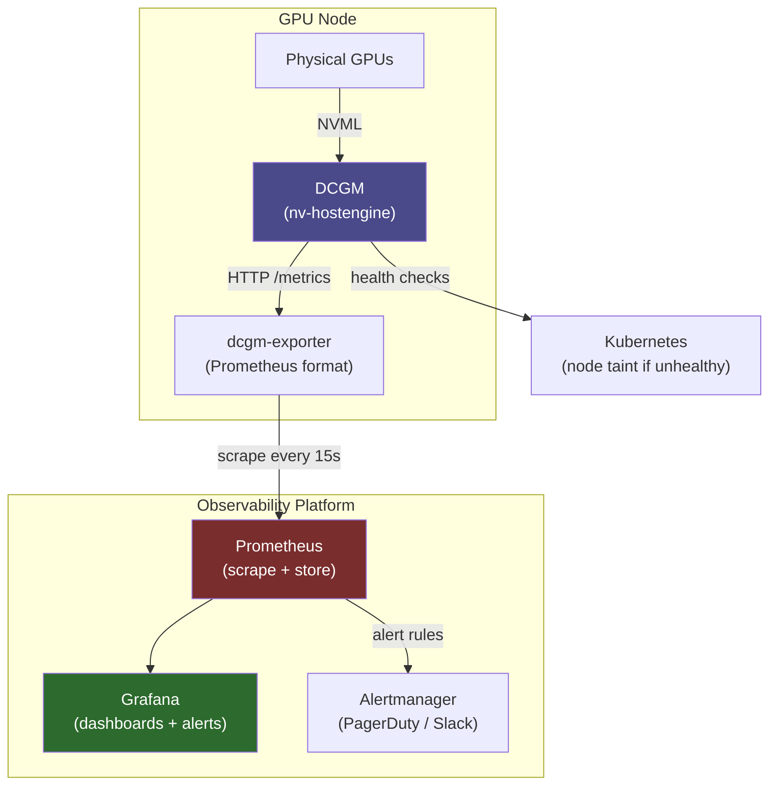

**Category:** GPU Infrastructure
**Difficulty:** Intermediate
**Reading time:** 6 min read

---

GPU monitoring provides real-time and historical visibility into GPU health, utilization, power consumption, and error rates — enabling proactive fault detection, performance debugging, and capacity planning. In production AI clusters, GPU telemetry is as operationally critical as CPU and network monitoring, and requires purpose-built tooling beyond standard infrastructure monitoring stacks.

- **DCGM (Data Center GPU Manager)** — NVIDIA's agent for GPU telemetry collection, health checks, and diagnostics; the standard monitoring foundation for production NVIDIA GPU clusters
- **nvidia-smi** — NVIDIA's CLI for querying GPU state; suitable for ad-hoc inspection but not for continuous telemetry collection at scale
- **GPU utilization** — percentage of time at least one CUDA kernel is executing on the GPU; a misleading metric because 99% utilization can still mean low MFU if kernels are memory-bound
- **SM Activity / SM Occupancy** — finer-grained utilization metrics: SM Activity is the fraction of SMs running kernels; SM Occupancy is active warps as a fraction of maximum warps
- **XID error** — NVIDIA's GPU error classification system; XID codes in `/var/log/syslog` or `dmesg` identify specific hardware faults (e.g., XID 63 = row remapping, XID 79 = GPU assert)
- **ECC error counters** — counts of single-bit corrected (SBE) and double-bit uncorrectable (DBE) memory errors reported per GPU; rising SBE counts predict DBE failures
- **NVML (NVIDIA Management Library)** — the C library underlying `nvidia-smi` and DCGM; enables programmatic GPU metric collection in custom monitoring agents

DCGM runs as a systemd service (`nv-hostengine`) on each GPU node. It continuously samples GPU metrics via NVML and exposes them via a local socket. The `dcgmi` CLI allows field-level queries; `dcgm-exporter` provides a Prometheus-compatible HTTP endpoint that scrapes DCGM metrics, enabling integration with standard Prometheus/Grafana stacks.

Key metrics to track in production:
- `DCGM_FI_DEV_GPU_UTIL` — GPU utilization (%)
- `DCGM_FI_DEV_POWER_USAGE` — real-time power draw (W)
- `DCGM_FI_DEV_GPU_TEMP` — GPU die temperature (°C)
- `DCGM_FI_DEV_ECC_SBE_VOL_TOTAL` — volatile single-bit ECC errors since last reset
- `DCGM_FI_DEV_XID_ERRORS` — XID error count; non-zero warrants investigation
- `DCGM_FI_PROF_SM_ACTIVE` — fraction of SMs executing kernels (requires DCGM profiling mode)

DCGM's health checks go beyond metrics: `dcgmi health -g 1 -c` runs GPU diagnostic tests (PCIe bandwidth, memory stress, NVLink loopback) that catch hardware degradation not visible in normal operation.

For training clusters, MFU (Model FLOP Utilization) is the operational metric that actually matters: actual training FLOPS ÷ theoretical peak FLOPS. Healthy H100 training runs achieve 35–55% MFU; below 30% signals a bottleneck worth investigating. MFU is computed from training logs (tokens/second, batch size, model FLOPs), not directly from DCGM.

Alert thresholds for production GPU clusters:
- GPU temperature > 80°C: investigate cooling
- ECC DBE errors > 0: page-retire affected memory or replace card
- XID 79 (GPU assert): indicates software bug or hardware fault — restart job and investigate
- Power draw > TDP: driver or firmware misconfiguration

- Building a Prometheus/Grafana GPU dashboard for a training cluster using dcgm-exporter
- Setting up DCGM health checks to automatically drain faulty GPU nodes from a Kubernetes cluster
- Investigating why training throughput dropped by 20% using SM Activity and memory bandwidth metrics
- Tracking ECC SBE error trends to predict GPU memory failure before data corruption occurs
- Generating GPU utilization reports for chargeback in a shared research cluster

| Advantage | Disadvantage |
|-----------|--------------|
| DCGM provides production-grade GPU diagnostics beyond simple utilization | DCGM profiling mode (SM Activity, tensor utilization) adds ~1% GPU overhead |
| Prometheus integration fits GPU metrics into existing monitoring infrastructure | XID error interpretation requires NVIDIA documentation — codes are not self-documenting |
| ECC counters enable predictive replacement before data corruption occurs | GPU utilization % is a poor proxy for efficiency — SM Activity and MFU are harder to collect |
| NVML API allows custom monitoring agents for specialized metric combinations | DCGM version must track NVIDIA driver version — adds operational dependency |

- [GPU Driver Management and Updates](gpu-driver-management-and-updates.md)
- [GPU Thermal Management Solutions](gpu-thermal-management-solutions.md)
- [GPU Power Consumption Optimization](gpu-power-consumption-optimization.md)

---
*Part of the [GPU Infrastructure](index.md) category · [Back to Master Index](../../index.md)*
