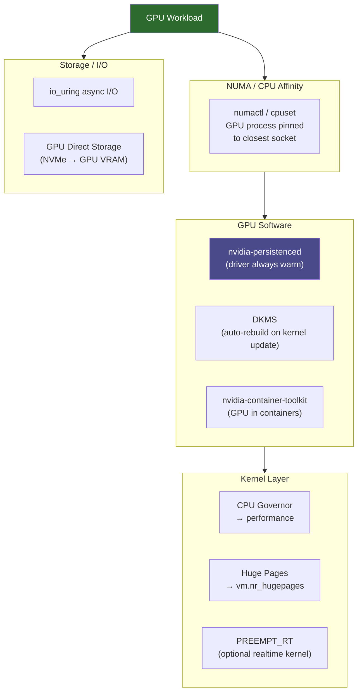

**Category:** GPU Infrastructure
**Difficulty:** Intermediate
**Reading time:** 6 min read

---

GPU-optimized operating systems are Linux distributions or configurations that minimize host CPU overhead, reduce kernel scheduling jitter, and pre-integrate GPU drivers and compute libraries to maximize GPU utilization in production datacenter environments. The OS layer is often overlooked but has measurable impact on MFU (Model FLOP Utilization) in large training clusters.

- **Realtime kernel** — a Linux kernel patched with PREEMPT_RT to bound scheduling latency; reduces jitter in GPU communication operations that depend on precise CPU timing
- **Huge pages** — 2 MB or 1 GB memory pages (vs 4 KB default) that reduce TLB pressure when GPU drivers pin large host memory buffers for DMA
- **NUMA pinning** — binding GPU processes to CPU cores that are topologically closest (same NUMA node) to the GPU's PCIe connection, reducing memory access latency
- **CPU governor** — Linux power management setting; `performance` governor keeps CPU clocks at maximum, preventing frequency scaling from adding latency to GPU launch overhead
- **IOMMU bypass** — disabling IOMMU for trusted GPU workloads removes address translation overhead from DMA operations (sacrifices isolation for performance)
- **DCGM (Data Center GPU Manager)** — NVIDIA's agent for GPU health monitoring, telemetry collection, and diagnostics; designed for always-on datacenter deployment
- **Container runtime (nvidia-container-toolkit)** — allows Docker/containerd/Kubernetes to expose GPU devices inside containers without running as root

A default Ubuntu Server installation works with NVIDIA GPUs but leaves performance on the table. A GPU-optimized baseline starts with kernel tuning: setting `intel_pstate=disable` and the `performance` CPU governor ensures GPU kernel launches from the CPU are not delayed by frequency ramp-up, which can add 50–200 μs per launch.

Huge page configuration (`vm.nr_hugepages`) pre-allocates 2 MB pages for GPU driver pinned memory. When CUDA registers host memory for DMA, the kernel walks page tables to pin each 4 KB page — at scale, this is thousands of page walks per buffer. Pre-allocated huge pages reduce this to a handful of 2 MB mappings.

NUMA affinity is configured via `numactl` or cgroup cpuset policies. An 8-GPU server typically has four GPUs per CPU socket; running GPU 0's process with affinity to socket 0's CPUs prevents cross-socket memory accesses that add ~50 ns of latency to every CUDA API call.

For the storage stack, GPU-optimized systems enable `io_uring` for async I/O and configure NVMe queues to match the number of CPU cores used for data loading — preventing I/O queue saturation that causes training data pipeline stalls.

Container environments add the `nvidia-container-toolkit`, which intercepts container runtime hooks to inject GPU device files and CUDA libraries into containers. This allows GPU workloads to run in Kubernetes pods without privileged mode.

- Tuning a bare-metal training cluster OS to maximize MFU for LLM pre-training
- Configuring GPU inference servers to minimize latency jitter for SLA-bound APIs
- Building a Kubernetes node image for GPU workloads with pre-installed drivers and container runtime
- Diagnosing unexplained GPU performance variance between nominally identical nodes
- Setting up DCGM agents for GPU health monitoring in a Prometheus/Grafana observability stack

| Advantage | Disadvantage |
|-----------|--------------|
| CPU governor and NUMA tuning can improve MFU by 2–5% at no hardware cost | OS tuning is node-specific — must be reproduced across every cluster node consistently |
| Realtime kernel reduces NCCL collective jitter in latency-sensitive clusters | PREEMPT_RT kernel is not in mainline distributions — requires custom kernel builds |
| Huge pages reduce GPU driver DMA setup overhead for large training jobs | Huge page pre-allocation reduces OS memory available for other purposes |
| Container runtime enables secure multi-tenant GPU access without root | Container toolkit versioning must track NVIDIA driver versions exactly |

- [GPU Driver Management and Updates](gpu-driver-management-and-updates.md)
- [GPU Monitoring and Telemetry](gpu-monitoring-and-telemetry.md)
- [CUDA Toolkit and Libraries](cuda-toolkit-and-libraries.md)

---
*Part of the [GPU Infrastructure](index.md) category · [Back to Master Index](../../index.md)*
