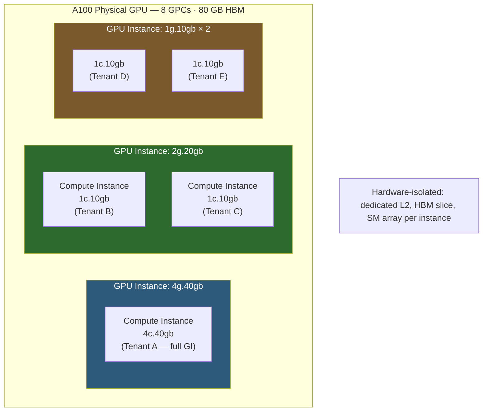

**Category:** GPU Infrastructure
**Difficulty:** Advanced
**Reading time:** 7 min read

---

MIG (Multi-Instance GPU), introduced with the NVIDIA A100, allows a single physical GPU to be partitioned at the hardware level into up to seven isolated compute instances, each with dedicated memory, compute, and cache resources. Unlike software-based time-slicing, MIG enforces isolation through microarchitecture-level hardware barriers — making it suitable for multi-tenant cloud environments.

- **GPC (Graphics Processing Cluster)** — the top-level compute partition unit in NVIDIA GPUs; A100 has eight GPCs, H100 has nine
- **MIG instance** — a hardware-isolated partition defined by a specific number of GPCs and HBM slices (e.g., 1g.10gb = 1 GPC + 10 GB HBM)
- **Compute Instance (CI)** — a sub-partition within a GPU Instance (GI); multiple CIs can share one GI's memory while using isolated compute
- **Hardware isolation** — MIG slices have dedicated L2 cache, memory controllers, and SM arrays; no cross-instance memory or compute sharing at the hardware level
- **MIG profile** — a named configuration combining GPU Instance + Compute Instance sizes (e.g., `MIG 3g.40gb` on A100 = 3 GPCs, 40 GB HBM)
- **Placement** — the physical slot within the GPU's partition grid where a MIG instance is allocated; affects which HBM controllers serve the instance

The A100 die contains eight GPCs, each containing 16 SMs, plus the eight HBM2e memory stacks partitioned into memory slices. When MIG mode is enabled (requires `nvidia-smi -i 0 --gpu-reset` and `nvidia-smi mig -e 1`), the driver exposes the partition grid.

An administrator creates a GPU Instance (GI) by selecting a profile — for example, `4g.40gb` allocates four GPCs and four memory slices (40 GB). Within that GI, one or more Compute Instances (CIs) are created to divide the compute further. A `4g.40gb` GI can be split into one CI of `4c.40gb` (all compute to one tenant) or four CIs of `1c.10gb` (four tenants, each with 10 GB).

The hardware enforces isolation: the SM array of one MIG instance cannot access the L2 cache or memory controllers assigned to another. This prevents side-channel cache attacks that affect software-only partitioning schemes. CUDA MPS (Multi-Process Service) and vGPU are software-level sharing; MIG is hardware-level.

Kubernetes integration uses the `nvidia-device-plugin` with MIG strategy set to `single` (expose only equal-size MIG instances) or `mixed` (expose different-sized instances). Cloud providers map MIG instances to VM types: AWS's `p4de.24xlarge` exposes A100 MIG slices as individual instance types.

Reconfiguring MIG requires destroying existing instances and recreating them — running workloads must be stopped, making partition changes a planned operation.

- Multi-tenant ML inference cloud where each customer gets guaranteed isolated GPU resources
- CI/CD pipelines where build jobs share a GPU with guaranteed isolation and no cross-job interference
- University or research lab clusters where students share A100/H100 capacity with fairness guarantees
- Cloud provider GPU instance families (AWS p4, Azure NC, GCP A100) exposing fractional GPU SKUs
- Development environments where multiple team members share expensive GPU hardware safely

| Advantage | Disadvantage |
|-----------|--------------|
| Hardware-level isolation — suitable for regulated/multi-tenant workloads | MIG reconfiguration requires stopping all instances on the GPU |
| Guaranteed memory and compute per instance — no noisy-neighbor effects | MIG instances cannot span multiple physical GPUs |
| Enables fine-grained GPU monetization (sell 1/7 of an A100) | Profiling and debugging tools have limited visibility across MIG boundaries |
| Kubernetes-native support via nvidia-device-plugin | Available only on A100, H100, and later; not on consumer or older datacenter GPUs |

- [vGPU Technology for Virtualization](vgpu-technology-for-virtualization.md)
- [GPU Passthrough for VMs](gpu-passthrough-for-vms.md)
- [NVIDIA A100 Tensor Core Architecture](nvidia-a100-tensor-core-architecture.md)

---
*Part of the [GPU Infrastructure](index.md) category · [Back to Master Index](../../index.md)*
