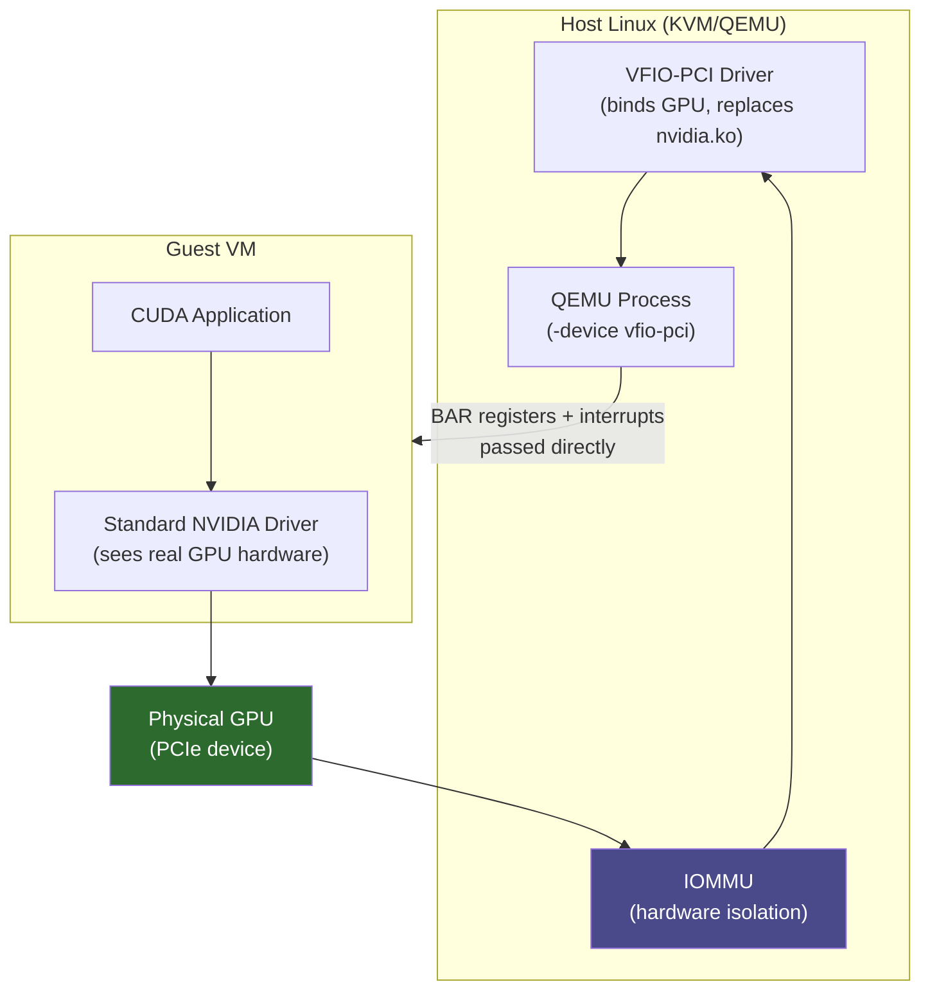

**Category:** GPU Infrastructure
**Difficulty:** Intermediate
**Reading time:** 6 min read

---

GPU passthrough (PCI passthrough or VFIO-PCI) allows a hypervisor to assign a physical GPU exclusively to a single virtual machine, giving that VM direct, unmediated access to the GPU hardware. It is used when full GPU performance is required inside a VM without the overhead of paravirtualized or API-remoting GPU stacks.

- **VFIO (Virtual Function I/O)** — Linux kernel subsystem that binds a PCIe device to a userspace driver for safe passthrough to QEMU/KVM guests
- **IOMMU (Input-Output Memory Management Unit)** — hardware that isolates DMA access, preventing a guest VM's GPU from accessing host memory outside its assigned region; AMD-Vi or Intel VT-d
- **PCIe passthrough** — assigning a physical PCIe device to a VM so the guest OS sees and drives it directly, with no hypervisor emulation layer
- **ACS (Access Control Services)** — PCIe feature enabling fine-grained IOMMU grouping; required to isolate individual GPUs rather than entire PCIe switches
- **IOMMU group** — the set of PCIe devices that must be passed through together due to sharing DMA fabric; ideally one GPU per group
- **Reset bug** — a known issue where some GPUs cannot be reset between VM allocations without a full server reboot, limiting reuse

GPU passthrough works through a chain of hardware and software mechanisms. First, the server's BIOS/UEFI must have IOMMU enabled (VT-d on Intel, AMD-Vi on AMD). The Linux kernel's VFIO driver then binds to the target GPU, replacing its native driver and exposing it as a safe DMA-isolated device.

QEMU/KVM launches the VM with a `-device vfio-pci` argument pointing to the GPU's PCIe address. The hypervisor hands the physical GPU's BAR registers and interrupts directly to the VM — the guest OS loads its GPU driver (e.g., NVIDIA's standard driver) and operates the hardware as if it were bare metal.

Performance overhead is minimal: benchmarks show GPU passthrough achieving 95–100% of bare-metal GPU performance because the GPU's compute and memory paths never touch the hypervisor. The only overhead is in initial setup and device reset operations.

The primary constraint is the IOMMU group: GPUs on the same PCIe switch as other devices may be grouped together, forcing all devices in the group to be passed through to the same VM. Servers with ACS-enabled CPUs and chipsets (most modern EPYC and Xeon platforms) provide per-GPU IOMMU groups.

GPU passthrough is one-to-one: a single physical GPU goes to exactly one VM at a time. For sharing a GPU across multiple VMs with isolation, vGPU (NVIDIA GRID) or MIG partitioning are used instead.

- Cloud providers offering bare-metal GPU instances where tenants need dedicated, exclusive GPU access
- Running Windows GPU workloads (DirectX, CUDA with Windows) inside a Linux KVM host
- GPU-accelerated VDI (Virtual Desktop Infrastructure) where one VM needs full 3D performance
- Isolated development environments where teams need guaranteed GPU access without sharing
- Testing GPU driver versions or CUDA versions without affecting host OS configuration

| Advantage | Disadvantage |
|-----------|--------------|
| Near-bare-metal GPU performance (95–100%) | One GPU per VM — no sharing; poor resource utilization if VMs are underloaded |
| Guest OS uses standard GPU drivers — no special drivers needed | GPU reset bug requires server reboot between some VM lifecycle operations |
| Hardware IOMMU isolation provides strong security boundary | Requires IOMMU-capable server hardware and proper IOMMU group topology |
| Enables running Windows GPU workloads on Linux hypervisors | GPU cannot be live-migrated — VM must be stopped and restarted on a different host |

- [vGPU Technology for Virtualization](vgpu-technology-for-virtualization.md)
- [GPU Partitioning and MIG](gpu-partitioning-and-mig.md)
- [GPU Driver Management and Updates](gpu-driver-management-and-updates.md)

---
*Part of the [GPU Infrastructure](index.md) category · [Back to Master Index](../../index.md)*
