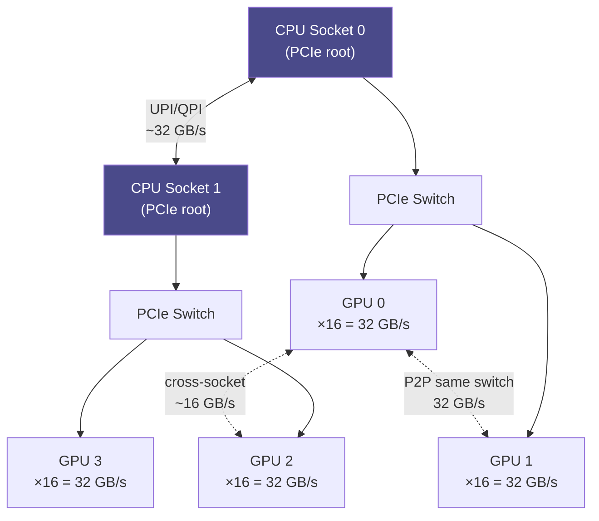

**Category:** GPU Infrastructure
**Difficulty:** Intermediate
**Reading time:** 5 min read

---

PCIe (Peripheral Component Interconnect Express) is the standard interface connecting GPUs to the CPU and system memory. PCIe generation and lane count determine the maximum bandwidth between the host and GPU, which directly affects data loading throughput, peer-to-peer transfers, and NVMe storage access in GPU-accelerated servers.

- **PCIe lane** — a bidirectional serial link; a ×16 slot provides 16 lanes, each contributing bandwidth
- **PCIe generations** — PCIe 3.0 (1 GB/s/lane), PCIe 4.0 (2 GB/s/lane), PCIe 5.0 (4 GB/s/lane); most current datacenter GPUs use PCIe 4.0 or 5.0
- **×16 slot** — the standard GPU connection providing 16 lanes; PCIe 4.0 ×16 gives 32 GB/s bidirectional (64 GB/s total theoretical)
- **Host-to-device transfer (H2D)** — copying data from CPU RAM to GPU VRAM over PCIe; a common bottleneck for data pipelines
- **Peer-to-peer (P2P)** — direct GPU-to-GPU transfers over PCIe without going through CPU RAM; requires both GPUs on the same PCIe root complex
- **PCIe bifurcation** — splitting a ×16 slot into multiple ×8 or ×4 slots to accommodate NVMe drives or additional accelerators
- **DMA (Direct Memory Access)** — GPU hardware transfers data to/from host memory independently, without CPU involvement, via PCIe

When a GPU is installed in a PCIe ×16 slot, the CPU's PCIe root complex allocates 16 lanes to that slot. Each PCIe 4.0 lane delivers 2 GB/s in each direction; 16 lanes provide 32 GB/s unidirectional bandwidth (limited in practice to ~28 GB/s after protocol overhead).

Data pipelines for training use DMA engines to copy batches from host RAM to GPU VRAM asynchronously, overlapping with GPU computation in the previous step. If the model's batch processing time is shorter than the PCIe transfer time, the pipeline stalls waiting for data — the PCIe bottleneck.

In multi-GPU servers without NVLink, GPUs communicate via PCIe. Two GPUs sharing the same PCIe switch get switch-local bandwidth; GPUs on different switches must traverse the CPU, halving effective bandwidth. Peer-to-peer transfers bypass this partially through GPU-Direct technology.

For NVMe storage, modern training pipelines stream datasets directly from NVMe drives to GPU via GPU-Direct Storage, skipping the CPU entirely. This route still traverses PCIe but eliminates CPU memory copies.

PCIe 5.0 (×16) doubles the bandwidth to 64 GB/s unidirectional, addressing bottlenecks in very high-throughput inference pipelines and enabling faster model weight loading on server restarts.

- Calculating whether PCIe bandwidth is a bottleneck in a training data pipeline
- Planning server topology for multi-GPU inference to avoid cross-switch PCIe penalties
- Sizing PCIe 4.0 vs 5.0 platforms for high-throughput storage-to-GPU pipelines
- Configuring PCIe bifurcation to co-locate NVMe drives and GPUs in compact 1U servers
- Diagnosing intermittent GPU-CPU transfer stalls in production inference servers

| Advantage | Disadvantage |
|-----------|--------------|
| Universal standard — any GPU works in any PCIe server | PCIe bandwidth is 5–10× lower than NVLink for GPU-to-GPU transfers |
| PCIe 5.0 doubles bandwidth over PCIe 4.0 at no extra lane cost | Lane count is fixed per CPU; adding more GPUs reduces per-GPU lanes |
| GPU-Direct Storage eliminates CPU bottleneck for dataset loading | P2P PCIe transfers require GPUs on the same root complex for optimal performance |
| Mature ecosystem — no proprietary infrastructure needed | NVLink-capable multi-GPU servers remain superior for collective operations |

- [NVLink Interconnect Technology](nvlink-interconnect-technology.md)
- [Multi-GPU Server Configurations](multi-gpu-server-configurations.md)
- [GPU Direct RDMA for Networking](gpu-direct-rdma-for-networking.md)

---
*Part of the [GPU Infrastructure](index.md) category · [Back to Master Index](../../index.md)*
