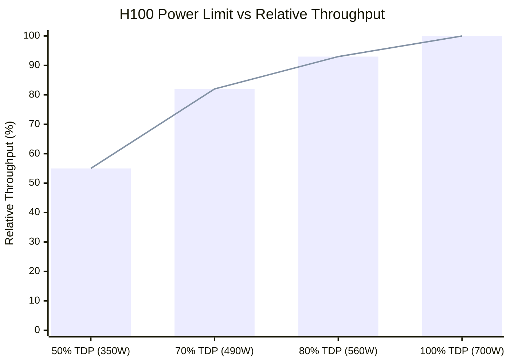

**Category:** GPU Infrastructure
**Difficulty:** Intermediate
**Reading time:** 6 min read

---

GPU power optimization reduces datacenter energy costs, enables higher GPU density per rack, and extends hardware lifespan — without sacrificing meaningful throughput. Techniques range from NVIDIA power limits and clock tuning to workload scheduling and quantization that reduces both compute and memory power draw.

- **TDP vs power limit** — TDP is the manufacturer's rated maximum sustained power; power limit is a configurable cap (via `nvidia-smi`) set below TDP to trade throughput for power reduction
- **Power efficiency curve** — the non-linear relationship between GPU clock speed and power draw; slowing clocks by 10% can reduce power by 25% due to cubic frequency-voltage scaling
- **DVFS (Dynamic Voltage and Frequency Scaling)** — GPU hardware automatically lowers voltage and clock when load is below maximum, reducing power at idle
- **Persistence mode** — NVIDIA daemon mode that keeps the GPU driver initialized between jobs, preventing cold-start power spikes and startup latency
- **SM clock capping** — setting a maximum GPU core clock (e.g., `nvidia-smi --lock-gpu-clocks=1200`) to enforce a power ceiling; useful for dense racks near power budget limits
- **Workload batching** — processing multiple inference requests together reduces per-token energy by amortizing fixed GPU overhead over more output
- **PUE (Power Usage Effectiveness)** — ratio of total facility power to IT equipment power; reducing GPU power improves both numerator and denominator

> Reducing power limit to 80% costs ~7% throughput while freeing 140W per GPU — often the optimal operating point for inference clusters.

The default GPU power limit matches TDP — but running at TDP is rarely optimal. NVIDIA's efficiency curves show that at 80% of TDP, most GPUs deliver 90–95% of peak throughput. Setting power limit to 80% (e.g., 560W for an H100 at 700W TDP) typically costs 3–7% throughput while freeing 140W per GPU — in a 10,000-GPU cluster, that is 1.4 MW of headroom.

Clock speed scales linearly with performance, but voltage must scale roughly with clock squared to maintain signal integrity — hence power scales with clock cubed. Reducing SM clocks from 1980 MHz to 1400 MHz drops power by ~35% while reducing throughput by ~30%. For batch inference where latency is less critical than energy cost per token, this is a favorable trade.

Quantization reduces power along two dimensions: fewer bits means smaller matrix operands → fewer Tensor Core cycles per token, and smaller model footprint → fewer HBM reads per token. An INT8 model consumes roughly 50% less energy per inference than FP16 at equivalent throughput.

Scheduling strategies also matter: consolidating GPU jobs onto fewer GPUs (high utilization) rather than spreading across many (low utilization) reduces the number of GPUs consuming idle-mode power (~100W for idle H100 with persistence mode on).

Monitoring power efficiency in production uses DCGM metrics (`DCGM_FI_DEV_POWER_USAGE`) aggregated per cluster, tracked as energy-per-token or energy-per-training-step — the GPU-level equivalent of MPG.

- Fitting more GPU servers into a rack constrained by 30 kW PDU limits
- Reducing cloud GPU rental costs by tuning power limits for batch inference jobs
- Implementing datacenter sustainability targets (energy per inference, carbon per model parameter)
- Diagnosing GPU servers consuming unexpectedly high power due to stuck clocks or misconfigured power limits
- Choosing quantization strategy (INT8 vs FP8 vs INT4) based on energy-per-token targets alongside accuracy requirements

| Advantage | Disadvantage |
|-----------|--------------|
| 20% power reduction at ~5% throughput loss — usually favorable for inference | Power capping reduces maximum burst throughput for latency-sensitive workloads |
| Frees rack power headroom to increase GPU density | Clock locking can interact poorly with DVFS — requires careful testing |
| Quantization simultaneously reduces compute, memory, and power | INT4/INT8 quantization introduces accuracy degradation requiring quality validation |
| Energy-per-token optimization improves unit economics at scale | Per-GPU power tuning requires monitoring infrastructure to detect regressions |

- [GPU Thermal Management Solutions](gpu-thermal-management-solutions.md)
- [GPU Monitoring and Telemetry](gpu-monitoring-and-telemetry.md)
- [GPU Memory Bandwidth Importance](gpu-memory-bandwidth-importance.md)

---
*Part of the [GPU Infrastructure](index.md) category · [Back to Master Index](../../index.md)*
