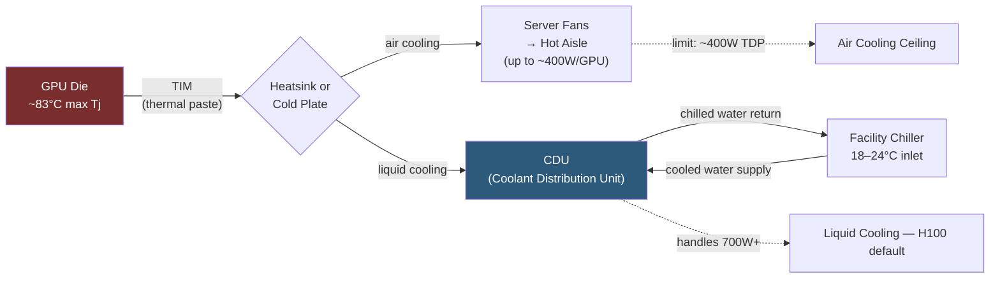

**Category:** GPU Infrastructure
**Difficulty:** Intermediate
**Reading time:** 6 min read

---

GPU thermal management is the discipline of keeping GPU junction temperatures within safe operating ranges to prevent thermal throttling, hardware damage, and reduced lifespan. As GPU TDPs have climbed from 300W (A100) to 700W (H100 SXM5), thermal management has shifted from passive airflow to active liquid cooling as the default for datacenter deployments.

- **TDP (Thermal Design Power)** — the maximum sustained heat output a GPU is designed to dissipate; the primary input for cooling system sizing
- **Junction temperature (Tj)** — the temperature of the GPU die itself; NVIDIA datacenter GPUs throttle at 83°C and shut down at 87°C
- **Thermal throttling** — automatic reduction of GPU clock speed to reduce heat output when Tj exceeds the throttle threshold; results in reduced compute throughput
- **TIM (Thermal Interface Material)** — the compound (thermal paste or pad) between the GPU die and the heatsink/cold plate; critically affects thermal resistance
- **Direct Liquid Cooling (DLC)** — cold plates mounted directly on GPU and CPU dies, circulating chilled water at 20–40°C; achieves 80%+ heat removal efficiency
- **Rear-door heat exchanger (RDHx)** — a rack-mounted heat exchanger that captures hot exhaust air from a server rack before it enters the datacenter hot aisle
- **Facility water temperature** — the inlet temperature of cooling water from the datacenter chiller; lower inlet = more cooling headroom but higher chiller energy cost

Heat flows from the GPU die through the TIM into the heatsink or cold plate, then into the cooling medium (air or liquid). The thermal resistance of each interface determines how much temperature rise occurs per watt.

For air cooling, high-performance server fans move 200–400 CFM of air through GPU heatsinks. Modern airflow-optimized 2U servers can cool GPUs up to ~400W each; 8-GPU configurations at 400W each (3.2 kW total) push the limits of air cooling and require hot-aisle containment and precision air conditioning.

Direct liquid cooling bypasses air entirely for the GPU die. Cold plates (aluminum or copper with internal microchannels) are bolted to the GPU package, and chilled water circulates through manifolds. DLC reduces server fan power by 30–40% (fans still needed for other components) and allows GPU TDPs up to 1,000W+ without thermal throttling. H100 SXM5 requires DLC; fan-only cooling cannot dissipate 700W per GPU in an 8-GPU chassis.

Immersion cooling submerges entire servers in dielectric fluid (mineral oil or 3M Novec). The fluid contacts all components directly, providing uniform cooling at low operating cost, but requires specialized racks, fluid handling systems, and limits physical access to hardware.

Monitoring thermal health in production uses `nvidia-smi` telemetry: GPU temperature, fan speed (for air-cooled), power draw, and throttle event counters are exposed via DCGM (Data Center GPU Manager) for integration with Prometheus/Grafana.

- Sizing facility cooling capacity before deploying a new GPU cluster (W/rack calculation)
- Troubleshooting thermal throttling events seen as unexpected compute throughput drops
- Planning liquid cooling retrofit for an existing air-cooled datacenter expanding to H100 density
- Selecting TIM during GPU maintenance to maximize junction-to-coolant thermal resistance
- Designing hot-aisle/cold-aisle containment to improve air cooling efficiency before liquid cooling is installed

| Advantage (liquid cooling) | Disadvantage |
|-----------|--------------|
| Handles 700W+ per GPU TDP that air cooling cannot | Higher installation cost — piping, manifolds, leak detection infrastructure |
| Reduces facility cooling energy consumption (higher COP) | Liquid leaks in server rooms cause catastrophic damage — requires monitoring |
| Eliminates thermal throttling in dense 8-GPU nodes | Immersion cooling requires full rack replacement — not backward compatible |
| Lower acoustic noise vs high-speed server fans | Maintenance access to liquid-cooled hardware is more complex |

- [Liquid Cooling for GPU Clusters](liquid-cooling-for-gpu-clusters.md)
- [GPU Power Consumption Optimization](gpu-power-consumption-optimization.md)
- [GPU Monitoring and Telemetry](gpu-monitoring-and-telemetry.md)

---
*Part of the [GPU Infrastructure](index.md) category · [Back to Master Index](../../index.md)*
