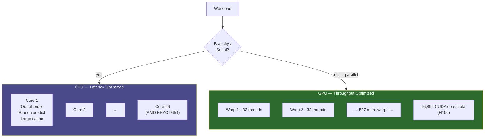

**Category:** GPU Infrastructure
**Difficulty:** Beginner
**Reading time:** 5 min read

---

CPUs are optimized for low-latency serial execution with a handful of powerful cores; GPUs are optimized for high-throughput parallel execution with thousands of simpler cores. Choosing between them — or combining them — depends on the degree of parallelism in a workload, memory access patterns, and latency requirements.

- **SIMD (Single Instruction, Multiple Data)** — executing the same operation on many data elements simultaneously; the foundation of GPU parallelism
- **Warp / wavefront** — the minimum group of threads a GPU executes together (32 on NVIDIA, 64 on AMD); all threads in a warp run the same instruction
- **Memory latency hiding** — GPUs tolerate high memory latency by rapidly switching between warps while one waits for data, requiring thousands of in-flight threads
- **Cache hierarchy** — CPUs rely on large, low-latency L1/L2/L3 caches for serial access patterns; GPU L1 caches are smaller but feed wider SIMD pipelines
- **Amdahl's Law** — the speedup of parallelization is limited by the serial fraction of a program; a workload that is 90% parallelizable can achieve at most 10× speedup
- **Occupancy** — the ratio of active warps to maximum warps on a GPU SM; high occupancy helps hide memory latency but does not guarantee higher throughput

A modern server CPU (e.g., AMD EPYC 9654) has 96 cores, each capable of executing 4–8 SIMD operations per clock with out-of-order execution and branch prediction. CPUs shine when code branches unpredictably, when data dependencies are deep, or when latency to first result must be minimized.

A GPU (e.g., NVIDIA H100) has 16,896 CUDA cores running at ~3× lower clock speed than a CPU. Each core is simpler — no out-of-order execution, minimal branch prediction — but the sheer core count means a GPU can run 100× more floating-point operations per second than a CPU when the workload is regular and parallelizable.

Deep learning training is almost entirely matrix multiplication (GEMM), which maps perfectly to GPU Tensor Cores: the same multiply-accumulate instruction runs on thousands of elements in lock-step, with no branching. A matrix multiply that takes 10ms on a CPU completes in ~0.1ms on an H100.

Workloads that do NOT parallelize well include: recursive algorithms, database query planning, request routing, and any code with heavy branching on per-element conditions. These remain on CPU.

In practice, GPU workloads always involve a CPU: the CPU manages data loading, batching, inter-process communication, and orchestration. GPU time is maximized by keeping the CPU-to-GPU data pipeline full (prefetching), avoiding frequent small kernel launches, and using asynchronous CUDA streams.

- Deep learning training and inference — GPU dominates; matrix multiply is embarrassingly parallel
- Video encoding/decoding — dedicated GPU silicon (NVENC) outperforms CPU by 10–20×
- Physics simulation (cloth, particles, fluid dynamics) — GPU for regular grids, CPU for complex collision trees
- Database query execution — CPU for complex joins and planners; GPU offloading for columnar analytics (cuDF)
- Web server request handling — CPU only; request processing is fundamentally serial and latency-sensitive

| Advantage (GPU) | Disadvantage (GPU) |
|-----------|--------------|
| 10–100× throughput for parallel workloads | Poor performance on branchy, serial code |
| Hardware-accelerated matrix multiply via Tensor Cores | High power draw (300–700W) vs CPU (120–400W for a full socket) |
| Memory bandwidth 10–30× higher than CPU memory | GPU memory is separate — CPU-to-GPU transfer adds latency overhead |
| Massively parallel thread execution hides memory latency | Programming model (CUDA/ROCm) requires specialized knowledge |

- [GPU Memory Bandwidth Importance](gpu-memory-bandwidth-importance.md)
- [CUDA Toolkit and Libraries](cuda-toolkit-and-libraries.md)
- [Multi-GPU Server Configurations](multi-gpu-server-configurations.md)

---
*Part of the [GPU Infrastructure](index.md) category · [Back to Master Index](../../index.md)*
