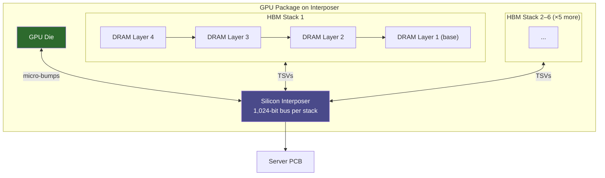

**Category:** GPU Infrastructure
**Difficulty:** Intermediate
**Reading time:** 6 min read

---

High Bandwidth Memory (HBM) is a 3D-stacked DRAM technology that places multiple DRAM dies vertically and connects them to the GPU die via a silicon interposer, achieving 5–10× the bandwidth of GDDR6 while consuming less power per bit. HBM is the enabling technology behind the memory performance of A100, H100, and AMD MI300X datacenter GPUs.

- **3D stacking** — DRAM dies are physically stacked on top of each other with through-silicon vias (TSVs) connecting layers, dramatically shortening signal paths
- **TSV (Through-Silicon Via)** — microscopic vertical conductors drilled through silicon dies to connect stacked chips without wire bonds
- **Interposer** — a silicon substrate that sits between the GPU die and the PCB, providing extremely dense routing between the GPU and HBM stacks
- **HBM generations** — HBM1 (128 GB/s/stack), HBM2 (256 GB/s/stack), HBM2e (460 GB/s/stack), HBM3 (819 GB/s/stack), HBM3e (1,200 GB/s/stack)
- **Stack height** — number of DRAM layers per HBM stack; HBM3 ships in 8-Hi (8 layers) and 12-Hi configurations
- **CoWoS (Chip-on-Wafer-on-Substrate)** — TSMC's advanced packaging technology used to integrate HBM stacks with GPU dies on an interposer; a key production bottleneck for H100

Conventional GDDR6 memory is mounted as discrete chips around the GPU die, connected via a 384-bit memory bus across the PCB. The physical distance and PCB trace length limit bandwidth and increase power consumption due to signal drive strength requirements.

HBM eliminates the PCB path entirely. HBM stacks and the GPU die are mounted on a shared silicon interposer using micro-bumps spaced ~55μm apart. The combined die+interposer package is then connected to the server PCB. The interposer provides a 1,024-bit wide memory interface per HBM stack — 8× wider than GDDR6's 32-bit channel — at much shorter trace lengths, dramatically reducing power per bit.

An H100 SXM5 uses six HBM3 stacks, each with an 1,024-bit interface running at 3.35 Gbps/pin, delivering 3.35 TB/s aggregate. This is physically impossible with GDDR6 — the pin count alone would require a PCB the size of a dinner plate.

The trade-off is yield and cost: interposers are expensive to produce, CoWoS packaging capacity is limited (TSMC had severe H100 delivery constraints in 2023 for this reason), and HBM DRAM is produced by only three vendors — SK Hynix, Samsung, and Micron.

Power efficiency is a key HBM advantage: at equal bandwidth, HBM consumes approximately 35% less power than GDDR6, critical for dense GPU clusters where power-per-rack is a hard constraint.

- Enabling the memory capacity needed to fit 40–192 GB of model weights on a single GPU
- Providing sufficient bandwidth for memory-bound inference (single-token generation, attention)
- Supporting FP64 scientific computing where precision requires full-size values and high throughput
- Enabling MIG partitioning — each MIG slice needs guaranteed bandwidth, only possible with HBM's shared high-bandwidth pool
- Meeting the bandwidth requirements of next-generation quantization formats (FP8, INT4)

| Advantage | Disadvantage |
|-----------|--------------|
| 5–10× bandwidth vs GDDR6 at similar power | 3–5× higher cost per GB than GDDR6 |
| Compact package reduces signal path and power draw | CoWoS packaging supply is limited — constrains GPU production volume |
| Enables large monolithic GPU memory (40–192 GB) | Cannot be added post-manufacture — memory capacity is fixed at build time |
| Higher bandwidth directly reduces inference latency | Only three HBM vendors create supply concentration risk |

- [GPU Memory Bandwidth Importance](gpu-memory-bandwidth-importance.md)
- [GDDR Memory in Datacenter GPUs](gddr-memory-in-datacenter-gpus.md)
- [NVIDIA A100 Tensor Core Architecture](nvidia-a100-tensor-core-architecture.md)

---
*Part of the [GPU Infrastructure](index.md) category · [Back to Master Index](../../index.md)*
