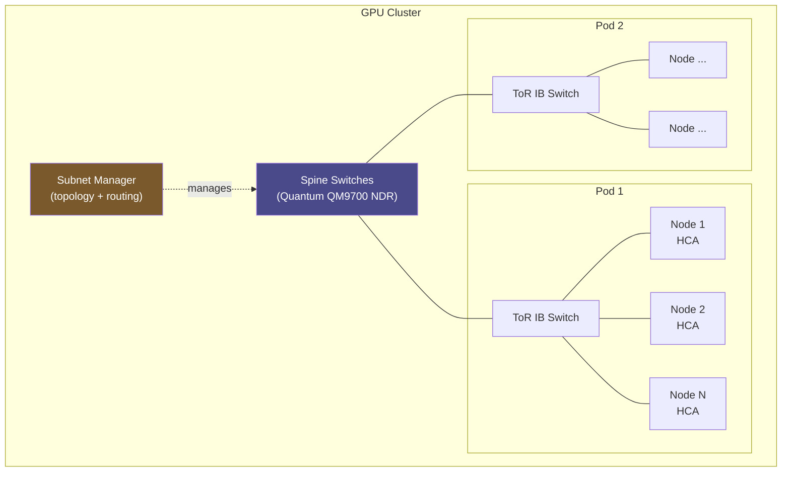

**Category:** GPU Infrastructure
**Difficulty:** Advanced
**Reading time:** 7 min read

---

InfiniBand is the dominant high-performance networking fabric for large-scale GPU clusters, offering sub-microsecond latency, native RDMA, and up to 400 Gb/s per port (NDR). It is preferred over Ethernet for distributed training because NCCL all-reduce operations run more efficiently over InfiniBand's native RDMA semantics than over RoCE.

- **InfiniBand (IB)** — a high-performance interconnect standard using a separate fabric from standard Ethernet; managed by NVIDIA (which acquired Mellanox in 2020)
- **HDR (High Data Rate)** — 200 Gb/s per port per direction; the current standard for most AI training clusters
- **NDR (Next Data Rate)** — 400 Gb/s per port; shipping in ConnectX-7 and Quantum-2 switches for next-generation clusters
- **HCA (Host Channel Adapter)** — the InfiniBand NIC installed in each server; handles RDMA operations in hardware, offloading the CPU
- **Subnet Manager (SM)** — software that manages IB fabric topology, assigns LIDs (local identifiers), and configures routing tables; typically runs on a dedicated switch or server
- **RDMA verbs** — the API for InfiniBand RDMA operations (Send/Receive, RDMA Read/Write, Atomic); NCCL uses these directly for all-reduce without OS networking overhead
- **Adaptive routing** — InfiniBand feature that dynamically selects the least-congested path through the fabric per packet, reducing hotspot congestion

Each GPU server installs one or more InfiniBand HCAs. The HCA connects to a top-of-rack InfiniBand switch (e.g., NVIDIA Quantum QM9700 for NDR). Switches connect upward to spine switches in a fat-tree or dragonfly topology.

The Subnet Manager discovers all HCAs and switches by querying them via management datagrams (MADs), builds a fabric topology graph, assigns 16-bit LIDs to each port, and computes routing tables that are programmed into each switch's forwarding tables. In large clusters (1,000+ nodes), SM runs as a distributed service with master/standby failover.

NCCL uses InfiniBand RDMA by calling the verbs API directly, bypassing the OS kernel entirely. For ring-allreduce, each GPU's HCA posts RDMA Write operations to push gradient chunks to peer GPU memory, with no CPU involvement in the data path. This achieves latencies of 1–3 μs for small messages and near-line-rate throughput for large gradient tensors.

InfiniBand's flow control is credit-based: the sender must have credits (granted by the receiver) before transmitting. This prevents receiver buffer overflow without TCP retransmissions, making InfiniBand reliable and lossless by design — critical for NCCL, which cannot tolerate dropped packets without aborting and restarting collective operations.

Adaptive routing in Quantum-2 switches improves large-cluster all-reduce performance by 15–30% over static routing by dynamically balancing traffic across equal-cost paths as congestion develops.

- Building GPU training clusters above 16 nodes where NCCL all-reduce performance is critical
- Connecting NVLink-limited multi-node H100 clusters with a non-blocking IB fabric for inter-pod communication
- Deploying NVIDIA Quantum InfiniBand switches in a fat-tree topology for guaranteed bisection bandwidth
- Using GPU Direct RDMA over InfiniBand to achieve sub-2μs GPU-to-GPU memory transfer latency
- High-performance computing (HPC) workloads requiring MPI collective operations at scale

| Advantage | Disadvantage |
|-----------|--------------|
| Native RDMA with sub-2μs latency — no kernel overhead | Higher cost than Ethernet per port — InfiniBand HCAs and switches are premium hardware |
| Lossless by design — NCCL all-reduce runs without retransmission events | NVIDIA's acquisition of Mellanox creates single-vendor dependency |
| Adaptive routing improves utilization under variable traffic patterns | Subnet Manager is a complex distributed system requiring operational expertise |
| 400 Gb/s NDR provides headroom for H100/B200 bandwidth requirements | IB operates on a separate fabric — requires parallel Ethernet for management and storage |

- [GPU Cluster Networking Topology](gpu-cluster-networking-topology.md)
- [GPU Direct RDMA for Networking](gpu-direct-rdma-for-networking.md)
- [NVLink Interconnect Technology](nvlink-interconnect-technology.md)

---
*Part of the [GPU Infrastructure](index.md) category · [Back to Master Index](../../index.md)*
