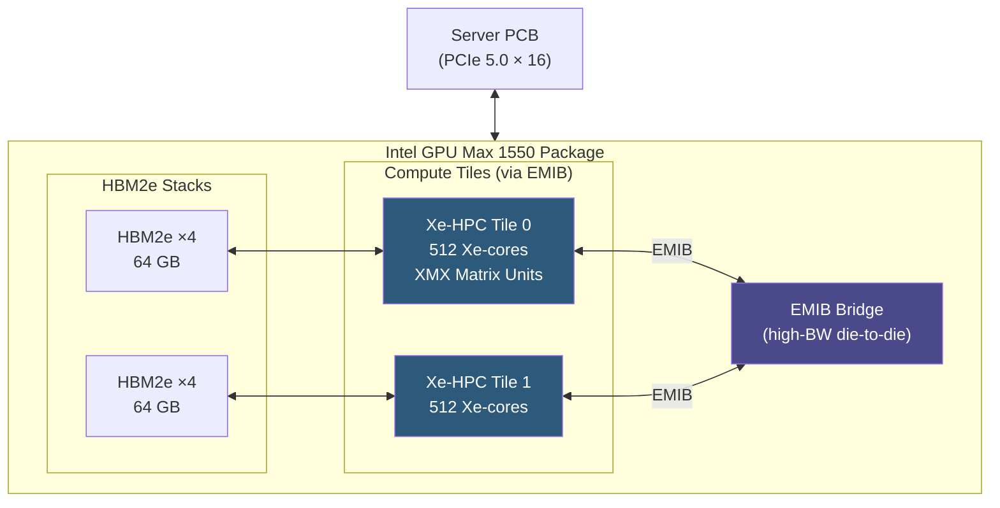

**Category:** GPU Infrastructure
**Difficulty:** Intermediate
**Reading time:** 6 min read

---

Intel's Data Center GPU Max series (formerly Ponte Vecchio, codenamed Xe HPC) is Intel's re-entry into high-performance datacenter compute, targeting HPC simulation and AI training. Built from multiple Xe compute tiles on an EMIB/Foveros interposer, the Max 1550 ships with 128 GB of HBM2e and positions Intel as a third option alongside NVIDIA and AMD in the accelerator market.

- **Xe HPC architecture** — Intel's compute-optimized GPU microarchitecture, forked from the Xe graphics lineage and designed for FP64 and matrix workloads
- **Xe-core** — Intel's GPU compute unit, analogous to NVIDIA's SM or AMD's Compute Unit
- **XMX (Xe Matrix Extensions)** — Intel's matrix-multiply accelerator units, supporting FP16, BF16, TF32, INT8, and INT4
- **EMIB (Embedded Multi-die Interconnect Bridge)** — Intel's 2D chiplet integration technology, providing high-bandwidth die-to-die links on a substrate
- **Xe Link** — Intel's GPU-to-GPU interconnect, providing up to 896 GB/s all-to-all bandwidth in 4-GPU or 8-GPU tiles
- **oneAPI** — Intel's unified programming model spanning CPUs, GPUs, and FPGAs, replacing vendor-specific APIs like CUDA
- **SYCL** — the open-standard C++ parallel programming model underlying oneAPI

The Max 1550 is assembled from compute tiles (each a separate die) and HBM2e stacks bonded together using EMIB bridges. The 1550 contains 128 Xe-cores across multiple tiles, delivering 52 TFLOPS of FP64 performance — competitive with the A100 for double-precision HPC simulations.

For AI workloads, XMX units handle BF16 and FP16 matrix multiplications, delivering approximately 1,979 TOPS at INT8. The 128 GB HBM2e provides 3.27 TB/s of memory bandwidth, higher than A100 but below MI300X.

Programming targets Intel's oneAPI toolkit, which provides Data Parallel C++ (DPC++) built on SYCL. Developers can write a single codebase targeting CPU and GPU backends. Intel also provides a CUDA migration tool that semi-automatically ports CUDA kernels to SYCL, easing the transition from NVIDIA ecosystems.

In multi-GPU deployments, Max GPUs connect via Xe Link through a dedicated switch in 4U blade configurations. Intel's Gaudi accelerators (a separate product line using RDMA-based interconnect) are better suited for distributed LLM training; Max GPUs excel at tightly coupled HPC jobs that need FP64 accuracy.

- FP64-intensive scientific computing (climate modeling, seismic analysis, CFD)
- Government and national laboratory HPC deployments with supply-chain diversity requirements
- AI training on oneAPI-compatible frameworks (PyTorch with Intel Extension, OpenVINO)
- Heterogeneous compute nodes combining Intel CPUs and GPUs in a unified oneAPI codebase
- Workloads that can leverage Intel's software optimization grants for early adopters

| Advantage | Disadvantage |
|-----------|--------------|
| Highest FP64 throughput in class — strong for scientific HPC | AI software ecosystem significantly smaller than CUDA or ROCm |
| 128 GB HBM2e covers large model memory requirements | oneAPI/SYCL tooling less mature than CUDA's decades-old ecosystem |
| Supply chain diversity reduces geopolitical vendor concentration | Adoption in AI training clusters limited by lack of optimized kernels |
| oneAPI open standard avoids CUDA vendor lock-in | Xe Link multi-GPU topology limited to smaller scale vs NVLink Network |

- [oneAPI for Intel GPUs](oneapi-for-intel-gpus.md)
- [GPU vs CPU for Parallel Workloads](gpu-vs-cpu-for-parallel-workloads.md)
- [AMD Instinct MI Series GPUs](amd-instinct-mi-series-gpus.md)

---
*Part of the [GPU Infrastructure](index.md) category · [Back to Master Index](../../index.md)*
