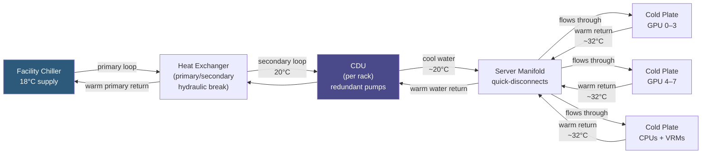

**Category:** GPU Infrastructure
**Difficulty:** Advanced
**Reading time:** 7 min read

---

Liquid cooling for GPU clusters encompasses direct liquid cooling (DLC) of individual servers, rear-door heat exchangers (RDHx) for rack-level heat removal, and full immersion cooling for maximum density. As GPU clusters now routinely exceed 20 kW/rack, liquid cooling is shifting from a specialty option to a baseline requirement for H100-class deployments.

- **CDU (Coolant Distribution Unit)** — a rack-mounted unit that circulates chilled water from facility supply to server cold plates, providing pump redundancy and flow monitoring
- **Primary loop / secondary loop** — facility chilled water (primary) is thermally coupled but hydraulically isolated from server-side water (secondary) to prevent contamination
- **Facility water (FW) temperature** — typically 18–24°C from a chiller; hotter facility water reduces cooling efficiency but enables waterside economizers in cooler climates
- **Cold plate** — a metal block with internal water channels that clamps directly to the GPU die; transfers heat to circulating water
- **1-phase immersion cooling** — servers submerged in dielectric fluid (mineral oil, engineered fluids); fluid remains liquid throughout, heat rejected via a fluid-to-water heat exchanger
- **2-phase immersion cooling** — servers submerged in fluid with a low boiling point (e.g., 3M Novec 7100); fluid boils at component surfaces, vapor condenses on a coil, returning heat-laden condensate to the liquid bath — highly efficient
- **PUE (Power Usage Effectiveness)** — datacenter energy efficiency metric; liquid-cooled facilities targeting PUE ≤ 1.1, vs 1.3–1.5 for air-cooled

A DLC deployment for an H100 cluster starts with facility chilled water delivered at 18°C to a CDU in each rack. The CDU pumps cooled water through flexible hoses to quick-disconnect fittings on each server's manifold. Inside the server, water flows through cold plates bonded to each H100, absorbing heat, and returns to the CDU at ~30–35°C. The CDU transfers this heat back to the facility loop.

Flow rate is sized to keep the cold plate delta-T (inlet to outlet temperature rise) under 10°C. At 700W per H100, 8 GPUs plus CPUs and other components can push 8–10 kW per server. A CDU must handle this with 40–80 LPM (liters per minute) of flow, using redundant pump sets for uptime.

Immersion cooling eliminates cold plates entirely. Servers are submerged without modification (1-phase) or in modified open-frame designs (2-phase). Heat transfer directly from component surfaces to fluid is extremely efficient — 2-phase systems achieve thermal resistance under 0.01°C/W per component vs 0.05–0.1°C/W for cold plates.

The catch with immersion is facility design: tanks require special floors for load-bearing, fluid handling and top-up procedures must be trained, and component access requires lifting hardware from tanks — typically done with trolleys and hoists. PCBs must be compatible with the dielectric fluid (some flux residues and coatings are incompatible).

Leak detection is non-negotiable for DLC: water and GPU electronics don't mix. Aquasense-style cable sensors under racks, pressure differential monitoring in CDUs, and camera systems that alert on wet spots are standard in production DLC environments.

- Deploying 8× H100 servers at 700W/GPU TDP where air cooling is thermally impossible
- Building AI training clusters in existing raised-floor datacenters at 20–30 kW/rack density
- Achieving PUE <1.15 in climates where free air economization is limited
- Immersion-cooling GPU servers in edge locations with limited HVAC infrastructure
- Reducing datacenter acoustic noise (GPU clusters with DLC run near silently vs 85 dB air-cooled)

| Advantage | Disadvantage |
|-----------|--------------|
| Handles any foreseeable GPU TDP — H100 today, future GPUs tomorrow | Significant infrastructure CapEx: CDUs, piping, leak detection, CDU maintenance contracts |
| PUE improvement reduces operating cost at scale | Leak events can damage multiple GPUs and require emergency response |
| Enables higher rack density, reducing datacenter floor space needed | 2-phase immersion requires compatible hardware and trained staff |
| Quieter operation, lower HVAC fan energy | Quick-disconnect couplings require periodic inspection and replacement |

- [GPU Thermal Management Solutions](gpu-thermal-management-solutions.md)
- [GPU Power Consumption Optimization](gpu-power-consumption-optimization.md)
- [Multi-GPU Server Configurations](multi-gpu-server-configurations.md)

---
*Part of the [GPU Infrastructure](index.md) category · [Back to Master Index](../../index.md)*
