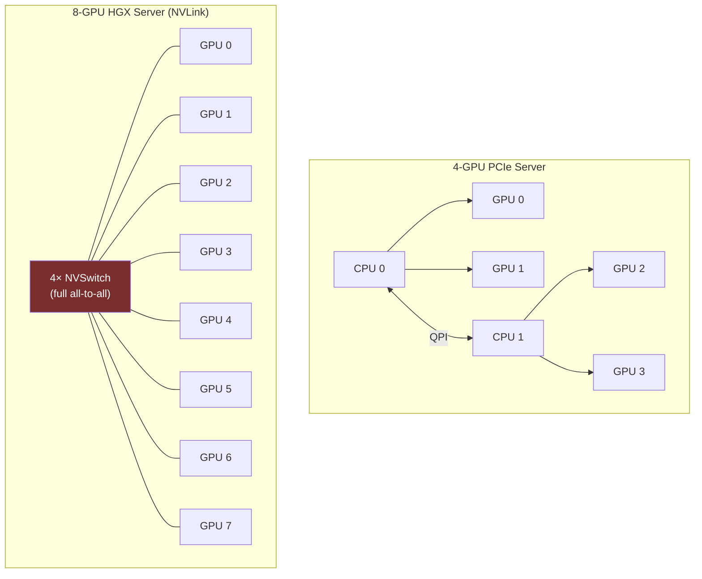

**Category:** GPU Infrastructure
**Difficulty:** Intermediate
**Reading time:** 6 min read

---

Multi-GPU servers range from standard PCIe rack servers with 2–4 GPUs to purpose-built AI compute nodes with 8 NVLink-connected GPUs. The choice of configuration determines per-GPU bandwidth, collective communications performance, thermal limits, and cost-per-FLOP for training and inference workloads.

- **HGX baseboard** — NVIDIA's standard 8-GPU AI server baseboard with integrated NVSwitch fabric; the reference design for H100/A100 multi-GPU servers
- **DGX** — NVIDIA's fully integrated AI system (server + HGX + networking + software stack); a turnkey HGX deployment
- **OAM (OCP Accelerator Module)** — open standard form factor for GPU modules on non-NVIDIA designs (Intel Gaudi, AMD Instinct)
- **PCIe topology** — describes which GPUs share a PCIe switch; GPUs on the same switch have higher P2P bandwidth than those that cross the CPU
- **NUMA (Non-Uniform Memory Access)** — CPU memory architecture where some RAM is closer (lower latency) to specific CPU sockets and PCIe lanes; affects GPU placement
- **TDP headroom** — total server power delivery capacity minus all other components; constrains how many high-TDP GPUs can be installed
- **GPU tray** — in large-scale deployments, each GPU module is hot-swappable and managed as a discrete field-replaceable unit

A 4-GPU PCIe server typically has two CPUs (dual-socket). Two GPUs connect to each CPU's PCIe root complex. GPUs on the same socket can communicate peer-to-peer at ~64 GB/s (PCIe 4.0 ×16); cross-socket transfers traverse the QPI/UPI CPU-to-CPU link, cutting bandwidth to ~32 GB/s. For training workloads, this topology limits ring-allreduce efficiency.

An 8-GPU HGX server uses NVSwitch to fully connect all eight A100 or H100 SXM GPUs. All gradient synchronization happens over NVLink (600–900 GB/s) rather than PCIe. CPU involvement is limited to control plane tasks; the GPUs communicate directly in a flat all-to-all fabric.

Power delivery is the hard constraint for dense 8-GPU configurations. Eight H100s at 700W each require 5.6 kW for GPUs alone; adding CPUs, memory, NVMe, and networking brings the server total to 7–10 kW. This requires 240V/30A circuits or higher and typically mandates liquid cooling.

Thermal management in 8-GPU servers requires either high-airflow rear-to-front chassis designs or direct liquid cooling (DLC). NVIDIA's HGX H100 ships with cold-plate liquid cooling as the standard configuration due to thermal density.

- 2-GPU PCIe workstation: interactive ML research and small model training
- 4-GPU PCIe server: fine-tuning and inference for mid-size teams
- 8-GPU HGX server (NVLink): pre-training runs and high-throughput inference clusters
- Multi-node HGX clusters: frontier model training requiring 64–1,024 GPUs
- OAM-based servers: AMD or Intel multi-GPU deployments with open hardware ecosystem

| Advantage | Disadvantage |
|-----------|--------------|
| 8-GPU NVLink servers eliminate inter-GPU PCIe bottleneck | HGX baseboards cost $30,000–$50,000 above GPU hardware cost |
| NVSwitch full all-to-all fabric prevents hot-spot bandwidth contention | 8×700W = 5.6 kW GPU TDP alone; requires purpose-built power and cooling |
| DGX turnkey systems reduce time-to-deployment for enterprise teams | Proprietary baseboard reduces server vendor choice |
| PCIe configs work in commodity 2U servers at lower CapEx | Cross-socket PCIe topology creates bandwidth asymmetry |

- [NVLink Interconnect Technology](nvlink-interconnect-technology.md)
- [GPU Cluster Networking Topology](gpu-cluster-networking-topology.md)
- [Liquid Cooling for GPU Clusters](liquid-cooling-for-gpu-clusters.md)

---
*Part of the [GPU Infrastructure](index.md) category · [Back to Master Index](../../index.md)*
