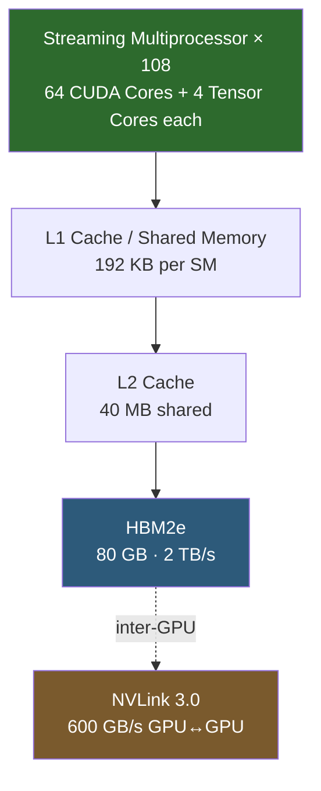

**Category:** GPU Infrastructure
**Difficulty:** Advanced
**Reading time:** 7 min read

---

The NVIDIA A100, based on the Ampere microarchitecture (2020), is the GPU that made large-scale transformer training practical — introducing third-generation Tensor Cores with multi-precision support, 80 GB HBM2e memory, and MIG partitioning. It remains widely deployed in cloud and on-premises clusters for both training and inference.

- **Tensor Core (3rd gen)** — matrix-multiply-accumulate (MMA) units that support TF32, FP16, BF16, INT8, and INT4 precisions in a single chip
- **TF32** — NVIDIA's "TensorFloat-32" format: FP32 range with FP16 mantissa precision, enabling drop-in speedups for existing FP32 training code
- **BF16 (bfloat16)** — 16-bit format with FP32's exponent range but reduced mantissa, preferred for training stability over FP16
- **MIG (Multi-Instance GPU)** — hardware-level partitioning of one A100 into up to 7 isolated GPU instances, each with dedicated memory and compute
- **HBM2e** — High Bandwidth Memory generation 2e, offering 2 TB/s memory bandwidth on the 80 GB variant
- **NVLink 3.0** — 600 GB/s bidirectional GPU-to-GPU interconnect, enabling near-unified memory across 8-GPU nodes
- **Sparsity acceleration** — 2× throughput for weight matrices that are ≥50% sparse, exploited by structured pruning techniques

The A100 die contains 6,912 CUDA cores and 432 Tensor Cores organized into 108 Streaming Multiprocessors (SMs). Each SM houses four Tensor Core units capable of computing 256 FP16 FMAs per clock cycle.

During training, the Tensor Engine handles the matrix multiplications that dominate transformer forward and backward passes. TF32 mode is automatically enabled by PyTorch and TensorFlow when FP32 is requested — the hardware silently truncates mantissa bits before the multiply, restoring precision on accumulation. This delivers up to 10× the FP32 throughput with no code changes.

Memory architecture is layered: each SM has 192 KB of configurable L1/shared memory, backed by a 40 MB L2 cache, then the 80 GB HBM2e stack at 2 TB/s. The large L2 cache is critical for attention mechanisms that re-read key/value matrices across heads.

For multi-GPU training, NVLink 3.0 connects all eight GPUs on an HGX A100 baseboard via an NVSwitch fabric, giving each GPU 600 GB/s aggregate bandwidth to every peer — allowing all-reduce gradient synchronization to run at memory speed rather than PCIe speed.

MIG mode partitions the die at the GPC (Graphics Processing Cluster) level — each MIG instance gets an isolated slice of SMs, L2 cache, and HBM, with hardware-enforced isolation suitable for multi-tenant cloud environments.

- Pre-training billion-parameter transformer models (GPT, BERT, T5 families)
- Multi-tenant GPU cloud instances where MIG provides guaranteed isolation
- High-throughput batch inference with INT8 quantization for latency-sensitive APIs
- Scientific simulation (molecular dynamics, climate modeling) requiring ECC memory
- Video encoding acceleration using A100's NVENC/NVDEC hardware units

| Advantage | Disadvantage |
|-----------|--------------|
| Multi-precision Tensor Cores cover training and inference in one card | 400W SXM TDP requires purpose-built liquid or high-airflow cooling |
| MIG enables fine-grained resource sharing without hypervisor overhead | MIG instances cannot span multiple GPUs — limits single-job scale |
| 80 GB HBM fits large models entirely in GPU memory | HBM2e bandwidth (2 TB/s) is bottleneck for memory-bound attention at long context |
| Mature software ecosystem (CUDA 11+, cuDNN, TensorRT) | Superseded by H100 for new training clusters — harder to justify new purchases |

- [NVIDIA H100 Hopper Architecture](nvidia-h100-hopper-architecture.md)
- [HBM High Bandwidth Memory Technology](hbm-high-bandwidth-memory-technology.md)
- [GPU Partitioning and MIG](gpu-partitioning-and-mig.md)

---
*Part of the [GPU Infrastructure](index.md) category · [Back to Master Index](../../index.md)*
