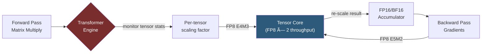

**Category:** GPU Infrastructure
**Difficulty:** Advanced
**Reading time:** 7 min read

---

The NVIDIA H100, based on the Hopper microarchitecture (2022), is purpose-built for the transformer era — introducing FP8 precision, the Transformer Engine, NVLink 4.0, and NVLink Switch for rack-scale GPU interconnect. It delivers roughly 3× the training throughput of the A100 on large language models and is the current standard for frontier AI training clusters.

- **Transformer Engine** — hardware and software co-design that automatically selects between FP8 and FP16 precision layer-by-layer during training, maximizing throughput while preserving convergence
- **FP8** — 8-bit floating-point format offering 2× the Tensor Core throughput of FP16/BF16, with two variants (E4M3 for forward pass, E5M2 for backward pass)
- **NVLink 4.0** — 900 GB/s bidirectional per-GPU bandwidth (up from 600 GB/s on A100)
- **NVLink Switch / NVLink Network** — dedicated switch chips enabling NVLink connectivity across multiple nodes, not just within a single server baseboard
- **Confidential Computing** — H100 supports TEE (Trusted Execution Environment) for GPU workloads, enabling encrypted model weights in multi-tenant environments
- **GH200 Grace Hopper Superchip** — integrated package combining H100 GPU with NVIDIA Grace CPU via 900 GB/s NVLink-C2C chip-to-chip interconnect
- **HBM3 / HBM3e** — third-generation High Bandwidth Memory; H100 SXM ships with 3.35 TB/s bandwidth on HBM3e variants

The H100 SXM5 die contains 16,896 CUDA cores and 528 fourth-generation Tensor Cores across 132 SMs. The headline feature is the Transformer Engine, which operates as a software-hardware loop: during training, the engine monitors per-tensor activation statistics, selects the appropriate FP8 sub-format, scales tensors before the Tensor Core multiply, and re-scales the result — all transparently via the cuDNN and NCCL libraries updated for Hopper.

FP8 doubles the throughput of FP16 by packing two FP8 values per memory word and allowing Tensor Cores to execute twice as many multiply-accumulate operations per clock. For a 70-billion-parameter model, this translates to 3–4× faster training iteration time compared to A100 BF16.

NVLink 4.0 connects all eight H100s on an HGX H100 baseboard through NVSwitch 3.0 chips. The NVLink Network feature extends this fabric across multiple nodes using dedicated NVLink Switch cabinets, allowing up to 256 H100s to share a flat 900 GB/s all-to-all bandwidth domain — critical for the all-reduce operations in distributed training.

Confidential Computing is implemented via a hardware security boundary around the GPU's SM array; keys never leave the GPU enclave, making H100 suitable for regulated industries and multi-tenant AI clouds.

- Frontier LLM pre-training (100B+ parameter models) requiring maximum MFU (Model FLOP Utilization)
- High-throughput inference clusters using FP8 quantization for sub-millisecond token generation
- Multi-node distributed training across 64–512 GPUs connected via NVLink Network
- Confidential AI inference for healthcare or financial data requiring hardware-level isolation
- Scientific workloads (protein folding, genomics) needing both FP64 and tensor compute in one device

| Advantage | Disadvantage |
|-----------|--------------|
| Transformer Engine delivers 3× LLM training speedup over A100 | 700W SXM5 TDP demands liquid cooling in nearly all deployments |
| NVLink Network enables rack-scale flat bandwidth topology | Custom NVLink Switch infrastructure adds significant CapEx and complexity |
| FP8 support future-proofs for next-generation quantization frameworks | FP8 training requires careful per-tensor scaling — not all frameworks support it yet |
| Confidential Computing opens regulated-industry use cases | Hardware availability constrained by TSMC CoWoS packaging capacity |

- [NVIDIA A100 Tensor Core Architecture](nvidia-a100-tensor-core-architecture.md)
- [NVLink Interconnect Technology](nvlink-interconnect-technology.md)
- [HBM High Bandwidth Memory Technology](hbm-high-bandwidth-memory-technology.md)

---
*Part of the [GPU Infrastructure](index.md) category · [Back to Master Index](../../index.md)*

