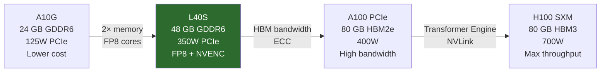

**Category:** GPU Infrastructure
**Difficulty:** Intermediate
**Reading time:** 6 min read

---

The NVIDIA L40S (Ada Lovelace architecture, 2023) is a PCIe card designed to bridge the gap between training-optimized H100s and the more economical A10G — offering 48 GB of GDDR6 memory, FP8 Tensor Cores, and hardware video codecs in a standard dual-slot form factor. It is particularly well-suited for inference at medium batch sizes and for mixed compute-plus-rendering workloads.

- **Ada Lovelace architecture** — NVIDIA's consumer and professional GPU generation (2022–2023), sharing Tensor Core and shader technology with H100 but using GDDR6 rather than HBM
- **FP8 Tensor Cores** — same FP8 precision as H100, enabling 2× inference throughput vs FP16 when models are quantized
- **GDDR6 vs HBM** — GDDR6 is cheaper and has lower latency on small batches; HBM provides higher bandwidth for large matrix operations
- **PCIe form factor** — standard server slot, no proprietary baseboard required; enables deployment in commodity 2U rack servers
- **NVENC/NVDEC** — dedicated hardware video encode/decode engines, allowing simultaneous AI inference and video transcoding
- **NVLink disabled** — L40S does not support NVLink, limiting multi-GPU memory pooling to NVSwitch-based systems

The L40S contains 18,176 CUDA cores and 568 fourth-generation Tensor Cores across 142 SMs, with 48 GB of GDDR6 at 864 GB/s memory bandwidth. Compared to the A100 PCIe (40/80 GB HBM2e), the L40S has faster Tensor Cores but narrower memory bandwidth — making it compute-bound rather than memory-bound for typical batch inference.

For inference workloads, the L40S excels when models fit within 48 GB and batch sizes are modest (1–32 tokens). At FP8 precision, the L40S delivers approximately 1,457 TOPS (teraoperations per second) for inference, competitive with the A100 at half the acquisition cost.

The card operates at a 350W TDP — high enough to require proper airflow, but manageable in standard 2U servers with 80mm fans. Two L40S cards can be installed in a standard dual-socket server without custom power delivery, unlike SXM-based GPUs.

NVENC/NVDEC hardware runs independently of the CUDA core array, meaning a video transcoding pipeline and an AI inference pipeline can run simultaneously without competing for compute resources. This makes the L40S popular in media and entertainment workflows combining AI-generated content with video delivery.

- Real-time LLM inference serving (7B–70B parameter models) at batch size 1–8
- Generative image/video inference (Stable Diffusion, video upscaling) at production scale
- Mixed workloads combining video transcoding and AI inference on the same GPU
- Cost-optimized inference deployments where H100 per-token cost is prohibitive
- On-premises AI inference appliances where PCIe form factor is required

| Advantage | Disadvantage |
|-----------|--------------|
| PCIe form factor runs in any standard rack server | No NVLink — multi-GPU scaling limited to PCIe bandwidth (64 GB/s bidirectional) |
| FP8 Tensor Cores deliver near-H100 inference TOPS at lower cost | GDDR6 bandwidth bottleneck on memory-bound workloads (long context, large batches) |
| NVENC/NVDEC enables GPU sharing across AI and video pipelines | 48 GB ceiling — large models (70B+ in FP16) require model parallelism across cards |
| Lower acquisition cost than H100/A100 SXM | Not suitable for training runs beyond small fine-tuning jobs |

- [NVIDIA Tesla GPU Datacenter Lineup](nvidia-tesla-gpu-datacenter-lineup.md)
- [GPU Memory Allocation Strategies](gpu-memory-allocation-strategies.md)
- [GPU vs CPU for Parallel Workloads](gpu-vs-cpu-for-parallel-workloads.md)

---
*Part of the [GPU Infrastructure](index.md) category · [Back to Master Index](../../index.md)*
