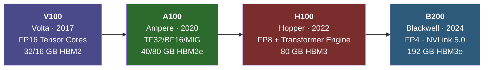

**Category:** GPU Infrastructure
**Difficulty:** Intermediate
**Reading time:** 6 min read

---

The NVIDIA Tesla lineup (now branded as NVIDIA Data Center GPUs) is a family of compute-focused GPUs designed exclusively for servers, HPC clusters, and AI workloads — with no display outputs and optimized for sustained, 24/7 datacenter operation. Understanding the lineup is essential for anyone provisioning GPU compute, as each generation targets a distinct performance-per-watt and memory-capacity point.

- **Compute GPU** — a GPU without display outputs, hardened for continuous server operation rather than consumer graphics
- **Tensor Cores** — specialized matrix-multiplication units inside NVIDIA GPUs that accelerate deep learning training and inference
- **TDP (Thermal Design Power)** — the maximum sustained wattage a GPU card will draw, used to size power delivery and cooling
- **SXM form factor** — NVIDIA's proprietary high-bandwidth module connector used in server boards, enabling NVLink and faster power delivery vs PCIe cards
- **ECC memory** — Error-Correcting Code memory that detects and corrects single-bit errors, mandatory for scientific and financial workloads
- **GPU generation naming** — Tesla (brand), Volta (V100), Ampere (A100), Hopper (H100), Blackwell (B200) refer to microarchitecture generations

NVIDIA's datacenter GPU lineup follows a generational cadence, with each architecture introducing new Tensor Core designs, larger HBM memory stacks, and faster interconnects.

The **Volta** generation (V100, 2017) introduced the first Tensor Cores with FP16 mixed-precision training, becoming the default for large-scale deep learning before the transformer era.

The **Ampere** generation (A100, 2020) doubled down on Tensor Core flexibility by adding TF32, BF16, INT8, and INT4 precision modes, plus a 3rd-generation NVLink for 600 GB/s GPU-to-GPU bandwidth. The A100 introduced MIG (Multi-Instance GPU), allowing one physical GPU to be partitioned into up to seven isolated compute slices.

The **Hopper** generation (H100, 2022) added Transformer Engine — hardware that automatically switches between FP8 and FP16 per layer — delivering roughly 3× the training throughput of A100 for transformer models. The NVLink Switch chip enabled NVLink across racks (NVLink Network).

Each generation ships in two form factors: **SXM** (for NVLink-capable server boards like DGX/HGX) and **PCIe** (for standard rack servers). SXM cards consistently outperform their PCIe counterparts by 10–30% due to higher TDP headroom and NVLink bandwidth.

- Large language model pre-training on multi-node GPU clusters (A100, H100 SXM)
- AI inference serving for latency-sensitive APIs (L40S, A10G)
- Scientific computing and molecular dynamics simulation (V100, A100 with ECC)
- Rendering and visualization pipelines in VFX studios (RTX 6000 Ada)
- Financial risk modeling requiring ECC memory guarantees (any Tesla-class GPU)

| Advantage | Disadvantage |
|-----------|--------------|
| ECC memory prevents silent data corruption in long runs | High acquisition cost ($10k–$40k+ per card) |
| SXM NVLink enables near-linear scaling across 8 GPUs | SXM requires proprietary server boards (DGX/HGX), limiting vendor choice |
| Compute-only design maximizes die area for CUDA cores | No display output — requires separate management GPU for server console |
| Long product lifecycle with multi-year driver support | Each new generation requires re-profiling and re-tuning inference kernels |

- [NVIDIA A100 Tensor Core Architecture](nvidia-a100-tensor-core-architecture.md)
- [NVIDIA H100 Hopper Architecture](nvidia-h100-hopper-architecture.md)
- [NVLink Interconnect Technology](nvlink-interconnect-technology.md)

---
*Part of the [GPU Infrastructure](index.md) category · [Back to Master Index](../../index.md)*
