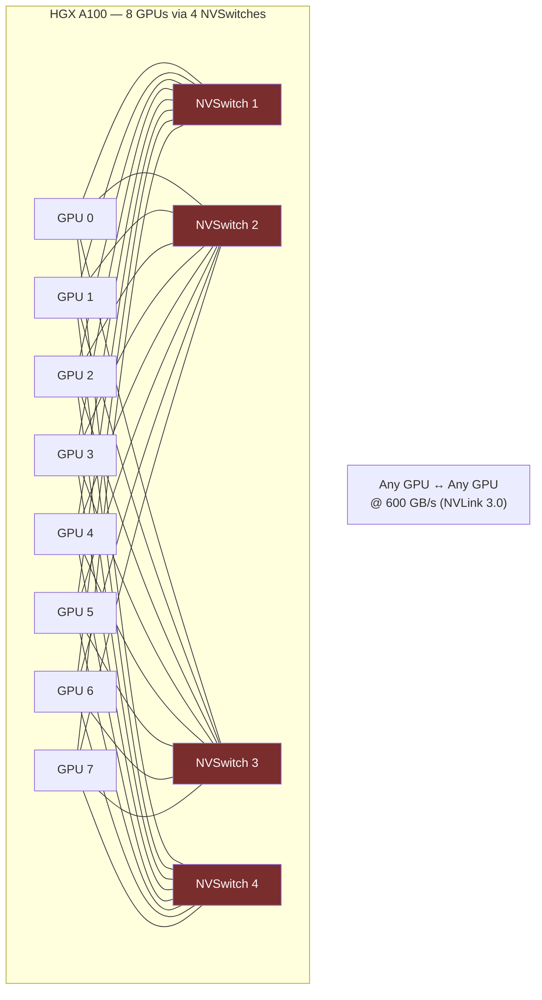

**Category:** GPU Infrastructure
**Difficulty:** Advanced
**Reading time:** 7 min read

---

NVLink is NVIDIA's proprietary high-bandwidth GPU-to-GPU interconnect that bypasses PCIe to provide 5–10× higher bandwidth between GPUs in the same server. NVLink is essential for distributed training and large model inference where all-reduce collective operations would be PCIe-bottlenecked, and NVLink 4.0 with NVSwitch now extends to multi-node rack-scale topologies.

- **NVLink generation** — NVLink 1.0 (160 GB/s, 2016), 2.0 (300 GB/s, 2018), 3.0 (600 GB/s, 2020), 4.0 (900 GB/s, 2022)
- **NVSwitch** — NVIDIA's dedicated switch chip that connects all GPUs in a server to a full all-to-all NVLink fabric (no single GPU acts as a switch)
- **All-to-all bandwidth** — each GPU can communicate with every other GPU simultaneously at peak bandwidth, critical for ring-allreduce and all-to-all collectives
- **SXM form factor** — required for NVLink; PCIe GPU cards (L40S, A10G) do not support NVLink
- **NVLink Network** — rack-scale extension using dedicated NVLink Switch cabinets, connecting up to 256 H100s in a flat NVLink domain
- **GPU-Direct RDMA** — allows NVLink traffic to skip CPU memory entirely, enabling zero-copy GPU-to-GPU transfers even across nodes
- **SHARP (Scalable Hierarchical Aggregation and Reduction Protocol)** — offloads all-reduce operations into the NVSwitch fabric itself, removing GPU cycles from collective operations

In an HGX A100 baseboard, eight A100 SXM4 GPUs are connected through four NVSwitch 2.0 chips, each providing 600 GB/s of switching bandwidth. The NVSwitch creates a non-blocking all-to-all topology: any GPU can write to any other GPU's HBM at line rate simultaneously, without routing conflicts.

This matters critically for ring-allreduce in distributed training. In a standard ring across 8 GPUs, each GPU sends and receives approximately N/8 data per step, bounded by the slowest link. On PCIe, two GPUs might share 64 GB/s; on NVLink 3.0, each GPU has 600 GB/s — a 9× improvement that directly translates to faster gradient synchronization.

NVLink 4.0 on H100 extends this to multi-node via the NVLink Switch System: a dedicated rack of NVLink Switch chips connects up to 32 servers (256 GPUs) into a single flat NVLink domain. All 256 GPUs can collectively achieve 900 GB/s all-to-all bandwidth, removing InfiniBand as the gradient sync bottleneck for jobs that fit within this scale.

SHARP allows the NVSwitch hardware itself to perform reduction operations (sum, min, max) in-network as data flows through the switch — reducing the volume of data returned to GPUs and freeing GPU compute for model computation rather than communication overhead.

- Gradient synchronization in multi-GPU training (all-reduce across 8 GPUs at near-memory-speed)
- Tensor parallelism in LLM inference where activations must be exchanged between GPU shards per layer
- Mixture-of-experts routing where expert tokens are dispatched across GPUs every forward pass
- Unified GPU memory pooling — with NVLink, CUDA can treat all GPUs' VRAM as a single addressable space
- NVLink Network for 256-GPU single-job training (eliminating InfiniBand for intra-rack collectives)

| Advantage | Disadvantage |
|-----------|--------------|
| 900 GB/s all-to-all bandwidth vs 64 GB/s for PCIe ×16 | Requires SXM GPUs on proprietary HGX/DGX baseboards — no standard server support |
| Non-blocking all-to-all fabric eliminates hot-spot contention | NVLink Network requires dedicated switch hardware adding significant CapEx |
| SHARP in-network reduction offloads all-reduce from GPU cores | NVIDIA vendor lock-in — AMD/Intel multi-GPU systems use Infinity Fabric/Xe Link instead |
| Enables unified virtual GPU memory space across NVLink peers | Limited to NVIDIA datacenter GPU ecosystem |

- [GPU PCIe Lanes and Bandwidth](gpu-pcie-lanes-and-bandwidth.md)
- [InfiniBand for GPU Interconnect](infiniband-for-gpu-interconnect.md)
- [Multi-GPU Server Configurations](multi-gpu-server-configurations.md)

---
*Part of the [GPU Infrastructure](index.md) category · [Back to Master Index](../../index.md)*
