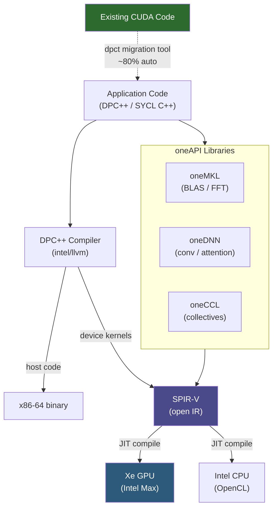

**Category:** GPU Infrastructure
**Difficulty:** Intermediate
**Reading time:** 6 min read

---

Intel's oneAPI is a unified programming model designed to write code that runs across CPUs, GPUs, FPGAs, and other accelerators without platform-specific rewrites. Built on the open SYCL standard, oneAPI is Intel's strategic answer to CUDA lock-in — and the primary software interface for Intel Data Center GPU Max series workloads.

- **SYCL** — an open-standard, single-source C++ parallel programming model built on ISO C++17; the foundation of oneAPI
- **DPC++ (Data Parallel C++)** — Intel's SYCL implementation with extensions; the primary language for oneAPI GPU kernels
- **oneAPI toolkit** — the full Intel distribution including DPC++ compiler, oneMKL (math kernel library), oneDNN (deep neural network primitives), and Level Zero runtime
- **Level Zero** — Intel's low-level GPU runtime API, analogous to CUDA Driver API; provides direct hardware access for advanced use cases
- **oneMKL (Math Kernel Library)** — Intel's equivalent to cuBLAS/rocBLAS; provides BLAS, FFT, and sparse operations for Intel CPUs and Xe GPUs
- **oneDNN** — Intel's equivalent to cuDNN/MIOpen; provides optimized deep learning primitives (convolution, attention, matrix multiply) for Xeon and Xe architectures
- **CUDA migration tool** — Intel's `dpct` (DPC++ Compatibility Tool) that automatically translates CUDA source to SYCL/DPC++

A SYCL program defines a `queue` targeting a device (CPU, GPU, or FPGA), then submits `command_group` lambdas containing parallel kernels. The DPC++ compiler compiles the host code to x86 and the device kernels to SPIR-V — an open intermediate representation that the Level Zero runtime JIT-compiles to native Xe GPU instructions at load time.

`intel/llvm` (the open-source DPC++ compiler) and Intel's commercial oneAPI Base Toolkit are the two distribution paths. The commercial toolkit includes pre-optimized oneMKL and oneDNN libraries with Intel-architecture-specific kernel schedules for Xeon CPUs and Xe GPUs.

PyTorch support for Intel GPUs comes through the `intel_extension_for_pytorch` (IPEX) package. IPEX patches PyTorch's dispatcher to route operations to oneDNN and oneMKL when an XPU (Xe Processing Unit) device is selected: `torch.device("xpu:0")`. Standard PyTorch training scripts require minimal changes beyond device target.

The CUDA migration path uses `dpct`, which automatically translates ~80% of CUDA API calls to SYCL equivalents — `cudaMalloc` → `sycl::malloc_device`, CUDA streams → SYCL queues. The remaining 20% requires manual work, particularly CUDA-specific intrinsics and library calls without direct SYCL equivalents.

Intel's XPU backend for TensorFlow and JAX is less mature than the PyTorch IPEX path, limiting adoption in frameworks beyond PyTorch.

- HPC applications requiring vendor-neutral code that runs on Intel CPU clusters and GPU accelerators with one codebase
- Government and national laboratory deployments with supply-chain requirements precluding exclusive NVIDIA or AMD hardware
- Porting existing OpenCL code to SYCL for a modernized, standards-based GPU programming model
- Running inference workloads on Intel GPU Max series in environments where Intel cloud instances are available
- Academic research into open standards-based GPU programming as an alternative to proprietary ecosystems

| Advantage | Disadvantage |
|-----------|--------------|
| Open SYCL standard — not tied to Intel hardware despite originating there | Ecosystem significantly smaller than CUDA; fewer tutorials, community answers, optimized libraries |
| Single codebase targets CPU, GPU, and FPGA | oneDNN and oneMKL kernel optimization lags cuDNN/cuBLAS for AI-specific operations |
| CUDA migration tool automates ~80% of CUDA-to-SYCL translation | JIT compilation from SPIR-V adds startup latency vs pre-compiled CUDA PTX |
| Intel Xeon + Xe GPU unified software stack reduces operational complexity | Intel GPU Max adoption in production AI clusters remains limited vs NVIDIA/AMD |

- [Intel Data Center GPU Max Series](intel-data-center-gpu-max-series.md)
- [ROCm for AMD GPUs](rocm-for-amd-gpus.md)
- [CUDA Toolkit and Libraries](cuda-toolkit-and-libraries.md)

---
*Part of the [GPU Infrastructure](index.md) category · [Back to Master Index](../../index.md)*
