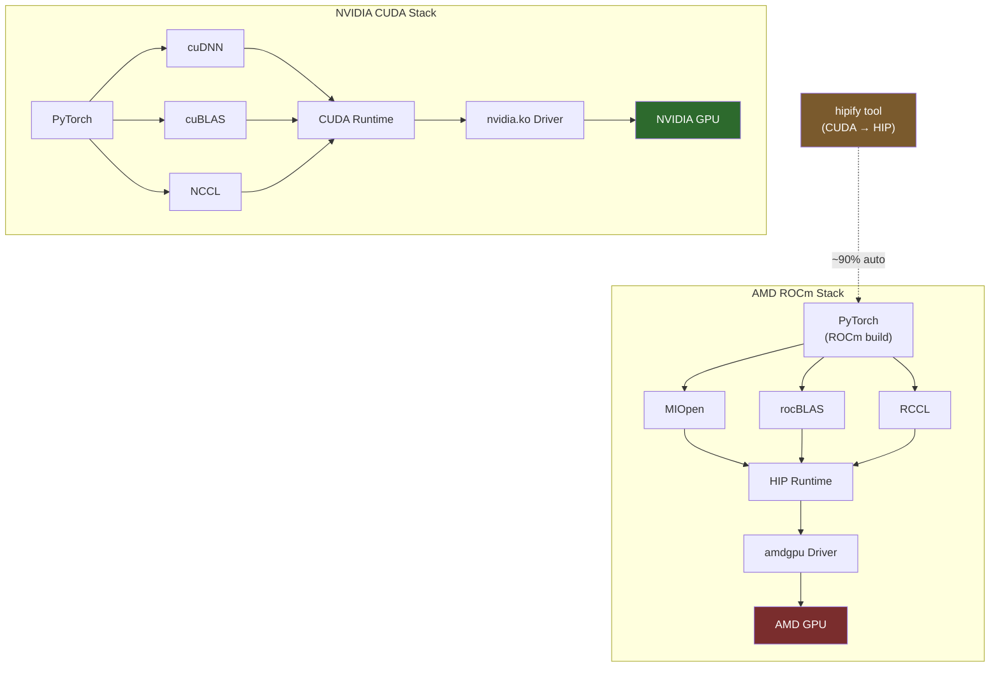

**Category:** GPU Infrastructure
**Difficulty:** Intermediate
**Reading time:** 6 min read

---

ROCm (Radeon Open Compute) is AMD's open-source GPU compute platform, providing the software stack for running AI and HPC workloads on AMD Instinct GPUs. It is AMD's answer to NVIDIA's CUDA ecosystem — offering a compiler, runtime, math libraries, and framework integrations — though it lags CUDA in ecosystem maturity and third-party library coverage.

- **HIP (Heterogeneous-compute Interface for Portability)** — AMD's CUDA-compatible GPU programming API; most CUDA code can be mechanically ported to HIP with the `hipify` tool
- **ROCm runtime** — the device management and kernel execution layer, analogous to the CUDA runtime
- **rocBLAS** — AMD's BLAS library, equivalent to cuBLAS; provides optimized GEMM for matrix multiply workloads
- **MIOpen** — AMD's deep learning primitives library, equivalent to cuDNN; provides optimized convolution, attention, and normalization kernels
- **RCCL (ROCm Collective Communications Library)** — AMD's fork of NCCL; implements all-reduce and other collectives for multi-GPU training over Infinity Fabric and RDMA
- **hipify** — tool that automatically translates CUDA source code to HIP, handling API name mappings and header includes
- **ROCm SMI** — system management interface for AMD GPUs; equivalent to `nvidia-smi` for monitoring, clock control, and health diagnostics

ROCm installs as a set of kernel modules (`amdgpu`) and userspace libraries on Linux. The `amdgpu` driver replaces the default display driver for Instinct cards and exposes the compute interface used by HIP and ROCm runtime.

The HIP API maps almost one-to-one with CUDA: `cudaMalloc` becomes `hipMalloc`, `__global__` kernels compile with `hipcc`, and CUDA streams become HIP streams. The `hipify-clang` tool can automatically translate ~90% of CUDA code to valid HIP, with the remaining 10% requiring manual handling of NVIDIA-specific extensions.

PyTorch supports AMD GPUs through its ROCm build path. When installed from AMD's ROCm-enabled PyTorch wheels, `torch.cuda.is_available()` returns `True` on AMD hardware (HIP presents itself as a CUDA-compatible device), and standard PyTorch training scripts run unchanged. TensorFlow similarly has ROCm build variants.

The key performance gap vs CUDA lies in library optimization depth. cuDNN's attention kernels (e.g., FlashAttention-2 integration) and cuBLAS's GEMM schedules are hand-tuned per NVIDIA architecture for many years. MIOpen and rocBLAS are improving but lag in kernel-level tuning, especially for newer attention variants and FP8 operations. The AMD MI300X partially compensates through its 192 GB memory capacity advantage.

RCCL handles multi-GPU communication for MI300X clusters, using Infinity Fabric for intra-node and RDMA over Ethernet/InfiniBand for inter-node. Performance is comparable to NCCL for standard all-reduce patterns.

- Running PyTorch training on AMD MI300X clusters where HBM memory capacity is the primary advantage
- Porting existing CUDA inference code to AMD hardware using hipify for cost-arbitrage
- Building multi-vendor GPU clusters where AMD provides pricing competition to NVIDIA
- HPC scientific computing using ROCm-enabled MPI and OpenMP offload on CDNA architecture
- Developing hardware-agnostic ML code using HIP abstractions from the start

| Advantage | Disadvantage |
|-----------|--------------|
| Open-source — no licensing fees, community contributions possible | Kernel-level library optimization lags CUDA cuDNN/cuBLAS by 6–18 months |
| HIP enables CUDA code portability with ~90% automated translation | Not all CUDA extensions have HIP equivalents — edge cases require manual work |
| MI300X 192 GB HBM3 enables single-GPU inference for 70B+ models | ROCm ecosystem tooling (profilers, debuggers) less mature than NVIDIA Nsight suite |
| Competition with NVIDIA improves pricing in cloud GPU markets | Third-party library support (vLLM, FlashAttention) arrives on ROCm later than CUDA |

- [AMD Instinct MI Series GPUs](amd-instinct-mi-series-gpus.md)
- [CUDA Toolkit and Libraries](cuda-toolkit-and-libraries.md)
- [oneAPI for Intel GPUs](oneapi-for-intel-gpus.md)

---
*Part of the [GPU Infrastructure](index.md) category · [Back to Master Index](../../index.md)*
