**Category:** GPU Infrastructure
**Difficulty:** Advanced
**Reading time:** 6 min read

---

NVIDIA vGPU (formerly GRID) is a licensed software layer that allows a single physical GPU to be partitioned into multiple virtual GPU instances, each assigned to a separate VM with quality-of-service guarantees. Unlike MIG (which partitions at the hardware level), vGPU uses time-slicing and memory segmentation at the driver level, enabling more flexible profiles at the cost of some isolation guarantees.

- **vGPU profile** — a named configuration specifying the amount of GPU memory, compute share, and encoder/decoder access assigned to a VM (e.g., A100-40C for 40 GB compute)
- **Time-slicing** — the mechanism by which vGPU shares GPU compute across VMs; each VM gets a scheduling quantum on the GPU hardware
- **vGPU Manager** — NVIDIA kernel module running on the hypervisor that mediates GPU access from all guest VMs
- **Guest vGPU driver** — NVIDIA driver installed inside the VM; communicates with the vGPU Manager on the host
- **GRID license** — per-GPU software license required to activate vGPU; different editions for VPC (compute), RTX (graphics), and vWS (workstation)
- **Quality of Service (QoS)** — vGPU profiles guarantee minimum memory allocation; compute QoS can be configured for GPU scheduling priority

```mermaid
gantt
    title GPU Time Slice Allocation (4 VMs sharing one GPU)
    dateFormat  X
    axisFormat %s

    section VM 1
    Compute quantum  :active, 0, 2
    Wait             :       2, 6
    Compute quantum  :active, 6, 8

    section VM 2
    Wait             :       0, 2
    Compute quantum  :active, 2, 4
    Wait             :       4, 8

    section VM 3
    Wait             :       0, 4
    Compute quantum  :active, 4, 6
    Wait             :       6, 8

    section VM 4
    Wait             :       0, 6
    Compute quantum  :active, 6, 8
```

When NVIDIA vGPU is installed on a hypervisor (VMware ESXi, KVM, Citrix Hypervisor), the vGPU Manager replaces the standard NVIDIA kernel driver on the host. Physical GPU resources are divided into slots: memory is partitioned statically (each VM gets an exclusive, non-overcommitted slice), while compute is shared dynamically via time-slicing.

A VM is created with a vGPU profile attached. The guest OS installs a standard NVIDIA vGPU guest driver, which presents a virtual GPU device to applications. From the application's perspective, it interacts with a normal CUDA device — CUDA, cuDNN, and TensorRT all function normally.

The vGPU Manager on the host intercepts GPU commands from all VMs and schedules them onto the physical GPU. Memory accesses are translated through IOMMU to the VM's assigned VRAM partition. Time-slicing context switches add overhead (typically 10–15% compared to passthrough) for compute workloads; graphics workloads see less impact due to the frame buffer model.

For AI inference in VDI and cloud environments, vGPU provides a balance: multiple tenants share one GPU with guaranteed memory, which is more efficient than one-GPU-per-VM passthrough, and more flexible than MIG (which requires hardware-level repartitioning).

- VDI (Virtual Desktop Infrastructure) where 10–20 employees share a single GPU for graphics acceleration
- Multi-tenant cloud inference where compute/memory QoS per tenant must be enforced
- Development and test environments where exact GPU isolation is less critical than density
- Remote workstation use cases requiring DirectX/OpenGL acceleration inside VMs
- Consolidating multiple AI workloads with different memory requirements on one GPU

| Advantage | Disadvantage |
|-----------|--------------|
| Higher VM density per GPU than passthrough — better utilization | Requires paid NVIDIA GRID license per GPU per year |
| Memory isolation between VMs prevents cross-tenant data leakage | Time-slicing adds 10–15% compute overhead vs dedicated GPU |
| Flexible profile sizing — match VM memory to workload needs | No hardware-level security boundary (unlike MIG) — side-channel risks in high-security environments |
| Live migration possible with compatible hypervisors | Profile changes require VM restart; adding VMs requires profile planning upfront |

- [GPU Passthrough for VMs](gpu-passthrough-for-vms.md)
- [GPU Partitioning and MIG](gpu-partitioning-and-mig.md)
- [GPU Memory Allocation Strategies](gpu-memory-allocation-strategies.md)

---
*Part of the [GPU Infrastructure](index.md) category · [Back to Master Index](../../index.md)*
