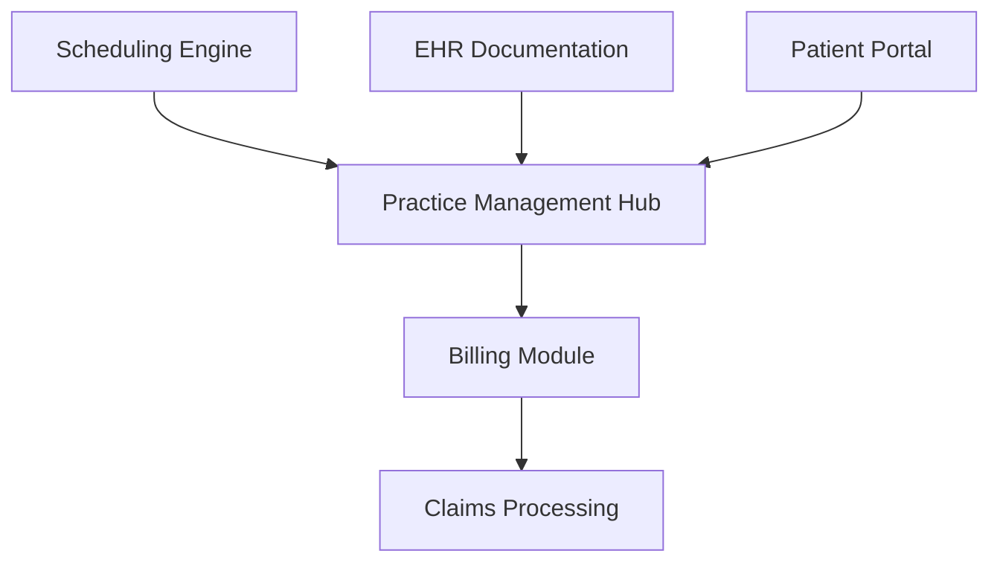

**Category:** Healthcare & Medical Hosting
**Difficulty:** Intermediate
**Reading time:** 6 min read

---

AdvancedMD is a cloud-based practice management and EHR solution designed for mid-sized and specialty medical practices. It integrates scheduling, electronic health records, billing, and patient engagement in a single platform with strong emphasis on revenue cycle management and workflow automation.

- **Unified Scheduling** — Multi-provider calendar management with real-time availability
- **EHR Integration** — Structured clinical documentation tied to billing codes
- **Revenue Cycle Management** — Automated claims submission, denial tracking, and follow-up
- **Patient Self-Service** — Online registration, appointment booking, and payment
- **Specialty-Focused Templates** — Pre-built workflows for orthopedics, surgery, psychiatry, etc.

AdvancedMD hosts its platform on redundant cloud servers with HIPAA-compliant data encryption and backup. The scheduling component manages provider availability, room assignments, and patient recall workflows. Clinical documentation is captured via structured templates that automatically map to billing codes, reducing coder review time. The billing module generates claims in compliance with payer-specific requirements, tracks denial reasons, and automates resubmission workflows. Revenue reports provide visibility into key metrics like Days in A/R and claim approval rates. The patient portal handles pre-visit registration, insurance verification, and post-visit payment collection, reducing administrative burden on staff.

- Specialty surgical practices managing complex schedules and multiple locations
- Orthopedic clinics with high-volume scheduling and claims complexity
- Mental health practices requiring HIPAA-secure patient portals and private messaging
- Multi-location practices needing centralized reporting and compliance monitoring
- Practices seeking strong integration between clinical and financial workflows
- Clinics requiring specialty-specific compliance templates (e.g., substance abuse treatment)

| Advantage | Disadvantage |
|-----------|--------------|
| Strong revenue cycle automation reduces billing errors | Steeper learning curve than some competitors |
| Specialty templates save implementation time | Customization limited outside built-in templates |
| Integrated EHR and PM reduces manual data entry | Per-location or per-provider pricing can scale quickly |
| Patient portal reduces front-desk overhead | Migration from legacy systems can be time-consuming |
| Strong reporting on billing metrics | API documentation less extensive than major vendors |

- [Medical billing system hosting](medical-billing-system-hosting.md)
- [HL7 interface hosting](hl7-interface-hosting.md)
- [Patient portal hosting](patient-portal-hosting.md)

---
*Part of the [Healthcare & Medical Hosting](healthcare-medical-hosting/index.md) category · [Back to Master Index](../../index.md)*