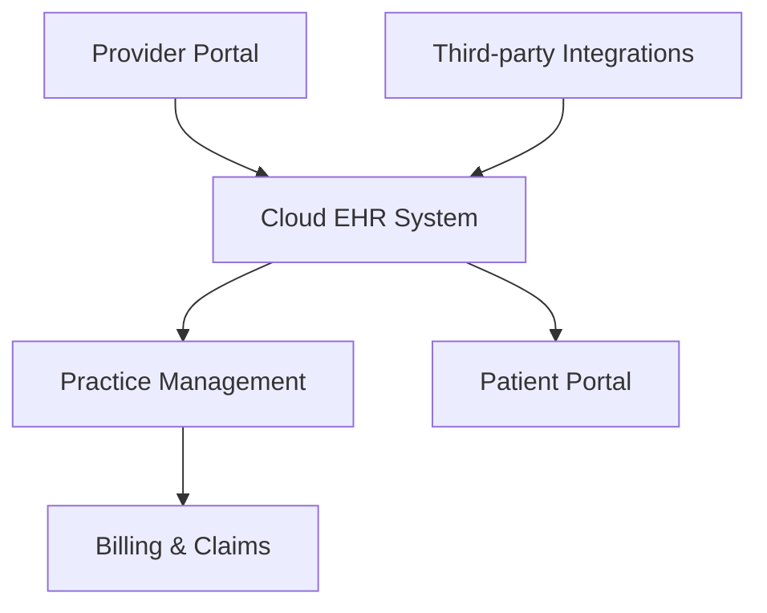

**Category:** Healthcare & Medical Hosting
**Difficulty:** Intermediate
**Reading time:** 6 min read

---

Athenahealth is a leading cloud-based medical practice management and EHR platform designed specifically for healthcare providers. It offers integrated scheduling, billing, clinical documentation, and patient engagement tools in a HIPAA-compliant, multi-tenant cloud architecture built to streamline healthcare operations.

- **Cloud-native EHR** — Electronic Health Records accessible from any browser without local installation
- **Practice Management Integration** — Scheduling, billing, and clinical workflows unified in one platform
- **HIPAA Compliance** — Enterprise-grade security and audit trails for protected health information
- **RESTful APIs** — Integration points for third-party healthcare applications and data exchange
- **Patient Engagement** — Online portals, secure messaging, and appointment management for patients

Athenahealth operates as a SaaS platform hosted on secure cloud infrastructure. Providers access the system through web browsers, entering clinical data that is stored in redundant, encrypted databases across geographically dispersed data centers. The practice management module handles patient scheduling, resource allocation, and workflow prioritization. Billing and claims processing is tightly integrated with clinical workflows, automating code capture and submission to insurance payers. The patient portal enables secure communication, appointment booking, and records access. APIs enable integration with labs, pharmacies, and other healthcare partners, facilitating data exchange through HL7 and FHIR standards. Multi-tenant architecture ensures isolation of patient data while enabling efficient resource utilization across thousands of practices.

- Multi-specialty medical practices managing hundreds of providers
- Urgent care and primary care clinics needing integrated scheduling and EHR
- Revenue cycle optimization with automated billing workflows
- Patient engagement through secure messaging and online scheduling
- Healthcare systems integrating multiple locations into unified platform
- Practices seeking managed cloud infrastructure without IT overhead

| Advantage | Disadvantage |
|-----------|--------------|
| Fully integrated EHR and PM in cloud | Vendor lock-in for large deployments |
| No on-premise infrastructure needed | Per-provider licensing can be expensive at scale |
| HIPAA-certified multi-tenant infrastructure | Limited customization compared to open-source EHR |
| Continuous updates without downtime | Data export and migration can be complex |
| Strong API ecosystem for integrations | Dependent on vendor's feature roadmap |

- [FHIR API hosting](fhir-api-hosting.md)
- [HL7 interface hosting](hl7-interface-hosting.md)
- [Patient portal hosting](patient-portal-hosting.md)

---
*Part of the [Healthcare & Medical Hosting](healthcare-medical-hosting/index.md) category · [Back to Master Index](../../index.md)*