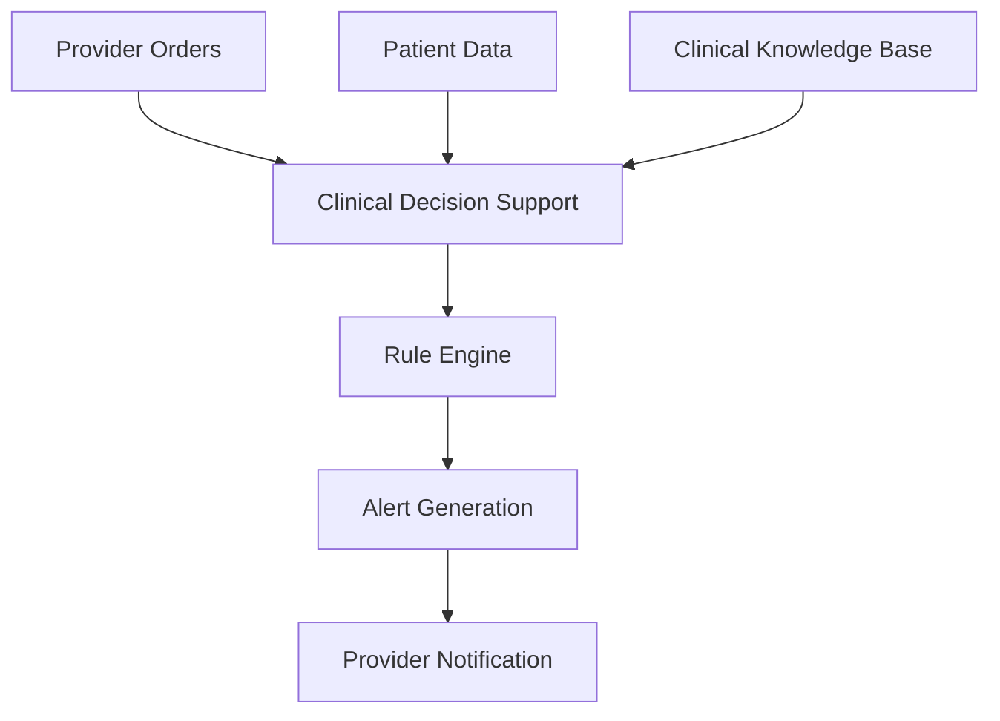

**Category:** Healthcare & Medical Hosting
**Difficulty:** Intermediate
**Reading time:** 6 min read

---

Clinical Decision Support Systems (CDSS) provide cloud-based platforms that analyze patient data and clinical evidence to guide treatment decisions. These systems integrate with EHRs to deliver real-time alerts, reminders, and recommendations at the point of care, improving quality and reducing medical errors.

- **Evidence-Based Rules** — Clinical rules derived from medical evidence and best practices
- **Real-Time Alerts** — Notifications during care delivery about drug interactions, allergies, etc.
- **Order Sets** — Standardized medication and testing protocols for common diagnoses
- **Quality Metrics** — Tracking adherence to clinical guidelines and best practices
- **Machine Learning** — Predictive models identifying patients at high risk

CDSS platforms operate on cloud infrastructure with real-time integration to EHR systems. When a provider orders medication, encounters a patient, or performs clinical actions, the system analyzes patient data (medications, allergies, conditions, lab results) against a clinical knowledge base. Rules engines evaluate whether the clinical action aligns with evidence-based guidelines. Alerts are generated for contraindications (drug-drug interactions, allergies, duplicative testing), clinical errors (incorrect dosing, inappropriate medications), and care gaps (missing preventive care, unmet quality measures). Machine learning models identify patients at high risk for adverse outcomes. Provider notifications are intelligently tuned to reduce alert fatigue while catching critical issues. Order sets provide standardized workflows for common diagnoses, reducing variability and ensuring comprehensive care.

- Hospital pharmacist-driven medication safety programs
- Specialty clinics implementing evidence-based care pathways
- Preventive care programs ensuring all patients receive guideline-directed screening
- Sepsis programs with rapid recognition and bundle protocols
- Antibiotic stewardship reducing unnecessary antimicrobial use
- Chronic disease management ensuring adherence to best practices

| Advantage | Disadvantage |
|-----------|--------------|
| Alerts prevent medication errors and adverse events | Alert fatigue reduces provider compliance if not tuned well |
| Evidence-based rules standardize care across providers | Clinical knowledge base requires constant updates |
| Real-time feedback at point of care drives behavior change | Integration complexity with diverse EHR vendors |
| Identifies care gaps enabling quality improvement | Initial setup and tuning highly time-intensive |
| Reduces unnecessary testing and medications | Machine learning models require large training datasets |

- [Healthcare analytics platforms](healthcare-analytics-platforms.md)
- [Prescription management systems](prescription-management-systems.md)
- [Population health management](population-health-management.md)

---
*Part of the [Healthcare & Medical Hosting](healthcare-medical-hosting/index.md) category · [Back to Master Index](../../index.md)*