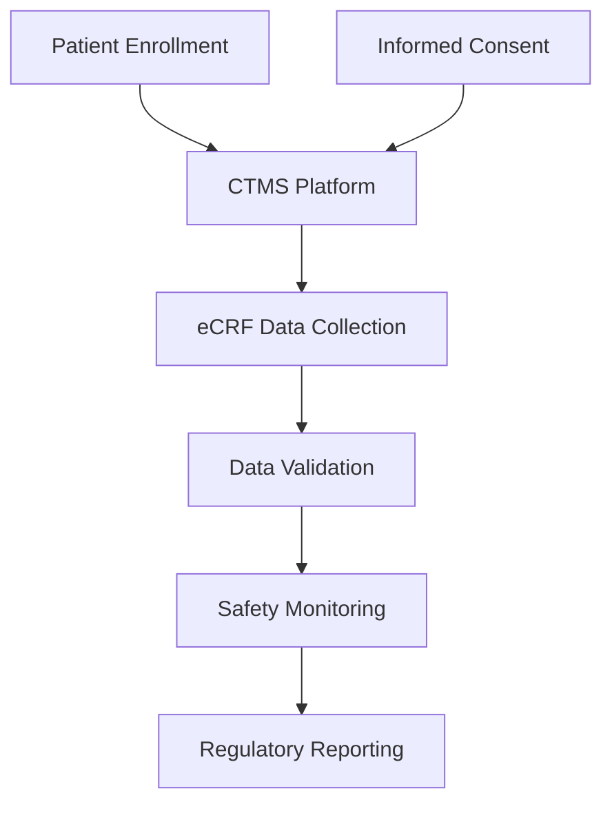

**Category:** Healthcare & Medical Hosting
**Difficulty:** Intermediate
**Reading time:** 6 min read

---

Clinical Trial Management Systems (CTMS) provide cloud-based platforms for managing all aspects of clinical research from protocol design through data analysis. CTMS platforms handle patient recruitment, informed consent, data collection, regulatory compliance, and safety reporting.

- **Patient Management** — Tracking and enrollment of research subjects
- **Data Collection** — Electronic Case Report Forms (eCRF) for structured data capture
- **Regulatory Compliance** — Documentation of informed consent and adverse event reporting
- **Safety Monitoring** — Tracking of serious adverse events and safety thresholds
- **Audit Trails** — Complete documentation of all data entry and modifications

CTMS platforms operate on HIPAA-compliant cloud infrastructure with strict governance for research data. Patients are enrolled through recruitment workflows, and informed consent is documented with digital signature capture. Electronic Case Report Forms (eCRFs) guide data collection with validation rules ensuring completeness and accuracy. Research coordinators enter patient data during visits, with automated checks preventing data entry errors. Safety monitoring systems track adverse events against predefined stopping rules. Principal investigators receive alerts when safety thresholds are exceeded, enabling rapid response. Regulatory reporting generates Safety Reports and study documentation required by IRBs and regulatory agencies. Data audit trails track all modifications with user and timestamp information. Query management systems handle data quality questions and corrections. Statistical analysis datasets are exported for analysis while maintaining patient privacy through de-identification.

- Pharmaceutical companies running multi-center phase III trials
- Academic medical centers conducting investigator-initiated studies
- Contract research organizations managing trials for sponsors
- Oncology trials with complex safety monitoring requirements
- Device trials with integration to medical device data
- Real-world evidence studies with distributed patient populations

| Advantage | Disadvantage |
|-----------|--------------|
| Centralized platform for multi-site trials | High cost and complexity of implementation |
| eCRF validation ensures data quality | Learning curve for research coordinators |
| Safety monitoring enables rapid response to issues | Regulatory requirements vary by jurisdiction |
| Audit trails support FDA inspection requirements | Integration with external data sources challenging |
| Regulatory reporting automation reduces manual work | Database lock procedures limit data modifications |

- [Healthcare compliance monitoring](healthcare-compliance-monitoring.md)
- [Medical research data hosting](medical-research-data-hosting.md)
- [Healthcare analytics platforms](healthcare-analytics-platforms.md)

---
*Part of the [Healthcare & Medical Hosting](healthcare-medical-hosting/index.md) category · [Back to Master Index](../../index.md)*
