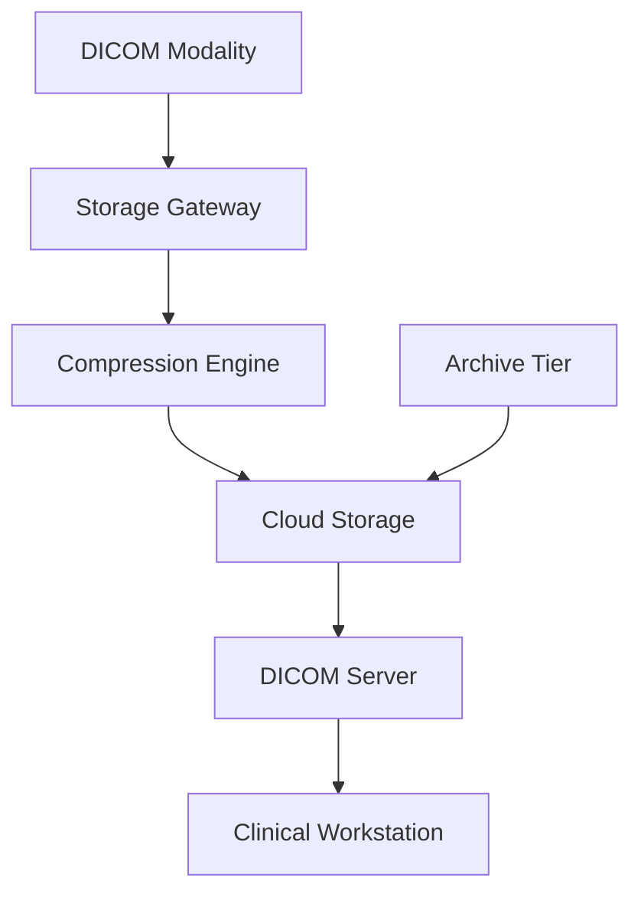

**Category:** Healthcare & Medical Hosting
**Difficulty:** Intermediate
**Reading time:** 6 min read

---

DICOM (Digital Imaging and Communications in Medicine) image storage provides specialized cloud infrastructure optimized for storing, retrieving, and managing medical imaging data in standard DICOM format. These systems ensure data integrity, compliance with medical imaging standards, and performance requirements for high-resolution medical images.

- **DICOM Standard Compliance** — Adherence to international medical imaging data format and protocols
- **Compression Algorithms** — Lossless and lossy compression optimizing storage without losing diagnostic quality
- **Metadata Management** — Complete tracking of image acquisition parameters, patient info, and provenance
- **Retrieval Protocol** — DICOM Query/Retrieve protocol enabling integration with clinical systems
- **Long-term Archive** — Compliance with retention requirements (often 5-7 years minimum)

DICOM storage systems implement standardized protocols for receiving images from medical equipment (scanners, cameras, etc.) and organizing them in cloud storage. Incoming images are processed to extract metadata (patient ID, study date, imaging parameters, etc.), apply appropriate compression, and store redundantly across multiple data centers. Compression uses JPEG2000 or other medical-grade algorithms ensuring no loss of diagnostic information in lossless mode. Storage tiers automatically move older studies to archive storage with longer retrieval times but lower costs. The DICOM server responds to Query/Retrieve requests from clinical systems and workstations, enabling integration with PACS and EHR platforms. Metadata indexing enables rapid search by patient, date, or imaging type. Compliance monitoring ensures data retention meets legal requirements and audit logs track all access for HIPAA documentation.

- Long-term archiving of imaging studies meeting regulatory retention requirements
- Cloud migration of existing on-premise DICOM archives
- Integration point between multiple PACS systems and modalities
- Research databases with controlled access to de-identified imaging data
- Backup and disaster recovery for critical imaging data
- Data warehousing for image analytics and AI model training

| Advantage | Disadvantage |
|-----------|--------------|
| Cloud-based eliminates on-premise storage infrastructure | Vendor lock-in to proprietary storage formats |
| Automatic tiering optimizes costs for archival data | Data egress costs can be significant for retrieval |
| Redundancy and backup ensure data availability | Complex DICOM protocol requires specialized integration |
| Scales easily as imaging volume grows | Performance depends on network bandwidth |
| Compliant with long-term archive regulations | Deduplication not applicable to imaging data |

- [Medical imaging (PACS) hosting](medical-imaging-pacs-hosting.md)
- [Healthcare data backup and recovery](healthcare-data-backup-and-recovery.md)
- [Medical research data hosting](medical-research-data-hosting.md)

---
*Part of the [Healthcare & Medical Hosting](healthcare-medical-hosting/index.md) category · [Back to Master Index](../../index.md)*